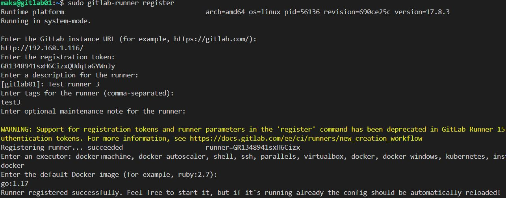

# Домашнее задание к занятию «GitLab»

---

### Задание 1

**Что нужно сделать:**

1. Разверните GitLab локально, используя Vagrantfile и инструкцию, описанные в [этом репозитории](https://github.com/netology-code/sdvps-materials/tree/main/gitlab).   
2. Создайте новый проект и пустой репозиторий в нём.
3. Зарегистрируйте gitlab-runner для этого проекта и запустите его в режиме Docker. Раннер можно регистрировать и запускать на той же виртуальной машине, на которой запущен GitLab.

В качестве ответа в репозиторий шаблона с решением добавьте скриншоты с настройками раннера в проекте.

Установка Gitlab CE на голую систему:

```bash
sudo apt update && sudo apt upgrade -y
sudo apt-get install -y curl openssh-server ca-certificates tzdata perl
cd /tmp
curl -LO https://packages.gitlab.com/install/repositories/gitlab/gitlab-ce/script.deb.sh
sudo bash script.deb.sh
sudo apt install gitlab-ce
# после установки заходим и редактируем
sudo nano /etc/gitlab/gitlab.rb
# external_url ‘http:// ip или доменное имя’
sudo gitlab-ctl reconfigure
```

Входим http:// ip  
Логин: root  
Пасс находится по адресу /etc/gitlab/initial_root_password  
Зарегистрируйте gitlab-runner для этого проекта и запустите его в режиме Docker.  
Установка gitlab-runner:  
```bash
curl -L "https://packages.gitlab.com/install/repositories/runner/gitlab-runner/script.deb.sh" | sudo bash
sudo apt install gitlab-runner
sudo gitlab-runner register
```
  

**Из докера**
```bash
docker run -d --name gitlab-runner --restart always \
  -v /srv/gitlab-runner/config:/etc/gitlab-runner \
  -v /var/run/docker.sock:/var/run/docker.sock \
  gitlab/gitlab-runner:latest

docker ps
# заходим в контейнер
sudo docker exec -ti gitlab-runner bash
# регестрируемся
```
  
Из GitLab  


---

### Задание 2

**Что нужно сделать:**

1. Запушьте [репозиторий](https://github.com/netology-code/sdvps-materials/tree/main/gitlab) на GitLab, изменив origin. Это изучалось на занятии по Git.
2. Создайте .gitlab-ci.yml, описав в нём все необходимые, на ваш взгляд, этапы.

В качестве ответа в шаблон с решением добавьте: 
   
 * файл gitlab-ci.yml для своего проекта или вставьте код в соответствующее поле в шаблоне; 
 * скриншоты с успешно собранными сборками.
 
 
---
## Дополнительные задания* (со звёздочкой)

Их выполнение необязательное и не влияет на получение зачёта по домашнему заданию. Можете их решить, если хотите лучше разобраться в материале.

---

### Задание 3*

Измените CI так, чтобы:

 - этап сборки запускался сразу, не дожидаясь результатов тестов;
 - тесты запускались только при изменении файлов с расширением *.go.

В качестве ответа добавьте в шаблон с решением файл gitlab-ci.yml своего проекта или вставьте код в соответсвующее поле в шаблоне.
