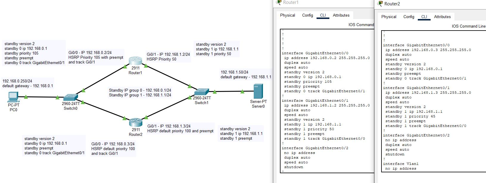

# Домашнее задание к занятию 1 «Disaster recovery и Keepalived»

**Боровиков Максим**

### Цель задания
В результате выполнения этого задания вы научитесь:
1. Настраивать отслеживание интерфейса для протокола HSRP;
2. Настраивать сервис Keepalived для использования плавающего IP

------

### Чеклист готовности к домашнему заданию

1. Установлена программа Cisco Packet Tracer
2. Установлена операционная система Ubuntu на виртуальную машину и имеется доступ к терминалу
3. Сделан клон этой виртуальной машины, они находятся в одной подсети и имеют разные IP адреса
4. Просмотрены конфигурационные файлы, рассматриваемые на лекции, которые находятся по [ссылке](1/)

------

### Задание 1
- Дана [схема](1/hsrp_advanced.pkt) для Cisco Packet Tracer, рассматриваемая в лекции.
- На данной схеме уже настроено отслеживание интерфейсов маршрутизаторов Gi0/1 (для нулевой группы)
- Необходимо аналогично настроить отслеживание состояния интерфейсов Gi0/0 (для первой группы).
- Для проверки корректности настройки, разорвите один из кабелей между одним из маршрутизаторов и Switch0 и запустите ping между PC0 и Server0.
- На проверку отправьте получившуюся схему в формате pkt и скриншот, где виден процесс настройки маршрутизатора.

Схема [конфигурации](1/hsrp_advanced_hw.pkt)  

  

*При отключении интерфейса, приоритет уменьшается на 10*

Отслежование изменения приоритетов на роутере
```
sh standby brief
```

Проверка:  
  
  

------

### Задание 2
- Запустите две виртуальные машины Linux, установите и настройте сервис Keepalived как в лекции, используя пример конфигурационного [файла](1/keepalived-simple.conf).
- Настройте любой веб-сервер (например, nginx или simple python server) на двух виртуальных машинах
- Напишите Bash-скрипт, который будет проверять доступность порта данного веб-сервера и существование файла index.html в root-директории данного веб-сервера.
- Настройте Keepalived так, чтобы он запускал данный скрипт каждые 3 секунды и переносил виртуальный IP на другой сервер, если bash-скрипт завершался с кодом, отличным от нуля (то есть порт веб-сервера был недоступен или отсутствовал index.html). Используйте для этого секцию vrrp_script
- На проверку отправьте получившейся bash-скрипт и конфигурационный файл keepalived, а также скриншот с демонстрацией переезда плавающего ip на другой сервер в случае недоступности порта или файла index.html

```bash
# Установка keepalived
sudo apt install keepalived
# создаём файл с настройками
sudo nano /etc/keepalived/keepalived.conf
# установка nginx
sudo apt install nginx
# редактирование файла nginx
sudo nano /var/www/html/index.nginx-debian.html
```
При создании скрипта не забываем дать права
```bash
sudo nano check_nginx.sh
sudo chmod 755 check_nginx.sh
```
Примеры keepalived [MASTER](config/MASTER_keepalived.conf) [BACKUP](config/BACKUP_keepalived.conf) [check_nginx](config/check_nginx.sh)  
Скрипт  
```bash
#!/bin/bash
if [[ $(netstat -ant | grep LISTEN | grep :80) ]] && [[ -f /var/www/html/index.nginx-debian.html ]]; then
  exit 0
else
  exit 1
fi
```
Демонстрация переезда:  
  
Останавливаем службу nginx  
```bash
# проверка порта
netstat -ant | grep LISTEN | grep :80
# отключение порта
sudo kill $(sudo lsof -t -i:80)
```


------
