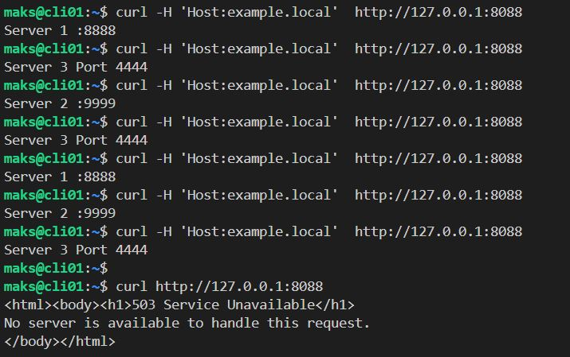

# Домашнее задание к занятию 2 «Кластеризация и балансировка нагрузки»

## Боровиков Максим

### Цель задания
В результате выполнения этого задания вы научитесь:
1. Настраивать балансировку с помощью HAProxy
2. Настраивать связку HAProxy + Nginx

------

### Чеклист готовности к домашнему заданию

1. Установлена операционная система Ubuntu на виртуальную машину и имеется доступ к терминалу
2. Просмотрены конфигурационные файлы, рассматриваемые на лекции, которые находятся по [ссылке](2/)

------

### Задание 1
- Запустите два simple python сервера на своей виртуальной машине на разных портах
- Установите и настройте HAProxy, воспользуйтесь материалами к лекции по [ссылке](2/)
- Настройте балансировку Round-robin на 4 уровне.
- На проверку направьте конфигурационный файл haproxy, скриншоты, где видно перенаправление запросов на разные серверы при обращении к HAProxy.

```bash
# запуск simple python сервера
python3 -m http.server 8888 --bind 0.0.0.0
python3 -m http.server 9999 --bind 0.0.0.0
# Install HAProxy
sudo apt install haproxy
# Файл конфигурации
sudo nano /etc/haproxy/haproxy.cfg
# проверка конфигурации
sudo haproxy -f /etc/haproxy/haproxy.cfg -c
# перезапуск сервиса(перепрочтение файла конфигурации)
sudo systemctl reload haproxy.service
```
Статистика HAPoxy находится по дресу *http:// ip :888/stats*  
Конфиг [HAProxy](config/haproxy01.cfg)  
  

------

### Задание 2
- Запустите три simple python сервера на своей виртуальной машине на разных портах
- Настройте балансировку Weighted Round Robin на 7 уровне, чтобы первый сервер имел вес 2, второй - 3, а третий - 4
- HAproxy должен балансировать только тот http-трафик, который адресован домену example.local
- На проверку направьте конфигурационный файл haproxy, скриншоты, где видно перенаправление запросов на разные серверы при обращении к HAProxy c использованием домена example.local и без него.  

Конфиг [HAProxy](config/haproxy02.cfg)  
Часть конфига haproxy.cfg
```
backend web_servers    # секция бэкенд
        mode http
        balance roundrobin
        option httpchk
        http-check send meth GET uri /index.html
        server s1 127.0.0.1:8888 weight 2 check
        server s2 127.0.0.1:9999 weight 3 check
        server s3 127.0.0.1:4444 weight 4 check
```

  
  

---
