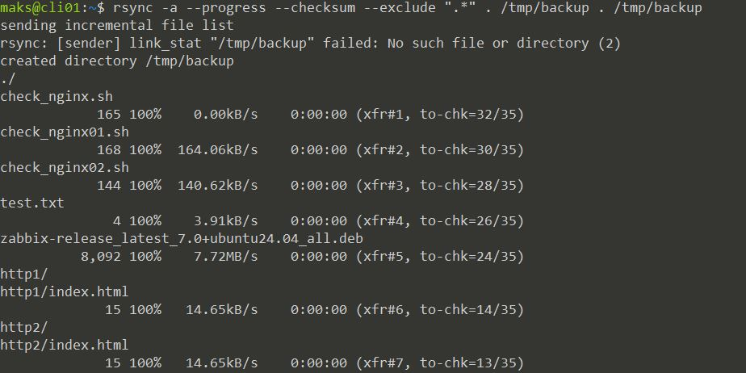
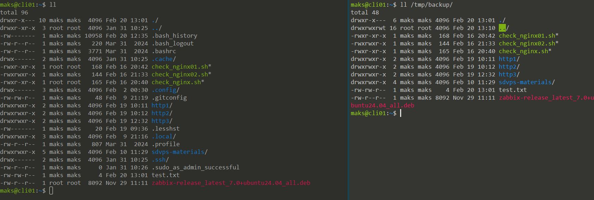
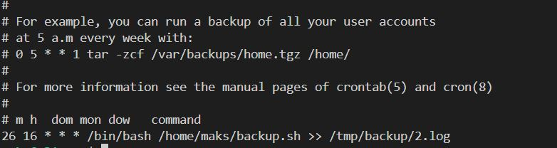
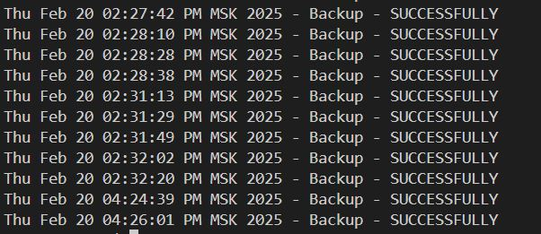

# Домашнее задание к занятию 3 «Резервное копирование»

## Боровиков Максим

### Цель задания
В результате выполнения этого задания вы научитесь:
1. Настраивать регулярные задачи на резервное копирование (полная зеркальная копия)
2. Настраивать инкрементное резервное копирование с помощью rsync

------

### Чеклист готовности к домашнему заданию

1. Установлена операционная система Ubuntu на виртуальную машину и имеется доступ к терминалу
2. Сделан клон этой виртуальной машины с другим IP адресом

------

### Задание 1
- Составьте команду rsync, которая позволяет создавать зеркальную копию домашней директории пользователя в директорию `/tmp/backup`
- Необходимо исключить из синхронизации все директории, начинающиеся с точки (скрытые)
- Необходимо сделать так, чтобы rsync подсчитывал хэш-суммы для всех файлов, даже если их время модификации и размер идентичны в источнике и приемнике.
- На проверку направить скриншот с командой и результатом ее выполнения

```bash
# создавать зеркальную копию домашней директории пользователя
rsync -a --progress . /tmp/backup
# исключить из синхронизации все директории, начинающиеся с точки (скрытые)
rsync -a --exclude ".*" . /tmp/backup
rsync -a --exclude=".*" . /tmp/backup
rsync -a --progress --exclude=".*" . /tmp/backup
rsync -av -f "- .*" . /tmp/backup  # более короткий вариант
# rsync подсчитывал хэш-суммы для всех файлов
rsync -a --progress --checksum --exclude ".*" . /tmp/backup . /tmp/backup
```
  
  

------

### Задание 2
- Написать скрипт и настроить задачу на регулярное резервное копирование домашней директории пользователя с помощью rsync и cron.
- Резервная копия должна быть полностью зеркальной
- Резервная копия должна создаваться раз в день, в системном логе должна появляться запись об успешном или неуспешном выполнении операции
- Резервная копия размещается локально, в директории `/tmp/backup`
- На проверку направить файл crontab и скриншот с результатом работы утилиты.

Скрипт [backup](config/backup.sh)

```bash
#!/bin/bash

rsync -avh --progress  --delete --checksum  /home/maks /tmp/backup > /tmp/backup/1.log 
if [ $? -eq 0 ]; then
        echo "$(date) - Backup - SUCCESSFULLY" >> /var/log/neto_hw/hw.log
else
        echo "$(date) - Backup - FAILED" >> /var/log/neto_hw/hw.log
fi
```
Crontab  
  
Вывод лога  


---
