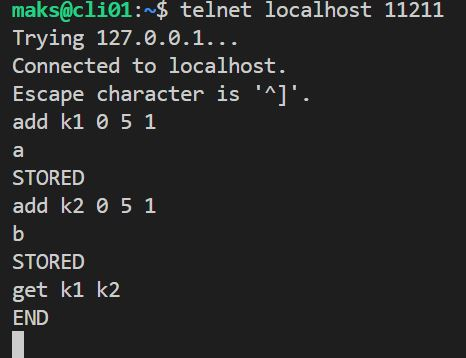

# Домашнее задание к занятию «Кеширование Redis/memcached»

### Задание 1. Кеширование 

Приведите примеры проблем, которые может решить кеширование. 

*Приведите ответ в свободной форме.*

1. Ускорение доступа к данным  
(использует быструю память(RAM))

2. Снижение нагрузки на серверы  
(Кеш принимает часть запросов, уменьшая число обращений к основному хранилищу)

3. Улучшение отзывчивости приложений  
(Данные из кеша возвращаются мгновенно)

4. Экономия ресурсов  
(Результаты сохраняются в кеше, избегая повторных вычислений)

5. Масштабируемость  
(Кеш распределяет нагрузку, позволяя обрабатывать больше запросов)  

---

### Задание 2. Memcached

Установите и запустите memcached.

*Приведите скриншот systemctl status memcached, где будет видно, что memcached запущен.*  

Установка  
```bash
sudo apt update && sudo apt install memcached
systemctl status memcached
```
  

Запуск из контейнера:  
(должен быть установлен docker)  
```bash
docker run --name my-memcached -d -p 11211:11211 memcached:latest -m 64
```
Подключение:  
```bash
telnet localhost 11211
# статистику вывести
stats
``` 

---

### Задание 3. Удаление по TTL в Memcached

Запишите в memcached несколько ключей с любыми именами и значениями, для которых выставлен TTL 5. 

*Приведите скриншот, на котором видно, что спустя 5 секунд ключи удалились из базы.*  

  

Добавить до следующей перезагрузки или очистки значение в memcached надо:  
```bash
set name 0 0 4
igor
get name
# для удаления 'name'
delete name
```
---

### Задание 4. Запись данных в Redis

Запишите в Redis несколько ключей с любыми именами и значениями. 

*Через redis-cli достаньте все записанные ключи и значения из базы, приведите скриншот этой операции.*  
Установка  
```bash
sudo apt update && sudo apt install redis
systemctl status redis
# свой клиент
redis-cli
```
Запуск из контейнера:  
(должен быть установлен docker)  
```bash
docker run --name my-redis -d -p 6379:6379 redis:latest
# подключение
docker exec -it my-redis redis-cli  
```


## Дополнительные задания (со звёздочкой*)
Эти задания дополнительные, то есть не обязательные к выполнению, и никак не повлияют на получение вами зачёта по этому домашнему заданию. Вы можете их выполнить, если хотите глубже разобраться в материале.

### Задание 5*. Работа с числами 

Запишите в Redis ключ key5 со значением типа "int" равным числу 5. Увеличьте его на 5, чтобы в итоге в значении лежало число 10.  

*Приведите скриншот, где будут проделаны все операции и будет видно, что значение key5 стало равно 10.*

