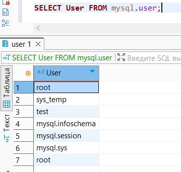
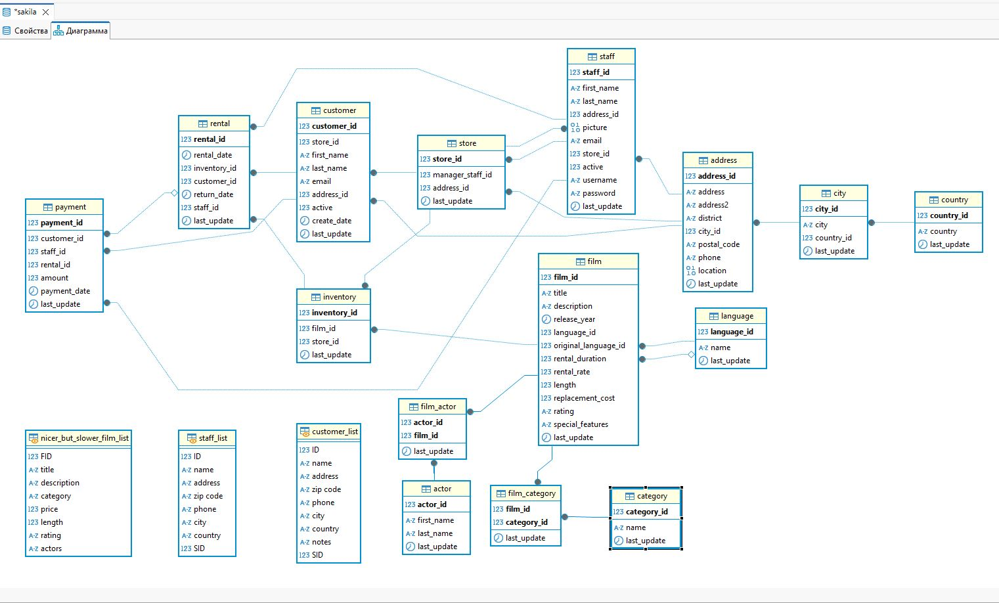

# Домашнее задание к занятию «Работа с данными (DDL/DML)»

### Боровиков Максим

---

Задание можно выполнить как в любом IDE, так и в командной строке.

### Задание 1
1.1. Поднимите чистый инстанс MySQL версии 8.0+. Можно использовать локальный сервер или контейнер Docker.  

[Docker файл](scripts/docker-compose.yml) 
или  

```bash
docker run --name test_db -p 3306:3306 -e MYSQL_ROOT_PASSWORD=secret -d mysql:latest
```

1.2. Создайте учётную запись sys_temp.  
```bash
CREATE USER 'sys_temp'@'*' IDENTIFIED BY 'secret';
```
1.3. Выполните запрос на получение списка пользователей в базе данных. (скриншот)
```bash
SELECT User FROM mysql.user;
```
  

1.4. Дайте все права для пользователя sys_temp. 

```bash
GRANT ALL PRIVILEGES ON *.* TO 'sys_temp'@'*' WITH GRANT OPTION;
```

1.5. Выполните запрос на получение списка прав для пользователя sys_temp. (скриншот)

```bash
SHOW GRANTS FOR 'sys_temp'@'*';
```
  

1.6. Переподключитесь к базе данных от имени sys_temp.  

Для смены типа аутентификации с sha2 используйте запрос: 
```sql
ALTER USER 'sys_test'@'localhost' IDENTIFIED WITH mysql_native_password BY 'password';
```

1.6. По ссылке https://downloads.mysql.com/docs/sakila-db.zip скачайте дамп базы данных.

1.7. Восстановите дамп в базу данных.

1.8. При работе в IDE сформируйте ER-диаграмму получившейся базы данных. При работе в командной строке используйте команду для получения всех таблиц базы данных. (скриншот)

  

*Результатом работы должны быть скриншоты обозначенных заданий, а также простыня со всеми запросами.*  
```sql
CREATE USER 'sys_temp'@'*' IDENTIFIED BY 'secret';
SELECT User FROM mysql.user;
GRANT ALL PRIVILEGES ON *.* TO 'sys_temp'@'*' WITH GRANT OPTION;
SHOW GRANTS FOR 'sys_temp'@'*';
SELECT * FROM information_schema.user_privileges WHERE GRANTEE="'sys_temp'@'*'";
```


### Задание 2
Составьте таблицу, используя любой текстовый редактор или Excel, в которой должно быть два столбца: в первом должны быть названия таблиц восстановленной базы, во втором названия первичных ключей этих таблиц. Пример: (скриншот/текст)
```
Название таблицы | Название первичного ключа
customer         | customer_id
```
```sql
SELECT 
    TABLE_NAME,
    COLUMN_NAME
FROM 
    INFORMATION_SCHEMA.KEY_COLUMN_USAGE
WHERE 
    TABLE_SCHEMA = DATABASE()
    AND CONSTRAINT_NAME = 'PRIMARY';
```
  

## Дополнительные задания (со звёздочкой*)
Эти задания дополнительные, то есть не обязательные к выполнению, и никак не повлияют на получение вами зачёта по этому домашнему заданию. Вы можете их выполнить, если хотите глубже шире разобраться в материале.

### Задание 3*
3.1. Уберите у пользователя sys_temp права на внесение, изменение и удаление данных из базы sakila.

```sql
SELECT user();
REVOKE ALL PRIVILEGES, GRANT OPTION FROM 'sys_temp'@'*';
SHOW GRANTS FOR 'sys_temp'@'*';
GRANT ALL PRIVILEGES ON sakila.* TO 'sys_temp'@'*' WITH GRANT OPTION;
SHOW GRANTS FOR 'sys_temp'@'*';
REVOKE INSERT, UPDATE, DELETE ON sakila.* FROM 'sys_temp'@'*';
SHOW GRANTS FOR 'sys_temp'@'*';
FLUSH PRIVILEGES;
```
3.2. Выполните запрос на получение списка прав для пользователя sys_temp. (скриншот)  

Полный права:  

  

После удаления:

  


*Результатом работы должны быть скриншоты обозначенных заданий, а также простыня со всеми запросами.*
