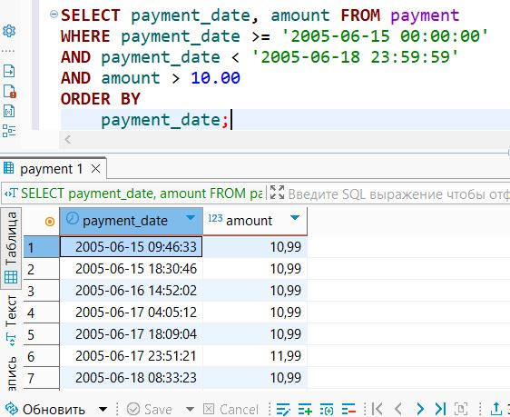

# Домашнее задание к занятию «SQL. Часть 1»

### Боровиков Максим

---

Задание можно выполнить как в любом IDE, так и в командной строке.

### Задание 1

Получите уникальные названия районов из таблицы с адресами, которые начинаются на “K” и заканчиваются на “a” и не содержат пробелов.

```sql
SELECT DISTINCT district
FROM address
WHERE district LIKE 'K%a' 
  AND district NOT LIKE '% %'
  AND district NOT LIKE '';
```
  

### Задание 2

Получите из таблицы платежей за прокат фильмов информацию по платежам, которые выполнялись в промежуток с 15 июня 2005 года по 18 июня 2005 года **включительно** и стоимость которых превышает 10.00.

```sql
SELECT payment_date, amount FROM payment
WHERE payment_date >= '2005-06-15 00:00:00' 
AND payment_date < '2005-06-18 23:59:59'
AND amount > 10.00
ORDER BY 
    payment_date;
```    
  

### Задание 3

Получите последние пять аренд фильмов.

```sql
SELECT rental_date
FROM rental
ORDER BY rental_date DESC
LIMIT 5;
```
  

### Задание 4

Одним запросом получите активных покупателей, имена которых Kelly или Willie. 

Сформируйте вывод в результат таким образом:
- все буквы в фамилии и имени из верхнего регистра переведите в нижний регистр,
- замените буквы 'll' в именах на 'pp'.

```sql
SELECT 
    customer_id,
    REPLACE(LOWER(first_name), 'll', 'pp') AS first_name_lower,
    LOWER(last_name) AS last_name_lower,
    active
FROM 
    customer
WHERE 
    active = 1
    AND (first_name = 'Kelly' OR first_name = 'Willie')
ORDER BY 
    customer_id;
```
  

## Дополнительные задания (со звёздочкой*)
Эти задания дополнительные, то есть не обязательные к выполнению, и никак не повлияют на получение вами зачёта по этому домашнему заданию. Вы можете их выполнить, если хотите глубже шире разобраться в материале.

### Задание 5*

Выведите Email каждого покупателя, разделив значение Email на две отдельных колонки: в первой колонке должно быть значение, указанное до @, во второй — значение, указанное после @.

```sql
SELECT 
    email,
    SUBSTRING_INDEX(email, '@', 1) AS email_prefix,
    SUBSTRING_INDEX(email, '@', -1) AS email_domain
FROM 
    customer;
```


### Задание 6*

Доработайте запрос из предыдущего задания, скорректируйте значения в новых колонках: первая буква должна быть заглавной, остальные — строчными.

```sql
SELECT 
    email,
    CONCAT(
        UPPER(LEFT(SUBSTRING_INDEX(email, '@', 1), 1)),
        LOWER(SUBSTRING(SUBSTRING_INDEX(email, '@', 1), 2))
    ) AS email_prefix,
    CONCAT(
        UPPER(LEFT(SUBSTRING_INDEX(email, '@', -1), 1)),
        LOWER(SUBSTRING(SUBSTRING_INDEX(email, '@', -1), 2))
    ) AS email_domain
FROM 
    customer;
```

