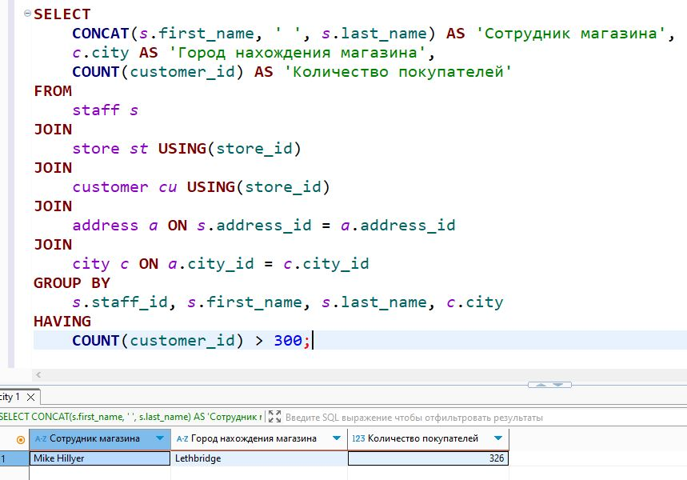

# Домашнее задание к занятию «SQL. Часть 2»

### Боровиков Максим

---

Задание можно выполнить как в любом IDE, так и в командной строке.

### Задание 1

Одним запросом получите информацию о магазине, в котором обслуживается более 300 покупателей, и выведите в результат следующую информацию: 
- фамилия и имя сотрудника из этого магазина;
- город нахождения магазина;
- количество пользователей, закреплённых в этом магазине.
```sql
SELECT 
    CONCAT(s.first_name, ' ', s.last_name) AS 'Сотрудник магазина',
    c.city AS 'Город нахождения магазина',
    COUNT(customer_id) AS 'Количество покупателей'
FROM 
    staff s
JOIN 
    store st USING(store_id)
JOIN 
    customer cu USING(store_id)
JOIN 
    address a ON s.address_id = a.address_id
JOIN 
    city c ON a.city_id = c.city_id
GROUP BY 
    s.staff_id, s.first_name, s.last_name, c.city
HAVING 
    COUNT(customer_id) > 300;
```


### Задание 2

Получите количество фильмов, продолжительность которых больше средней продолжительности всех фильмов.
```sql
SELECT COUNT(*) AS films_count_above_average
FROM film
WHERE length > (SELECT AVG(length) FROM film);
```
  

### Задание 3

Получите информацию, за какой месяц была получена наибольшая сумма платежей, и добавьте информацию по количеству аренд за этот месяц.
```sql
SELECT 
    DATE_FORMAT(p.payment_date, '%Y-%m') AS payment_month,
    SUM(p.amount) AS total_amount,
    COUNT(DISTINCT p.rental_id) AS rental_count
FROM 
    payment p
GROUP BY 
    DATE_FORMAT(p.payment_date, '%Y-%m')
ORDER BY 
    total_amount DESC
LIMIT 1;
```


## Дополнительные задания (со звёздочкой*)
Эти задания дополнительные, то есть не обязательные к выполнению, и никак не повлияют на получение вами зачёта по этому домашнему заданию. Вы можете их выполнить, если хотите глубже шире разобраться в материале.


