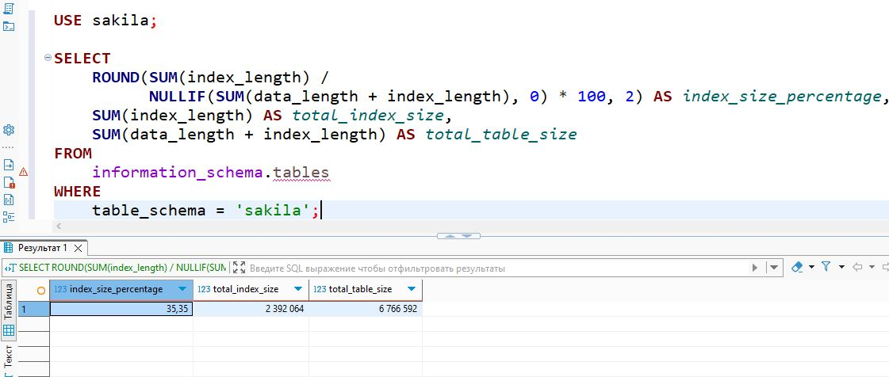
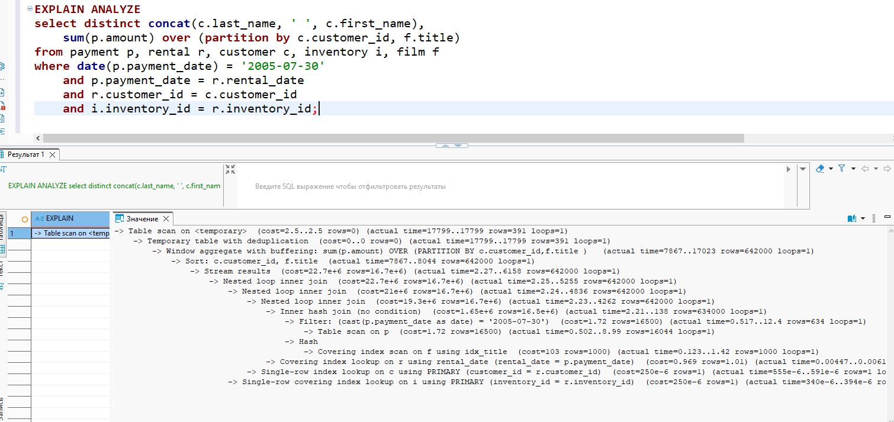
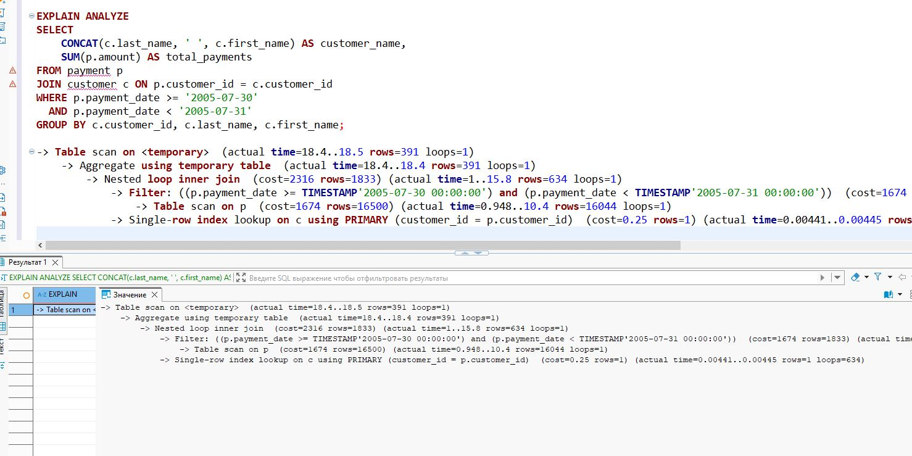
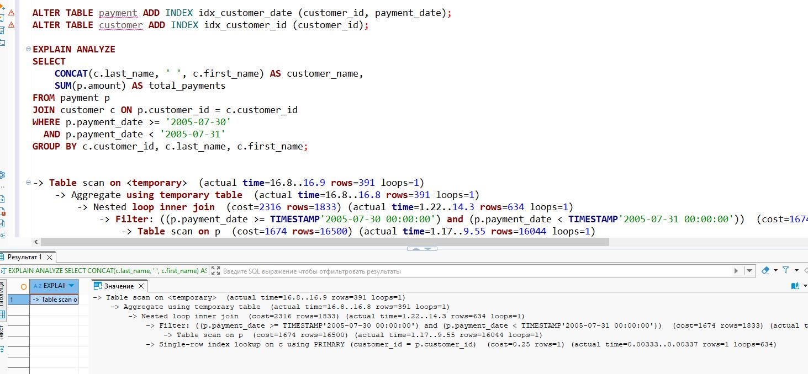

# Домашнее задание к занятию «Индексы»

### Задание 1

Напишите запрос к учебной базе данных, который вернёт процентное отношение общего размера всех индексов к общему размеру всех таблиц.
```sql
SELECT 
    ROUND(SUM(index_length) / 
          NULLIF(SUM(data_length + index_length), 0) * 100, 2) AS index_size_percentage,
    SUM(index_length) AS total_index_size,
    SUM(data_length + index_length) AS total_table_size
FROM 
    information_schema.tables
WHERE 
    table_schema = 'sakila';
```


### Задание 2

Выполните explain analyze следующего запроса:
```sql
select distinct concat(c.last_name, ' ', c.first_name), 
    sum(p.amount) over (partition by c.customer_id, f.title)
from payment p, rental r, customer c, inventory i, film f
where date(p.payment_date) = '2005-07-30' 
    and p.payment_date = r.rental_date 
    and r.customer_id = c.customer_id 
    and i.inventory_id = r.inventory_id;
```

- перечислите узкие места;
- оптимизируйте запрос: внесите корректировки по использованию операторов, при необходимости добавьте индексы.

Запрос выводит всех клиентов у которых есть платежи за 2005-07-30. 
Таблицы film, rental, inventory  лишние.  
Оконная функция разделена по customer_id и title, больше всего времяни уходит на выполнение.  
DISTINCT с оконной функцией может создавать избыточную работу.  
Упрастить условия даты.

Упрощения:  
Уберём таблицы не влияющие на результат (film, rental, inventory)  
Заменена оконная функция на GROUP BY  
Используем прямой диапазон  
Оставлено только соединение payment-customer  
```sql
SELECT 
    CONCAT(c.last_name, ' ', c.first_name) AS customer_name,
    SUM(p.amount) AS total_payments
FROM payment p
JOIN customer c ON p.customer_id = c.customer_id
WHERE p.payment_date >= '2005-07-30' 
  AND p.payment_date < '2005-07-31'
GROUP BY c.customer_id, c.last_name, c.first_name;
```


Добавим индексы
```sql
ALTER TABLE payment ADD INDEX idx_customer_date (customer_id, payment_date);
ALTER TABLE customer ADD INDEX idx_customer_id (customer_id);
```
Результат:



