# Домашнее задание к занятию «Уязвимости и атаки на информационные системы»

------

### Задание 1

Скачайте и установите виртуальную машину Metasploitable: https://sourceforge.net/projects/metasploitable/.

Это типовая ОС для экспериментов в области информационной безопасности, с которой следует начать при анализе уязвимостей.

Просканируйте эту виртуальную машину, используя **nmap**.

Попробуйте найти уязвимости, которым подвержена эта виртуальная машина.

Сами уязвимости можно поискать на сайте https://www.exploit-db.com/.

Для этого нужно в поиске ввести название сетевой службы, обнаруженной на атакуемой машине, и выбрать подходящие по версии уязвимости.

Ответьте на следующие вопросы:

- Какие сетевые службы в ней разрешены?
- Какие уязвимости были вами обнаружены? (список со ссылками: достаточно трёх уязвимостей)
  
*Приведите ответ в свободной форме.*  
```bash
nmap -sV -O 192.168.1.77
```
Уязвимости искал: https://www.exploit-db.com/

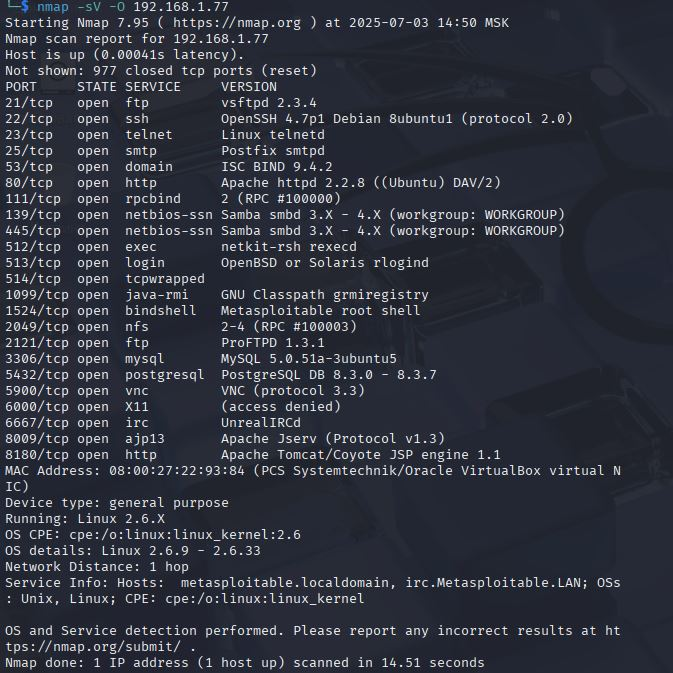
1. vsftpd 2.3.4 [vsftpd 2.3.4](https://www.exploit-db.com/exploits/17491 "https://www.exploit-db.com/exploits/17491")

2. ProFTPD 1.3.1 [ProFTPD 1.3.1](https://www.exploit-db.com/exploits/32798 "https://www.exploit-db.com/exploits/32798")

3. Apache HTTP Server 2.2.8 [Apache HTTP Server 2.2.8](https://www.exploit-db.com/exploits/17696 "https://www.exploit-db.com/exploits/17696")

Делал через Kali.  
Так же можно через searchsploit:
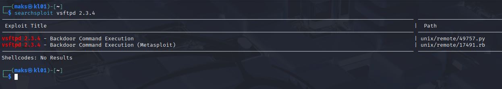

Так же есть вариант через msfconsole:  
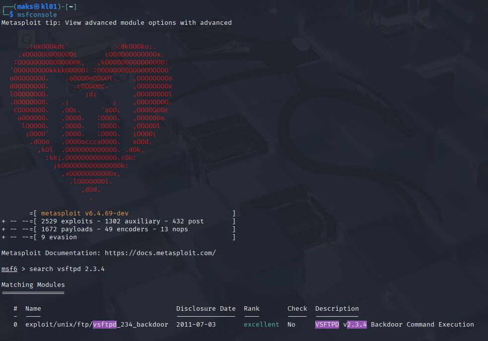

### Задание 2

Проведите сканирование Metasploitable в режимах SYN (-sS: TCP SYN-скан), FIN (-sF: TCP FIN-скан), Xmas (-sX: Xmas-скан), UDP (-sU: UPD-скан).

Запишите сеансы сканирования в Wireshark.

Ответьте на следующие вопросы:

- Чем отличаются эти режимы сканирования с точки зрения сетевого трафика?
- Как отвечает сервер?  

-p  - ограничем порты  
-oN запишем в файл результат
```bash
# SYN-сканирование (TCP Half-Open)
nmap -sS -p 1-1000 192.168.1.77 -oN syn_scan.txt
```
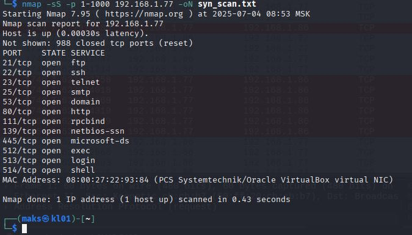
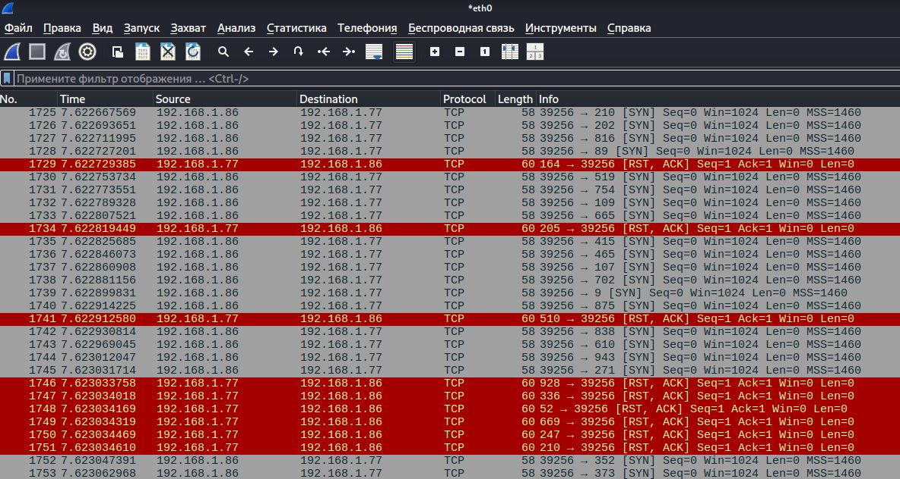
Отправляет SYN-пакет, но не завершает рукопожатие (не отправляет ACK).  
Если порт открыт SYN/ACK, если закрыт - RST. 

```bash
# FIN-сканирование (Stealth)
nmap -sF -p 1-1000 192.168.1.77 
```
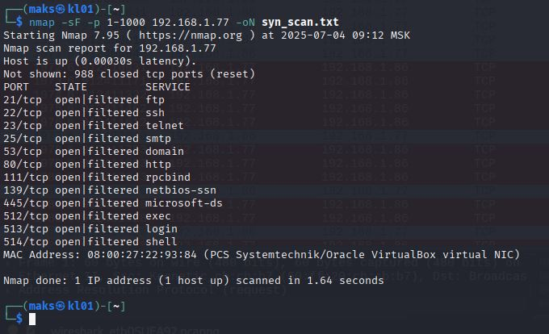
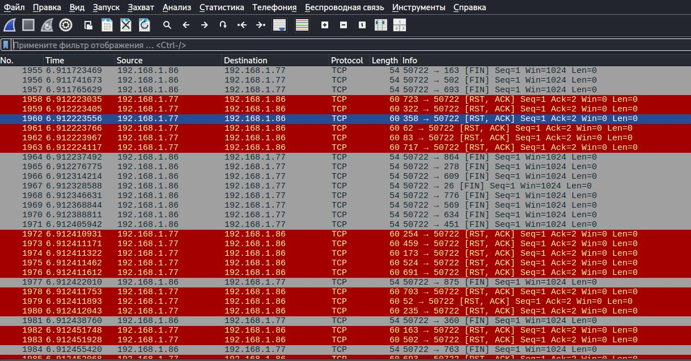
Отправляет FIN-пакет (как будто соединение уже закрыто).  
Если порт закрыт - RST, если открыт - нет ответа.

```bash
# Xmas-сканирование (URG+PSH+FIN)
nmap -sX -p 1-1000 192.168.1.77
```
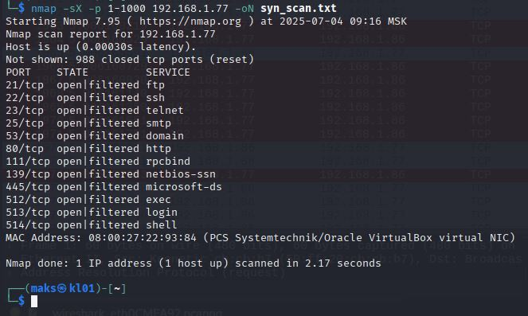
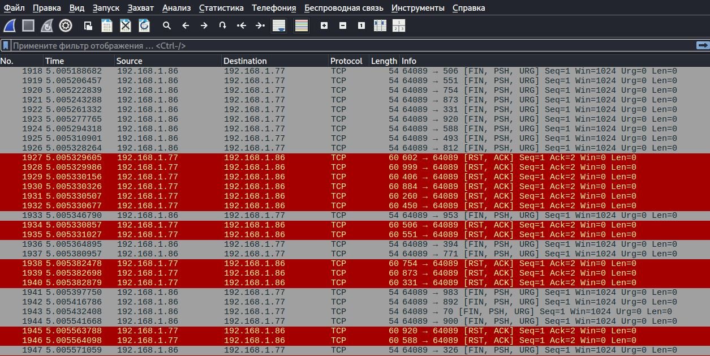
Отправляет пакет с флагами FIN+PSH+URG.  
Аналогично FIN: закрытый - RST,ASK, открытый - нет ответа.

```bash
# UDP-сканирование
nmap -sU -p 1-500 192.168.1.77 
```
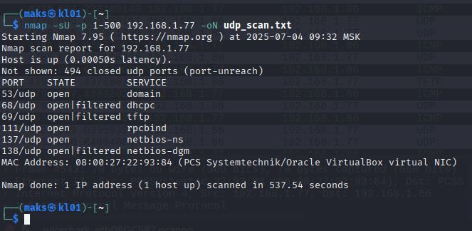
*Для удобства фильтрации ip.addr==192.168.1.86*
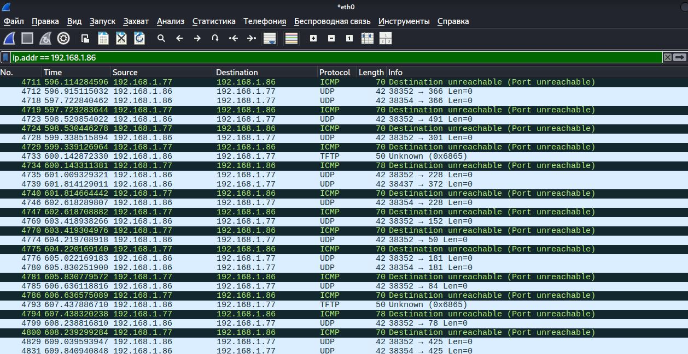
Отправляет UDP-пакет (без подтверждения).  
Если порт открыт - нет ответа или сервисный ответ, если закрыт - ICMP Port Unreachable.  

**Выводы**
* SYN (-sS) – самый быстрый и надежный, но может быть замечен фаерволом.

* FIN/Xmas (-sF, -sX) – скрытые, но не всегда работают (зависит от ОС).

* UDP (-sU) – медленное, но необходимо для поиска DNS, SNMP, DHCP и др.  

*Приведите ответ в свободной форме.*

