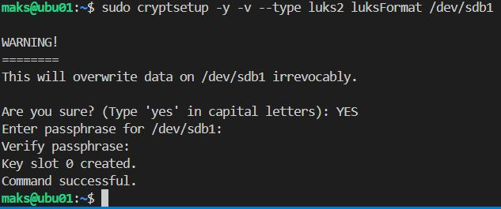
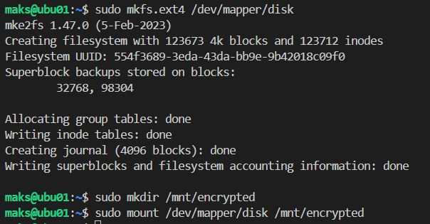

# Домашнее задание к занятию  «Защита хоста»

------

### Задание 1

1. Установите **eCryptfs**.
```bash
sudo apt update && sudo apt upgrade -y
sudo apt install ecryptfs-utils -y
```
2. Добавьте пользователя cryptouser.
```bash
sudo adduser cryptouser
sudo usermod -aG sudo cryptouser
```
3. Зашифруйте домашний каталог пользователя с помощью eCryptfs.
```bash
sudo ecryptfs-migrate-home -u cryptouser
```
Можно сразу создать пользователя с шифрованием:
```bash
sudo adduser --encrypt-home cryptouser
```
1. Войдём под пользователем cryptouser:
```bash
su - cryptouser
ls -la
```

```bash
mount | grep ecryptfs
```


```bash
sudo ls -la /home/cryptouser
```


Удаление:
```bash
# делаем резервную копию
sudo cp -rp /home/cryptouser /home/cryptouser.backup
# удалим домашний каталог
sudo rm -rf /home/cryptouser
# Удаляем пакет
sudo apt remove ecryptfs-utils libecryptfs1 
sudo rm -rf /home/.ecryptfs/
sudo rm -rf /home/cryptouser.1XLwpC6J/
# восстанавливаем папку 
sudo cp -rp /home/cryptouser.backup/ /home/cryptouser
```


видео 43 минута

*В качестве ответа  пришлите снимки экрана домашнего каталога пользователя с исходными и зашифрованными данными.*  

### Задание 2

1. Установите поддержку **LUKS**.
```bash
# sudo apt install gparted (если есть графика)
sudo apt update && sudo apt install cryptsetup -y
```

2. Создайте небольшой раздел, например, 100 Мб.
* Найдём свободный диск
```bash
sudo fdisk -l
sudo fdisk /dev/sdb
```
В fdisk
* n (новый раздел)
* p (primary)
* 1 (номер раздела)
* Enter
* Enter
* w (сохроняем)
Проверка
```bash
sudo fdisk -l /dev/sdb
```


3. Зашифруйте созданный раздел с помощью LUKS.
```bash
sudo cryptsetup -y -v --type luks2 luksFormat /dev/sdb1
# вводим YES большими буквами
# устанавливаем пароль
```


ОТкрываем зашиффрованный раздел
```bash
sudo cryptsetup open /dev/sdb1 disk  # disk - это имя
```
Теперь доступен виртуальный девайс **/dev/mapper/disk**
```bash
ls /dev/mapper/disk
```
Создадим файловую систему
```bash
sudo mkfs.ext4 /dev/mapper/disk
```
Монтирование раздела
```bash
sudo mkdir /mnt/encrypted
sudo mount /dev/mapper/disk /mnt/encrypted
```
Теперь можно использовать /mnt/encrypted как обычную папку — все данные будут шифроваться "на лету".


Проверка
```bash
sudo cryptsetup luksDump /dev/sdb1
```


Автомонтирование при загрузке:
**НО при запуске системы нужно вводить**
```bash
echo "disk /dev/sdb1 none luks" | sudo tee -a /etc/crypttab
echo "/dev/mapper/disk /mnt/encrypted ext4 defaults 0 2" | sudo tee -a /etc/fstab
```


Видео 47 мин

*В качестве ответа пришлите снимки экрана с поэтапным выполнением задания.*
Доп команды
* Закрыть раздел:
```bash
sudo umount /mnt/encrypted
sudo cryptsetup close disk
```
* Изменить пароль LUKS:
```bash
sudo cryptsetup luksChangeKey /dev/sdb1
```


## Дополнительные задания (со звёздочкой*)

Эти задания дополнительные, то есть не обязательные к выполнению, и никак не повлияют на получение вами зачёта по этому домашнему заданию. Вы можете их выполнить, если хотите глубже шире разобраться в материале

### Задание 3 *

Видео 26 минута
```bash
aa-enforce man  # включение
aa-complain man  # отключение
```

1. Установите **apparmor**.
2. Повторите эксперимент, указанный в лекции.
3. Отключите (удалите) apparmor.


*В качестве ответа пришлите снимки экрана с поэтапным выполнением задания.*


