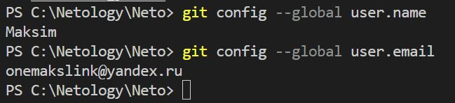
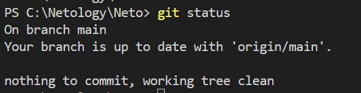
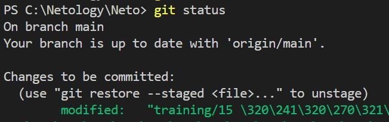
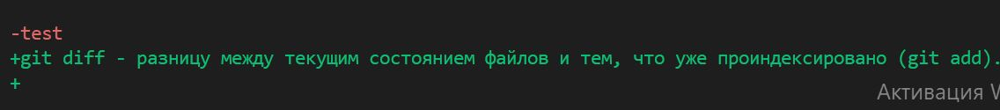
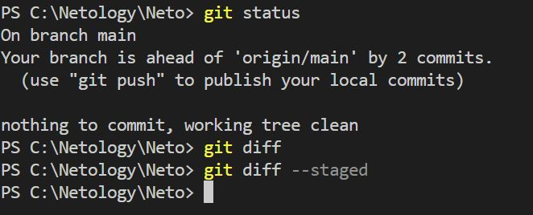

# Домашнее задание к занятию «Системы контроля версий»

### Боровиков Максим

------

## Задание 1. Создать и настроить репозиторий для дальнейшей работы на курсе

В рамках курса вы будете писать скрипты и создавать конфигурации для различных систем, которые необходимо сохранять для будущего использования. 
Сначала надо создать и настроить локальный репозиторий, после чего добавить удалённый репозиторий на GitHub.

### Создание репозитория и первого коммита

1. Зарегистрируйте аккаунт на [https://github.com/](https://github.com/). Если предпочитаете другое хранилище для репозитория, можно использовать его.

2. Создайте публичный репозиторий, который будете использовать дальше на протяжении всего курса, желательное с названием `devops-netology`.
    
3. Создайте [авторизационный токен](https://docs.github.com/en/authentication/keeping-your-account-and-data-secure/creating-a-personal-access-token) для клонирования репозитория.
4. Склонируйте репозиторий, используя протокол HTTPS (`git clone ...`).
  
5. Перейдите в каталог с клоном репозитория (`cd devops-netology`).

6. Произведите первоначальную настройку Git, указав своё настоящее имя, чтобы нам было проще общаться, и email (`git config --global user.name` и `git config --global user.email johndoe@example.com`). 
```
git config --global user.name
git config --global user.email
```


7. Выполните команду `git status` и запомните результат.


8. Отредактируйте файл `README.md` любым удобным способом, тем самым переведя файл в состояние `Modified`.


9. Ещё раз выполните `git status` и продолжайте проверять вывод этой команды после каждого следующего шага. 

10. Теперь посмотрите изменения в файле `README.md`, выполнив команды `git diff` и `git diff --staged`.

`git diff` - показывает разницу между текущим состоянием файлов и тем, что уже проиндексировано (git add).  

`git diff --staged` - показывает Изменения, которые уже добавлены в staging (git add), но ещё не закоммичены.  
 

11. Переведите файл в состояние `staged` (или, как говорят, просто добавьте файл в коммит) командой `git add README.md`.

12. И ещё раз выполните команды `git diff` и `git diff --staged`. Поиграйте с изменениями и этими командами, чтобы чётко понять, что и когда они отображают. 

13. Теперь можно сделать коммит `git commit -m 'First commit'`.

14. И ещё раз посмотреть выводы команд `git status`, `git diff` и `git diff --staged`.


### Создание файлов `.gitignore` и второго коммита

1. Создайте файл `.gitignore` (обратите внимание на точку в начале файла), проверьте его статус сразу после создания. 
2. Добавьте файл `.gitignore` в следующий коммит (`git add...`).
3. На одном из следующих блоков вы будете изучать `Terraform`, давайте сразу создадим соотвествующий каталог `terraform` и внутри этого каталога — файл `.gitignore` по примеру: https://github.com/github/gitignore/blob/master/Terraform.gitignore.  
4. В файле `README.md` опишите своими словами, какие файлы будут проигнорированы в будущем благодаря добавленному `.gitignore`.

`.terraform/` — игнорирует всё содержимое папки .terraform  
`*.tfstate` — игнорирует все файлы с расширением .tfstate  
`*.tfstate.*` — игнорирует файлы с любым значением вместо '*'  
`crash.log` - будут проигнорированы все файлы с именем crash.log  
`crash.*.log` - буду проигнорированы все файлы с именем crash.`любое значение`.log  
`*.tfvars` - будут проигнорированы все файлы с расширением tfvars  
`*.tfvars.json` - будут проигнорированы все файлы с расширением tfvars.json  
`override.tf override.tf.json` - будут проигнорированы все файлы с такими именами  
`*_override.tf *_override.tf.json` - будут проигнорированы все файлы с такими именами, вместо * любое значение  
`.terraform.tfstate.lock.info .terraformrc` - будут проигнорированы все файлы, заканчивающиеся на .terraform.tfstate.lock.info  
`terraform.rc` - будут проигнорирован файл terraform.rc  

5. Закоммитьте все новые и изменённые файлы. Комментарий к коммиту должен быть `Added gitignore`.

### Эксперимент с удалением и перемещением файлов (третий и четвёртый коммит)

1. Создайте файлы `will_be_deleted.txt` (с текстом `will_be_deleted`) и `will_be_moved.txt` (с текстом `will_be_moved`) и закоммите их с комментарием `Prepare to delete and move`.
1. В случае необходимости обратитесь к [официальной документации](https://git-scm.com/book/ru/v2/Основы-Git-Запись-изменений-в-репозиторий) — здесь подробно описано, как выполнить следующие шаги. 
1. Удалите файл `will_be_deleted.txt` с диска и из репозитория. 
1. Переименуйте (переместите) файл `will_be_moved.txt` на диске и в репозитории, чтобы он стал называться `has_been_moved.txt`.
1. Закоммитьте результат работы с комментарием `Moved and deleted`.

### Проверка изменения

1. В результате предыдущих шагов в репозитории должно быть как минимум пять коммитов (если вы сделали ещё промежуточные — нет проблем):
    * `Initial Commit` — созданный GitHub при инициализации репозитория. 
    * `First commit` — созданный после изменения файла `README.md`.
    * `Added gitignore` — после добавления `.gitignore`.
    * `Prepare to delete and move` — после добавления двух временных файлов.
    * `Moved and deleted` — после удаления и перемещения временных файлов. 
2. Проверьте это, используя комманду `git log`. Подробно о формате вывода этой команды мы поговорим на следующем занятии, но посмотреть, что она отображает, можно уже сейчас.

### Отправка изменений в репозиторий

Выполните команду `git push`, если Git запросит логин и пароль — введите ваши логин и пароль от GitHub. 

В качестве результата отправьте ссылку на репозиторий. 

----

### Правила приёма домашнего задания

В личном кабинете отправлена ссылка на ваш репозиторий.


### Критерии оценки

Зачёт:

* выполнены все задания;
* ответы даны в развёрнутой форме;
* приложены соответствующие скриншоты и файлы проекта;
* в выполненных заданиях нет противоречий и нарушения логики.

На доработку:

* задание выполнено частично или не выполнено вообще;
* в логике выполнения заданий есть противоречия и существенные недостатки. 
