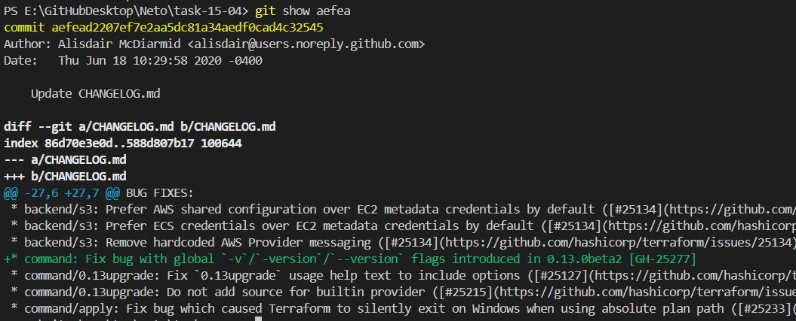
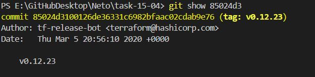
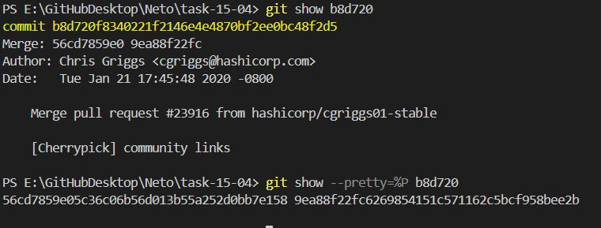
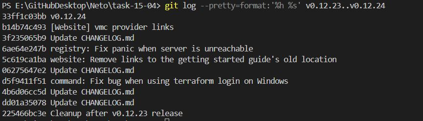
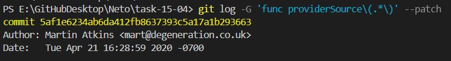
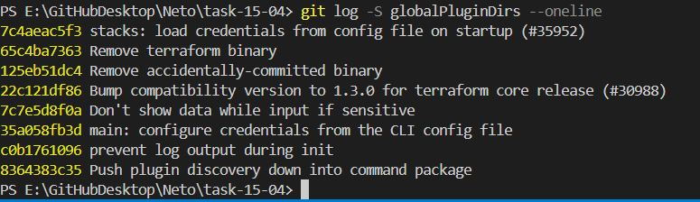
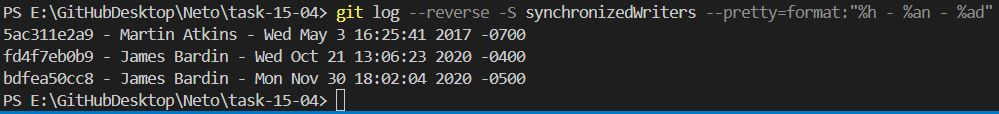

# Домашнее задание к занятию «Инструменты Git»

## Боровиков Максим

### Цель задания

В результате выполнения задания вы:

* научитесь работать с утилитами Git;
* потренируетесь решать типовые задачи, возникающие при работе в команде. 

### Инструкция к заданию

1. Склонируйте [репозиторий](https://github.com/hashicorp/terraform) с исходным кодом Terraform.
2. Создайте файл для ответов на задания в своём репозитории, после выполнения прикрепите ссылку на .md-файл с ответами в личном кабинете.
3. Любые вопросы по решению задач задавайте в чате учебной группы.

------

## Задание

В клонированном репозитории:

```bash
git clone https://github.com/hashicorp/terraform task-15-04  # склонировал в папку task-15-04
```

1. Найдите полный хеш и комментарий коммита, хеш которого начинается на `aefea`.
```bash
git show aefea
# or
git show aefea --pretty=fuller
```


2. Ответьте на вопросы.

* Какому тегу соответствует коммит `85024d3`?
```bash
git show 85024d3
# or
git show 85024d3 --pretty=fuller
```
tag: v0.12.23  


* Сколько родителей у коммита `b8d720`? Напишите их хеши.
```bash
git show b8d720
# or
git show --pretty=%P b8d720  # хэш полный
```
Merge: 56cd7859e0 9ea88f22fc


* Перечислите хеши и комментарии всех коммитов, которые были сделаны между тегами  v0.12.23 и v0.12.24.
```bash
git log --pretty=format:'%h %s' v0.12.23..v0.12.24
# or
git log --pretty=format:'%H %s' v0.12.23..v0.12.24  # полные хеши
```


* Найдите коммит, в котором была создана функция `func providerSource`, её определение в коде выглядит так: `func providerSource(...)` (вместо троеточия перечислены аргументы).
```bash
git log -G 'func providerSource\(.*\)' --patch
```
commit 5af1e6234ab6da412fb8637393c5a17a1b293663
Author: Martin Atkins <mart@degeneration.co.uk>
Date:   Tue Apr 21 16:28:59 2020 -0700


* Найдите все коммиты, в которых была изменена функция `globalPluginDirs`.
```bash
git log -S globalPluginDirs --oneline
```


* Кто автор функции `synchronizedWriters`? 
```bash
git log --reverse -S synchronizedWriters --pretty=format:"%h - %an - %ad"
```
5ac311e2a9 - Martin Atkins - Wed May 3 16:25:41 2017 -0700


