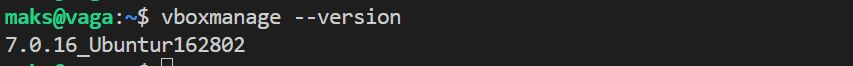
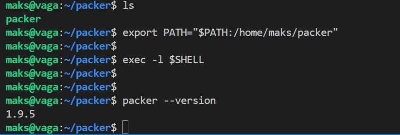
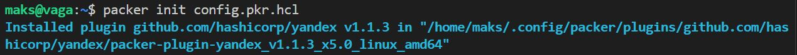
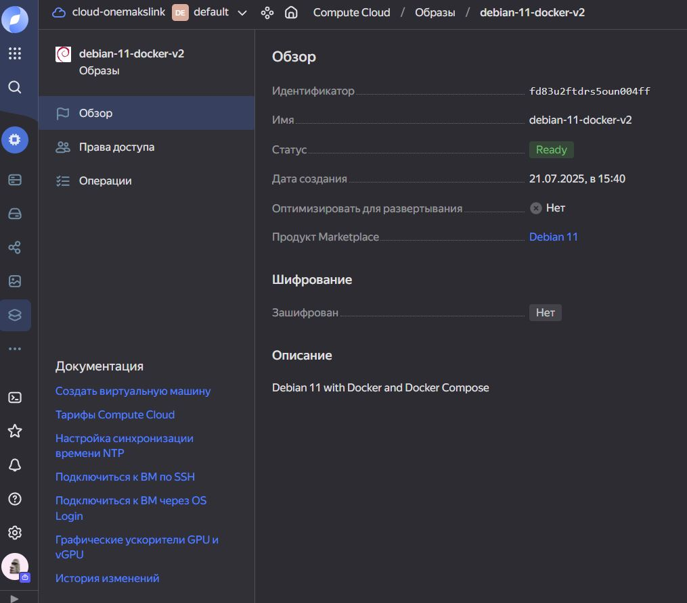
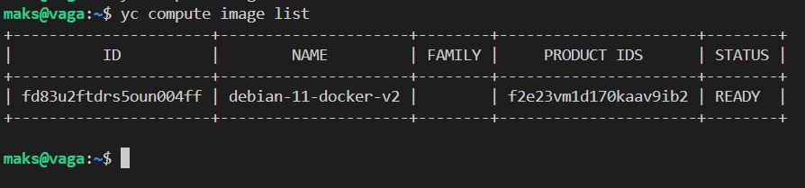
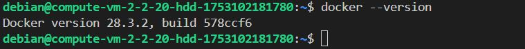

# Домашнее задание к занятию 2. «Применение принципов IaaC в работе с виртуальными машинами»

#### Это задание для самостоятельной отработки навыков и не предполагает обратной связи от преподавателя. Его выполнение не влияет на завершение модуля. Но мы рекомендуем его выполнить, чтобы закрепить полученные знания. Все вопросы, возникающие в процессе выполнения заданий, пишите в учебный чат или в раздел "Вопросы по заданиям" в личном кабинете.
---
## Важно

**Перед началом работы над заданием изучите [Инструкцию по экономии облачных ресурсов](https://github.com/netology-code/devops-materials/blob/master/cloudwork.MD).**
Перед отправкой работы на проверку удаляйте неиспользуемые ресурсы.
Это нужно, чтобы не расходовать средства, полученные в результате использования промокода.
Подробные рекомендации [здесь](https://github.com/netology-code/virt-homeworks/blob/virt-11/r/README.md).

---

### Цели задания

1. Научиться создвать виртуальные машины в Virtualbox с помощью Vagrant.
2. Научиться базовому использованию packer в yandex cloud.

   
## Задача 1
Установите на личный Linux-компьютер или учебную **локальную** ВМ с Linux следующие сервисы(желательно ОС ubuntu 20.04):

- [VirtualBox](https://www.virtualbox.org/),
- [Vagrant](https://github.com/netology-code/devops-materials), рекомендуем версию 2.3.4
- [Packer](https://github.com/netology-code/devops-materials/blob/master/README.md) версии 1.9.х + плагин от Яндекс Облако по [инструкции](https://cloud.yandex.ru/docs/tutorials/infrastructure-management/packer-quickstart)
- [уandex cloud cli](https://cloud.yandex.com/ru/docs/cli/quickstart) Так же инициализируйте профиль с помощью ```yc init``` .


Примечание: Облачная ВМ с Linux в данной задаче не подойдёт из-за ограничений облачного провайдера. У вас просто не установится virtualbox.

## Решение 1
- VirtualBox
```bash
sudo apt update && sudo apt upgrade -y
sudo apt install virtualbox
# по смотреть версию
vboxmanage --version
```


- Vagrant
```bash
wget https://hashicorp-releases.yandexcloud.net/vagrant/2.3.4/vagrant_2.3.4-1_amd64.deb
dpkg -i vagrant_2.3.4-1_amd64.deb
vagrant --version
```


- Packer
```bash
wget https://hashicorp-releases.yandexcloud.net/packer/1.9.5/packer_1.9.5_linux_amd64.zip
unzip packer_1.9.5_linux_amd64.zip -d ~/packer
# добавил в переменную
export PATH="$PATH:/home/maks/packer"
# перезапуск оболочки
exec -l $SHELL
# версия 
packer --version
```


- плагин от яндекс
```bash
nano config.pkr.hcl
```
```text
packer {
  required_plugins {
    yandex = {
      version = ">= 1.1.2"
      source  = "github.com/hashicorp/yandex"
    }
  }
}
```
Установите плагин
```bash
packer init config.pkr.hcl
```


- уandex cloud cli
```bash
curl -sSL https://storage.yandexcloud.net/yandexcloud-yc/install.sh | bash
# перезапуск оболочки
exec -l $SHELL
```
настройку профиля CLI
```bash
yc init
```
По тексту, перешёл по ссылке, скопировал OAuth token.  
Далее везде нажал `1`  

- Проверка настройки вашего профиля CLI:
```bash
yc config list
```

## Задача 2 (образ не доступен)

Пример команды скачивания 
```bash
# vagrant box add [options] <name, url, or path>
vagrant box add https://atlas.hashicorp.com/ARTACK/boxes/debian-jessie
```

1. Убедитесь, что у вас есть ssh ключ в ОС или создайте его с помощью команды ```ssh-keygen -t ed25519```
2. Создайте виртуальную машину Virtualbox с помощью Vagrant и  [Vagrantfile](https://github.com/netology-code/virtd-homeworks/blob/shvirtd-1/05-virt-02-iaac/src/Vagrantfile) в директории src.
3. Зайдите внутрь ВМ и убедитесь, что Docker установлен с помощью команды:
```
docker version && docker compose version
```

3. Если Vagrant выдаёт ошибку (блокировка трафика):
```
URL: ["https://vagrantcloud.com/bento/ubuntu-20.04"]     
Error: The requested URL returned error: 404:
```

Выполните следующие действия:

- Скачайте с [сайта](https://app.vagrantup.com/bento/boxes/ubuntu-20.04) файл-образ "bento/ubuntu-20.04".
- Добавьте его в список образов Vagrant: "vagrant box add bento/ubuntu-20.04 <путь к файлу>".

**Важно:**    
- Если ваша хостовая рабочая станция - это windows ОС, то у вас могут возникнуть проблемы со вложенной виртуализацией. Ознакомиться со cпособами решения можно [по ссылке](https://www.comss.ru/page.php?id=7726).

- Если вы устанавливали hyper-v или docker desktop, то  все равно может возникать ошибка:  
`Stderr: VBoxManage: error: AMD-V VT-X is not available (VERR_SVM_NO_SVM)`   
 Попробуйте в этом случае выполнить в Windows от администратора команду `bcdedit /set hypervisorlaunchtype off` и перезагрузиться.

- Если ваша рабочая станция в меру различных факторов не может запустить вложенную виртуализацию - допускается неполное выполнение(до ошибки запуска ВМ)

## Задача 3

1. Отредактируйте файл    [mydebian.json.pkr.hcl](https://github.com/netology-code/virtd-homeworks/blob/shvirtd-1/05-virt-02-iaac/src/mydebian.json.pkr.hcl)  или [mydebian.jsonl](https://github.com/netology-code/virtd-homeworks/blob/shvirtd-1/05-virt-02-iaac/src/mydebian.json) в директории src (packer умеет и в json, и в hcl форматы):
   - добавьте в скрипт установку docker. Возьмите скрипт установки для debian из  [документации](https://docs.docker.com/engine/install/debian/)  к docker, 
   - дополнительно установите в данном образе htop и tmux.(не забудьте про ключ автоматического подтверждения установки для apt)

Проверка на ошибки
```bash
packer validate 1.pkr.hcl
```
Сборка 
```bash
packer build 1.pkr.hcl
```

3. Найдите свой образ в web консоли yandex_cloud

4. Необязательное задание(*): найдите в документации yandex cloud как найти свой образ с помощью утилиты командной строки "yc cli".
```bash
yc compute image list
```

5. Создайте новую ВМ (минимальные параметры) в облаке, используя данный образ.
6. Подключитесь по ssh и убедитесь в наличии установленного docker.
```bash
docker --version
```


7. Удалите ВМ и образ.
8. **ВНИМАНИЕ!** Никогда не выкладываете oauth token от облака в git-репозиторий! Утечка секретного токена может привести к финансовым потерям. После выполнения задания обязательно удалите секретные данные из файла mydebian.json и mydebian.json.pkr.hcl. (замените содержимое токена на  "ххххх")
9. В качестве ответа на задание  загрузите результирующий файл в ваш ЛК.

**[Конфиг](1.pkr.hcl)**


**Что поможет**

Что помогло в решении:  
Отсюда берём фолдер и токен
```bash
yc config list
```
Отсюда берём подсетку:  
```bash
yc vpc subnet list
```

Общие команды:  
ВМ
```bash
yc compute image list
```
Сети
```bash
yc vpc network list
```
Подсети
```bash
yc vpc subnet list
```
Проверка наличия образа
```bash
yc compute image list --folder-id standard-images | grep debian-11
```
