# Домашнее задание к занятию 4 «Оркестрация группой Docker контейнеров на примере Docker Compose»

## Задача 1

Сценарий выполнения задачи:
- Установите docker и docker compose plugin на свою linux рабочую станцию или ВМ.
- Если dockerhub недоступен создайте файл /etc/docker/daemon.json с содержимым: ```{"registry-mirrors": ["https://mirror.gcr.io", "https://daocloud.io", "https://c.163.com/", "https://registry.docker-cn.com"]}```
- Зарегистрируйтесь и создайте публичный репозиторий  с именем "custom-nginx" на https://hub.docker.com (ТОЛЬКО ЕСЛИ У ВАС ЕСТЬ ДОСТУП);
- скачайте образ nginx:1.21.1;
```bash
docker pull nginx:1.21.1
```
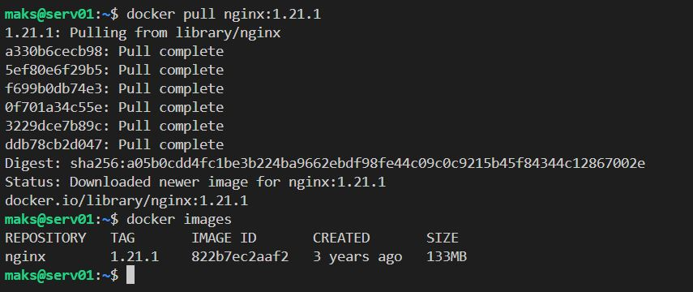
- Создайте Dockerfile и реализуйте в нем замену дефолтной индекс-страницы(/usr/share/nginx/html/index.html), на файл index.html с содержимым:
```
<html>
<head>
Hey, Netology
</head>
<body>
<h1>I will be DevOps Engineer!</h1>
</body>
</html>
```
Dockerfile   
```txt
FROM nginx:1.21.1

COPY index.html /usr/share/nginx/html/index.html
```
- Соберите и отправьте созданный образ в свой dockerhub-репозитории c tag 1.0.0 (ТОЛЬКО ЕСЛИ ЕСТЬ ДОСТУП). 
```bash
docker build -t nginx:1.0.0 .
docker images
```
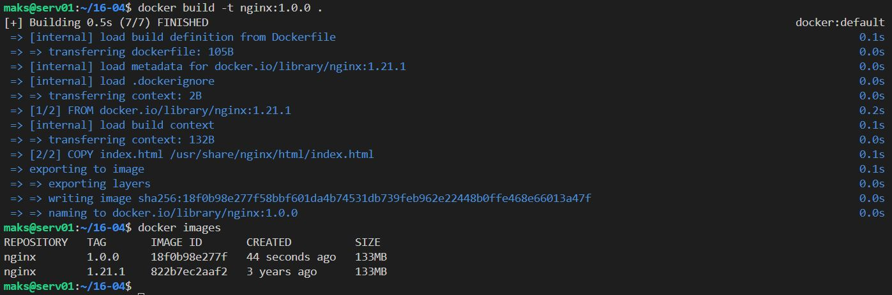

Вход в DockerHub (предварительно зарегестрировался)
```bash
docker login
# открываю страничку ввожу код
```
Необходимо создать поновой образ
```bash
docker tag nginx:1.0.0 alkohead/custom-nginx:1.0.0
# отправляем в репозиторий
docker push alkohead/custom-nginx:1.0.0
```

- Предоставьте ответ в виде ссылки на https://hub.docker.com/repository/docker/alkohead/custom-nginx/general .

## Задача 2
1. Запустите ваш образ custom-nginx:1.0.0 командой docker run в соответвии с требованиями:
- имя контейнера "ФИО-custom-nginx-t2"
- контейнер работает в фоне
- контейнер опубликован на порту хост системы 127.0.0.1:8080
```bash
docker run -d --name "Borovikov-custom-nginx-t2" -p 127.0.0.1:8080:80 alkohead/custom-nginx:1.0.0
```
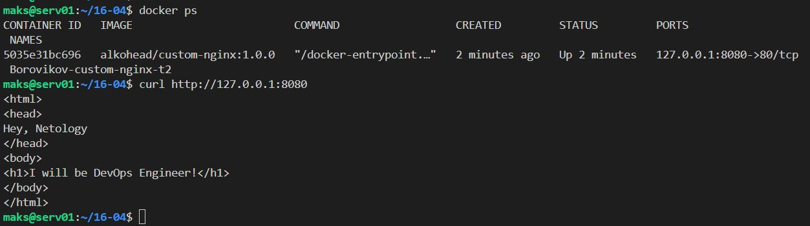

2. Не удаляя, переименуйте контейнер в "custom-nginx-t2"
```bash
docker rename Borovikov-custom-nginx-t2 custom-nginx-t2
```
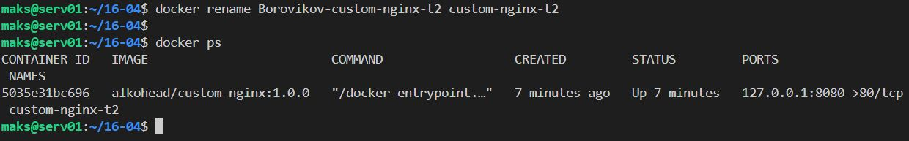

3. Выполните команду ```date +"%d-%m-%Y %T.%N %Z" ; sleep 0.150 ; docker ps ; ss -tlpn | grep 127.0.0.1:8080  ; docker logs custom-nginx-t2 -n1 ; docker exec -it custom-nginx-t2 base64 /usr/share/nginx/html/index.html```

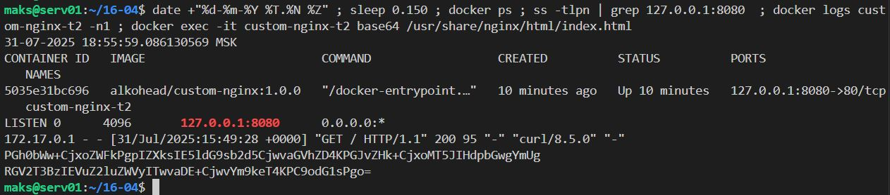

4. Убедитесь с помощью curl или веб браузера, что индекс-страница доступна. 

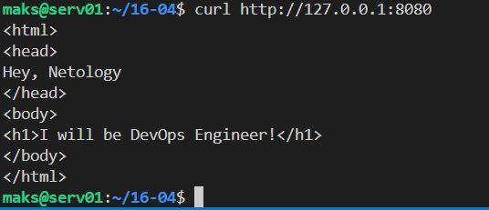

В качестве ответа приложите скриншоты консоли, где видно все введенные команды и их вывод.


## Задача 3
1. Воспользуйтесь docker help или google, чтобы узнать как подключиться к стандартному потоку ввода/вывода/ошибок контейнера "custom-nginx-t2".

```bash
docker attach custom-nginx-t2
```

2. Подключитесь к контейнеру и нажмите комбинацию Ctrl-C.

3. Выполните ```docker ps -a``` и объясните своими словами почему контейнер остановился.  

Нажатие Ctrl-C отправил `signal 2 (SIGINT)`, По умолчанию `SIGINT` остановит контейнер.

4. Перезапустите контейнер
```bash
docker start custom-nginx-t2
```

5. Зайдите в интерактивный терминал контейнера "custom-nginx-t2" с оболочкой bash.
```bash
docker exec -it custom-nginx-t2 bash
```

6. Установите любимый текстовый редактор(vim, nano итд) с помощью apt-get.

Предварительно выдвала ошибку о не доступности серверов при `apt-get update`   
Для исправления ошибки было сделано:

```bash
echo "deb http://archive.debian.org/debian buster main contrib non-free" > /etc/apt/sources.list
# обновление списка кэша пакетов
apt-get update
apt-get install nano
``` 
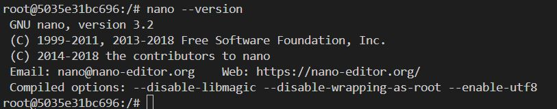

7. Отредактируйте файл "/etc/nginx/conf.d/default.conf", заменив порт "listen 80" на "listen 81".


8. Запомните(!) и выполните команду ```nginx -s reload```, а затем внутри контейнера ```curl http://127.0.0.1:80 ; curl http://127.0.0.1:81```.  

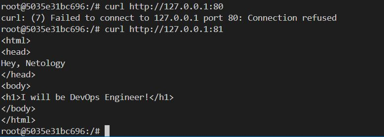

9. Выйдите из контейнера, набрав в консоли  ```exit``` или Ctrl-D.

10. Проверьте вывод команд: ```ss -tlpn | grep 127.0.0.1:8080``` , ```docker port custom-nginx-t2```, ```curl http://127.0.0.1:8080```. Кратко объясните суть возникшей проблемы.  

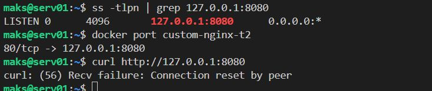

Внутри контейнера мы перенастроили NGINX слушать порт 81. А в настройках докер осталось что докер пересылает со внешнего порта 8080 на порт контейнера 80

11. * Это дополнительное, необязательное задание. Попробуйте самостоятельно исправить конфигурацию контейнера, используя доступные источники в интернете. Не изменяйте конфигурацию nginx и не удаляйте контейнер. Останавливать контейнер можно. [пример источника](https://www.baeldung.com/linux/assign-port-docker-container)

Docker не позволяет напрямую изменить `-p` у существующего контейнера, по этому остановим контейнер и создать новый образ из текущего состояния контейнера, запустить новый контейнер с новыми параметрами портов
```bash
# остановка контейнера
docker stop custom-nginx-t2
# cохраняем текущий контейнера в новый образ (без удаления старого)
docker commit custom-nginx-t2 custom-nginx-t2-port81
# запускаем новый контейнер с пробросом порта 8080 - 81
docker run -d --name custom-nginx-t2-port81 -p 127.0.0.1:8080:81 custom-nginx-t2-port81
curl http://127.0.0.1:8080
```
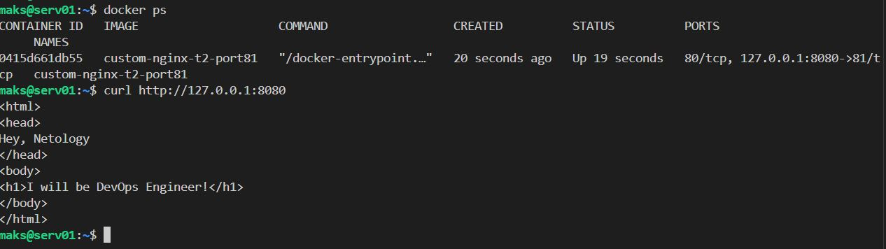

12. Удалите запущенный контейнер "custom-nginx-t2", не останавливая его.(воспользуйтесь --help или google)

```bash
docker rm -f custom-nginx-t2
```
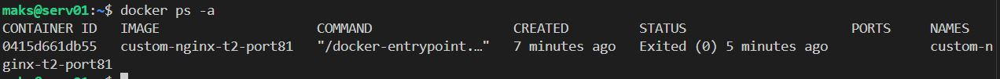

В качестве ответа приложите скриншоты консоли, где видно все введенные команды и их вывод.


## Задача 4


- Запустите первый контейнер из образа ***centos*** c любым тегом в фоновом режиме, подключив папку  текущий рабочий каталог ```$(pwd)``` на хостовой машине в ```/data``` контейнера, используя ключ -v.

```bash
docker run -d -v "$(pwd):/data" --name centos-container centos:7 tail -f /dev/null
docker ps
```
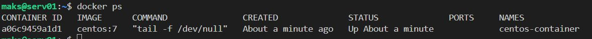

- Запустите второй контейнер из образа ***debian*** в фоновом режиме, подключив текущий рабочий каталог ```$(pwd)``` в ```/data``` контейнера. 

```bash
docker run -d -v "$(pwd):/data" --name debian-container debian:12 tail -f /dev/null
docker ps
```
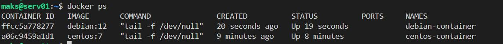

- Подключитесь к первому контейнеру с помощью ```docker exec``` и создайте текстовый файл любого содержания в ```/data```.

```bash
docker exec -it centos-container bash
echo 111 > /data/1.txt
```
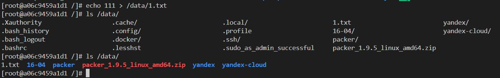

- Добавьте ещё один файл в текущий каталог ```$(pwd)``` на хостовой машине.

```bash
echo 222 > 2.txt
```
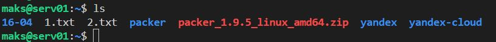

- Подключитесь во второй контейнер и отобразите листинг и содержание файлов в ```/data``` контейнера.

```bash
docker exec -it debian-container bash
ls /data/
```
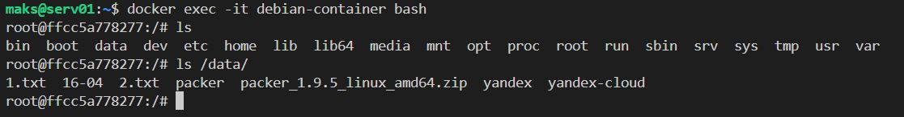

В качестве ответа приложите скриншоты консоли, где видно все введенные команды и их вывод.


## Задача 5

1. Создайте отдельную директорию(например /tmp/netology/docker/task5) и 2 файла внутри него.
"compose.yaml" с содержимым:
```
version: "3"
services:
  portainer:
    network_mode: host
    image: portainer/portainer-ce:latest
    volumes:
      - /var/run/docker.sock:/var/run/docker.sock
```
"docker-compose.yaml" с содержимым:
```
version: "3"
services:
  registry:
    image: registry:2

    ports:
    - "5000:5000"
```

И выполните команду "docker compose up -d". Какой из файлов был запущен и почему? (подсказка: https://docs.docker.com/compose/compose-application-model/#the-compose-file )

Был запущен `compose.yaml` т.к. он является предпочтительным 

2. Отредактируйте файл compose.yaml так, чтобы были запущенны оба файла. (подсказка: https://docs.docker.com/compose/compose-file/14-include/)

Было добавлена строчка 
```txt
include:
  - docker-compose.yaml
```
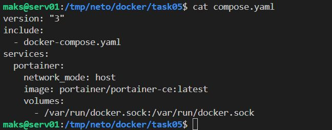

НО была найдена такая команда:
```bash
docker compose -f compose.yaml -f docker-compose.yaml up -d

```
**НО есть ньюанс последний файл имеет приоритет в конфликтующих настройках**

```bash
docker ps
```
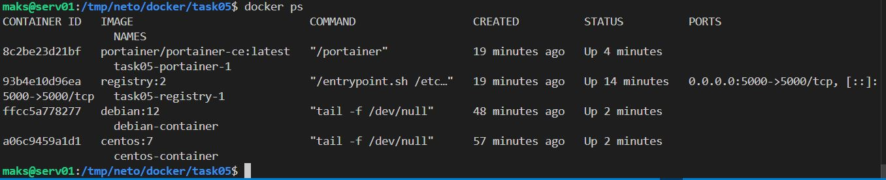

3. Выполните в консоли вашей хостовой ОС необходимые команды чтобы залить образ custom-nginx как custom-nginx:latest в запущенное вами, локальное registry. Дополнительная документация: https://distribution.github.io/distribution/about/deploying/

```bash
docker images
# переименовал образ
docker tag alkohead/custom-nginx:1.0.0 localhost:5000/custom-nginx:latest
# Загрузка в локальный Registry
docker push localhost:5000/custom-nginx:latest
# проверка
curl http://localhost:5000/v2/_catalog
```
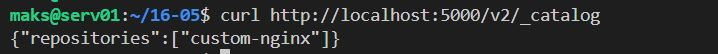

4. Откройте страницу "http://127.0.0.1:9000" и произведите начальную настройку portainer.(логин и пароль адмнистратора)

Подготовка к запуску.  
Были внесены следующие изменения в `compose.yaml`
```txt
include:
  - docker-compose.yaml
services:
  portainer:
    ports:
      - "9000:9000"
    image: portainer/portainer-ce:latest
    volumes:
      - /var/run/docker.sock:/var/run/docker.sock
```
```bash
# перечитать конфиг
docker compose up -d --force-recreate
```
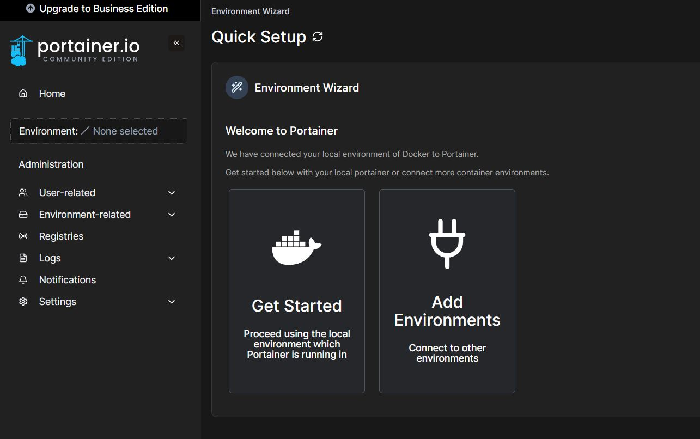


5. Откройте страницу "http://127.0.0.1:9000/#!/home", выберите ваше local  окружение. Перейдите на вкладку "stacks" и в "web editor" задеплойте следующий компоуз:

```
version: '3'

services:
  nginx:
    image: 127.0.0.1:5000/custom-nginx
    ports:
      - "9090:80"
```
Решение:
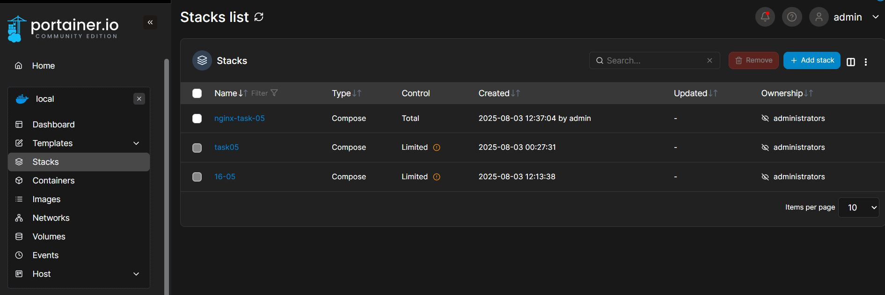

6. Перейдите на страницу "http://127.0.0.1:9000/#!/2/docker/containers", выберите контейнер с nginx и нажмите на кнопку "inspect". В представлении <> Tree разверните поле "Config" и сделайте скриншот от поля "AppArmorProfile" до "Driver".

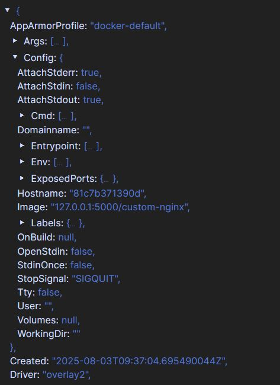

7. Удалите любой из манифестов компоуза(например compose.yaml).  Выполните команду "docker compose up -d". Прочитайте warning, объясните суть предупреждения и выполните предложенное действие. Погасите compose-проект ОДНОЙ(обязательно!!) командой.

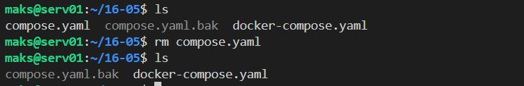
```bash
docker compose up -d
```
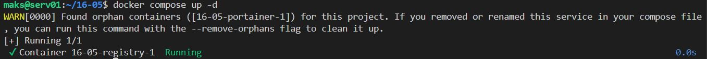

Ругается на присутсвие контейнера и отстусвие описания `compose` контейнера `16-05-portainer-1`

```bash
docker compose up -d --remove-orphans
```
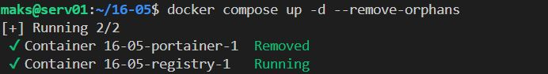

Погасите compose-проект ОДНОЙ(обязательно!!) командой
```bash
docker compose down
docker compose ps
```
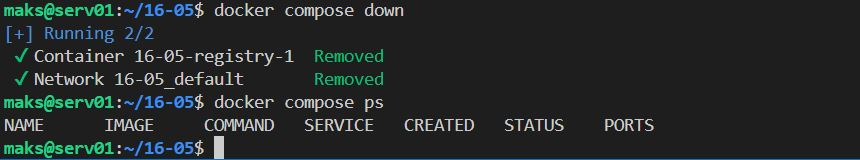

В качестве ответа приложите скриншоты консоли, где видно все введенные команды и их вывод, файл compose.yaml , скриншот portainer c задеплоенным компоузом.

---

### Правила приема

Домашнее задание выполните в файле readme.md в GitHub-репозитории. В личном кабинете отправьте на проверку ссылку на .md-файл в вашем репозитории.


