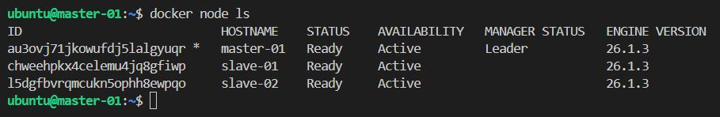
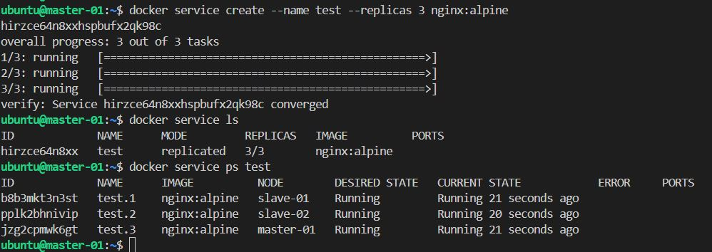

# Домашнее задание к занятию 6. «Оркестрация кластером Docker контейнеров на примере Docker Swarm»

#### Это задание для самостоятельной отработки навыков и не предполагает обратной связи от преподавателя. Его выполнение не влияет на завершение модуля. Но мы рекомендуем его выполнить, чтобы закрепить полученные знания. Все вопросы, возникающие в процессе выполнения заданий, пишите в учебный чат или в раздел "Вопросы по заданиям" в личном кабинете.

---

## Важно

**Перед началом работы над заданием изучите [Инструкцию по экономии облачных ресурсов](https://github.com/netology-code/devops-materials/blob/master/cloudwork.MD).**
Перед отправкой работы на проверку удаляйте неиспользуемые ресурсы.
Это нужно, чтобы не расходовать средства, полученные в результате использования промокода.
Подробные рекомендации [здесь](https://github.com/netology-code/virt-homeworks/blob/virt-11/r/README.md).

[Ссылки для установки открытого ПО](https://github.com/netology-code/devops-materials/blob/master/README.md).

---

## Задача 1

Создайте ваш первый Docker Swarm-кластер в Яндекс Облаке.
Документация swarm: https://docs.docker.com/engine/reference/commandline/swarm_init/
1. Создайте 3 облачные виртуальные машины в одной сети.
2. Установите docker на каждую ВМ.
3. Создайте swarm-кластер из 1 мастера и 2-х рабочих нод.

Конфиграционные файлы `terraform` находятся в папке `code`  
Конфигурационные файлы `ansible` находятся по пути `code/ansi`

```bash
# установка docker
ansible-playbook -i inventory/docker-hosts.ini simple-docker.yml
```
```bash
docker swarm init --advertise-addr 10.0.1.3
docker swarm join-token -q worker # токен для подключения worker
docker swarm join-token -q manager # токен для подключения manager
# подключение
docker swarm join --token SWMTKN-1-585zmmoeqv4idbf1ghplqxr7dr3egv23fj61u00wih34g9liif-7983ww5cquwygrhjktih65crt 10.0.1.3:2377
```


4. Проверьте список нод командой:
```
docker node ls
```


```bash
# Создать тестовый сервис
docker service create --name test --replicas 3 nginx:alpine

# Проверка сервиса
docker service ls
docker service ps test
```


## Задача 2 (*) (необязательное задание *).
1.  Задеплойте ваш python-fork из предыдущего ДЗ(05-virt-04-docker-in-practice) в получившийся кластер.
2. Удалите стенд.


## Задача 3 (*)

Если вы уже знакомы с terraform и ansible  - повторите практику по примеру лекции "Развертывание стека микросервисов в Docker Swarm кластере". Попробуйте улучшить пайплайн, запустив ansible через terraform с динамическим инвентарем.

Проверьте доступность grafana.

Иначе вернитесь к выполнению задания после прохождения модулей "terraform" и "ansible".

