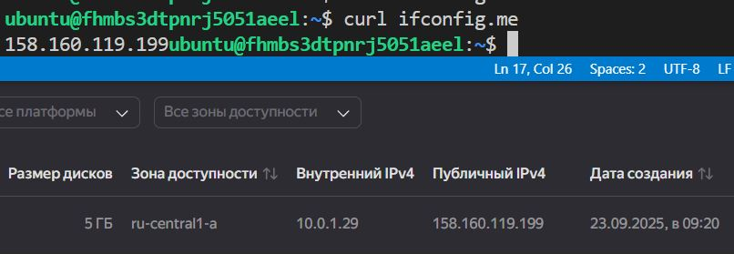
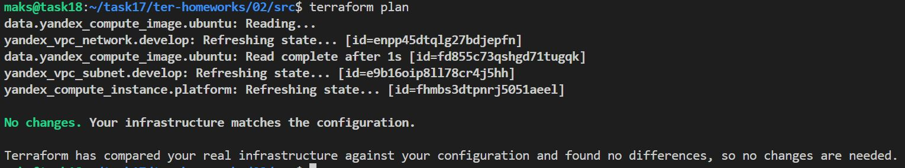
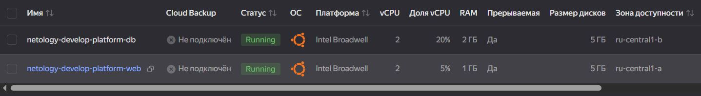
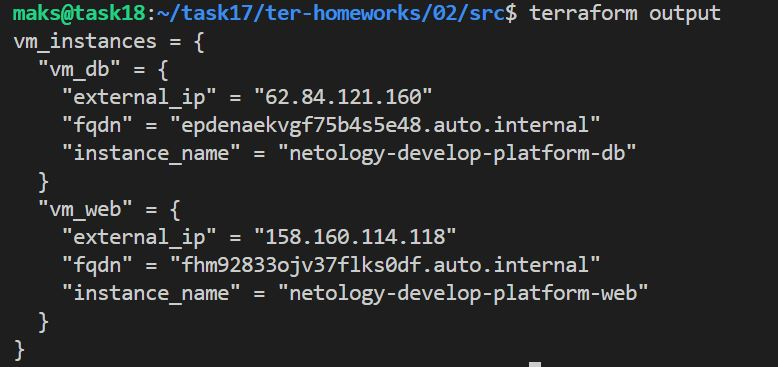
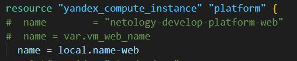
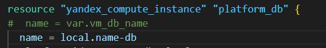
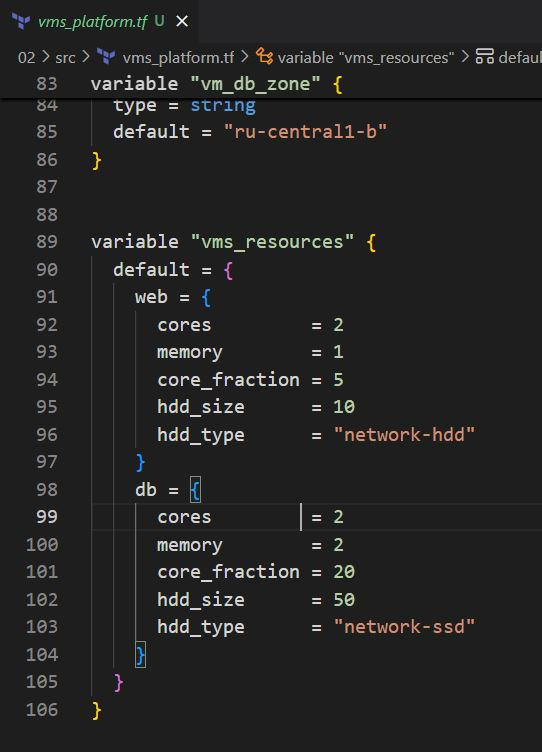
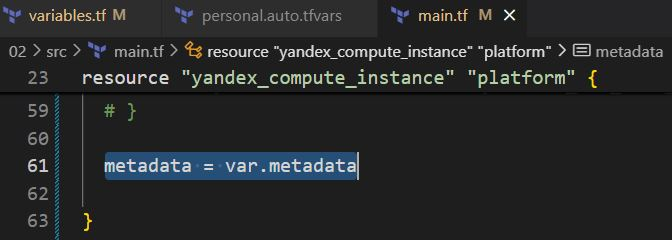
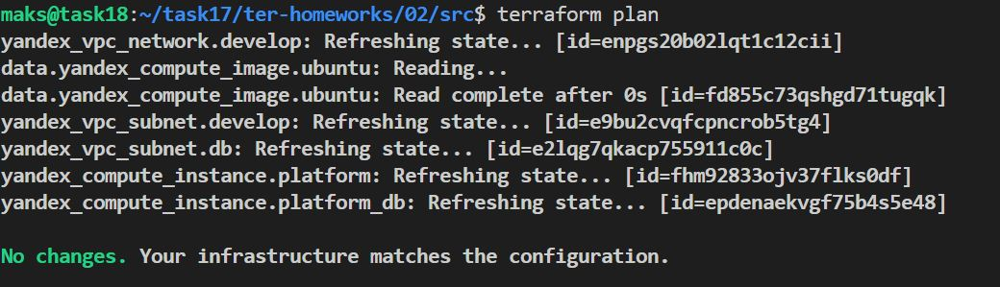

# Домашнее задание к занятию «Основы Terraform. Yandex Cloud»

### Цели задания

1. Создать свои ресурсы в облаке Yandex Cloud с помощью Terraform.
2. Освоить работу с переменными Terraform.


### Чек-лист готовности к домашнему заданию

1. Зарегистрирован аккаунт в Yandex Cloud. Использован промокод на грант.

2. Установлен инструмент Yandex CLI.
```bash
curl -sSL https://storage.yandexcloud.net/yandexcloud-yc/install.sh | bash
# перезапуск оболочки
exec -l $SHELL
yc init  # Настройка профиля
```

3. Исходный код для выполнения задания расположен в директории [**02/src**](https://github.com/netology-code/ter-homeworks/tree/main/02/src).


### Задание 0

1. Ознакомьтесь с [документацией к security-groups в Yandex Cloud](https://cloud.yandex.ru/docs/vpc/concepts/security-groups?from=int-console-help-center-or-nav). 
Этот функционал понадобится к следующей лекции.

------
### Внимание!! Обязательно предоставляем на проверку получившийся код в виде ссылки на ваш github-репозиторий!
------

### Задание 1
В качестве ответа всегда полностью прикладывайте ваш terraform-код в git.
Убедитесь что ваша версия **Terraform** ~>1.8.4

1. Изучите проект. В файле variables.tf объявлены переменные для Yandex provider.
2. Создайте сервисный аккаунт и ключ. [service_account_key_file](https://terraform-provider.yandexcloud.net).
4. Сгенерируйте новый или используйте свой текущий ssh-ключ. Запишите его открытую(public) часть в переменную **vms_ssh_public_root_key**.
```bash
ssh-keygen -t ed25519 -C "My key"
```

5. Инициализируйте проект, выполните код. Исправьте намеренно допущенные синтаксические ошибки. Ищите внимательно, посимвольно. Ответьте, в чём заключается их суть.

`platform_id = "standart-v4"` - может быть только v1, v2 и v3  
Минимум `2 Cores`  
`standart` - `t` на `d` `standard`

[ССЫЛКА на мин и макс конфигурация](https://yandex.cloud/ru/docs/compute/concepts/performance-levels "https://yandex.cloud/ru/docs/compute/concepts/performance-levels")

6. Подключитесь к консоли ВМ через ssh и выполните команду ``` curl ifconfig.me```. (если переносил ключик не забываем про права `chmod 600 ~/.ssh/id_ed25519`)
Примечание: К OS ubuntu "out of a box, те из коробки" необходимо подключаться под пользователем ubuntu: ```"ssh ubuntu@vm_ip_address"```. Предварительно убедитесь, что ваш ключ добавлен в ssh-агент: ```eval $(ssh-agent) && ssh-add``` Вы познакомитесь с тем как при создании ВМ создать своего пользователя в блоке metadata в следующей лекции.;



8. Ответьте, как в процессе обучения могут пригодиться параметры ```preemptible = true``` и ```core_fraction=5``` в параметрах ВМ.

`core_fraction= 5` - процент производительности ядра 5% (финансовая экономия)

`preemptible = true` - прерываемая ВМ, работает не более 24 часов


### Задание 2

1. Замените все хардкод-**значения** для ресурсов **yandex_compute_image** и **yandex_compute_instance** на **отдельные** переменные. К названиям переменных ВМ добавьте в начало префикс **vm_web_** .  Пример: **vm_web_name**.
2. Объявите нужные переменные в файле variables.tf, обязательно указывайте тип переменной. Заполните их **default** прежними значениями из main.tf. 
3. Проверьте terraform plan. Изменений быть не должно.  
`main.tf`
```txt
resource "yandex_vpc_network" "develop" {
  name = var.vpc_name
}
resource "yandex_vpc_subnet" "develop" {
  name           = var.vpc_name
  zone           = var.default_zone
  network_id     = yandex_vpc_network.develop.id
  v4_cidr_blocks = var.default_cidr
}

data "yandex_compute_image" "ubuntu" {
#  family = "ubuntu-2004-lts"
  family = var.vm_web_family
}

resource "yandex_compute_instance" "platform" {
#  name        = "netology-develop-platform-web"
  name = var.vm_web_name
#  platform_id = "standard-v1"
  platform_id = var.vm_web_standart
  resources {
  #  cores         = 2
    cores = var.vm_web_cores
  #  memory        = 1
    memory  = var.vm_web_memory
  #  core_fraction = 5
    core_fraction = var.vm_web_fraction
  }
  boot_disk {
    initialize_params {
      image_id = data.yandex_compute_image.ubuntu.image_id
    }
  }
  scheduling_policy {
  #  preemptible = true
    preemptible = var.vm_web_preemptible
  }
  network_interface {
    subnet_id = yandex_vpc_subnet.develop.id
  #  nat       = true
    nat = var.vm_web_nat
  }

  metadata = {
  #  serial-port-enable = 1
    serial-port-enable = var.vm_web_serial
    ssh-keys           = "ubuntu:${var.vms_ssh_root_key}"
  }

}
```
`variables.tf`
```txt
###cloud vars
variable "vm_web_family" {
  type = string
  default = "ubuntu-2004-lts"
}

variable "vm_web_name" {
  type = string
  default = "netology-develop-platform-web"
}

variable "vm_web_standart" {
  type = string
  default = "standard-v1"
}

variable "vm_web_cores" {
  type = number
  default = 2
}

variable "vm_web_memory" {
  type = number
  default = 1  
}

variable "vm_web_fraction" {
  type = number
  default = 5
}


variable "vm_web_preemptible" {
  type = bool
  default = true
}

variable "vm_web_nat" {
  type = bool
  default = true  
}

variable "vm_web_serial" {
  type = number
  default = 1
}


variable "cloud_id" {
  type        = string
  description = "https://cloud.yandex.ru/docs/resource-manager/operations/cloud/get-id"
}

variable "folder_id" {
  type        = string
  description = "https://cloud.yandex.ru/docs/resource-manager/operations/folder/get-id"
}

variable "default_zone" {
  type        = string
  default     = "ru-central1-a"
  description = "https://cloud.yandex.ru/docs/overview/concepts/geo-scope"
}
variable "default_cidr" {
  type        = list(string)
  default     = ["10.0.1.0/24"]
  description = "https://cloud.yandex.ru/docs/vpc/operations/subnet-create"
}

variable "vpc_name" {
  type        = string
  default     = "develop"
  description = "VPC network & subnet name"
}


###ssh vars

variable "vms_ssh_root_key" {
  type        = string
  default     = "<your_ssh_ed25519_key>"
  description = "ssh-keygen -t ed25519"
}
```


### Задание 3

1. Создайте в корне проекта файл 'vms_platform.tf' . Перенесите в него все переменные первой ВМ.
2. Скопируйте блок ресурса и создайте с его помощью вторую ВМ в файле main.tf: **"netology-develop-platform-db"** ,  ```cores  = 2, memory = 2, core_fraction = 20```. Объявите её переменные с префиксом **vm_db_** в том же файле ('vms_platform.tf').  ВМ должна работать в зоне "ru-central1-b"
3. Примените изменения.

[Конфиг main.tf](code/task_03_main.tf)  
[Конфиг variables.tf](code/task_03_variables.tf)  
[Конфиг vms_platform.tf](code/task_3_vms_platform.tf)  



### Задание 4

1. Объявите в файле outputs.tf **один** output , содержащий: instance_name, external_ip, fqdn для каждой из ВМ в удобном лично для вас формате.(без хардкода!!!)
2. Примените изменения.

[Код outputs.tf](code/task_04_outputs.tf)



В качестве решения приложите вывод значений ip-адресов команды ```terraform output```.


### Задание 5

1. В файле locals.tf опишите в **одном** local-блоке имя каждой ВМ, используйте интерполяцию ${..} с НЕСКОЛЬКИМИ переменными по примеру из лекции.
2. Замените переменные внутри ресурса ВМ на созданные вами local-переменные.
3. Примените изменения.

locals.tf
```txt
locals {
  # name-web = "netology-develop-platform-web"
  name-web = "netology-${var.vpc_name}-${var.loc_plat}-web"

  # name-db = "netology-develop-platform-db"
  name-db = "netology-${var.vpc_name}-${var.loc_plat}-db"
}
```
varibles.tf
```txt
variable "loc_plat" {
  type = string
  default = "platform"
}
```




### Задание 6

1. Вместо использования трёх переменных  ".._cores",".._memory",".._core_fraction" в блоке  resources {...}, объедините их в единую map-переменную **vms_resources** и  внутри неё конфиги обеих ВМ в виде вложенного map(object).  
   ```
   пример из terraform.tfvars:
   vms_resources = {
     web={
       cores=2
       memory=2
       core_fraction=5
       hdd_size=10
       hdd_type="network-hdd"
       ...
     },
     db= {
       cores=2
       memory=4
       core_fraction=20
       hdd_size=10
       hdd_type="network-ssd"
       ...
     }
   }
   ```
   пример `vms_platform.tf`



`main.tf`
```txt
resource "yandex_compute_instance" "platform" {
#  name        = "netology-develop-platform-web"
#  name = var.vm_web_name
  name = local.name-web
#  platform_id = "standard-v1"
  platform_id = var.vm_web_standart
  resources {
  #  cores         = 2
  #  cores = var.vm_web_cores
    cores = var.vms_resources.web.cores
  #  memory        = 1
  #  memory  = var.vm_web_memory
    memory = var.vms_resources.web.memory
  #  core_fraction = 5
  #  core_fraction = var.vm_web_fraction
    core_fraction = var.vms_resources.web.core_fraction
  }
```
```txt
resource "yandex_compute_instance" "platform_db" {
#  name = var.vm_db_name
  name = local.name-db
  platform_id = var.vm_db_platform
  zone = var.vm_db_zone
  resources {
  #  cores         = var.vm_db_cores
    cores = var.vms_resources.db.cores
  #  memory        = var.vm_db_memory
    memory = var.vms_resources.db.memory
  #  core_fraction = var.vm_db_fraction
    core_fraction = var.vms_resources.db.core_fraction
  }
```
3. Создайте и используйте отдельную map(object) переменную для блока metadata, она должна быть общая для всех ваших ВМ.
   ```
   пример из terraform.tfvars:
   metadata = {
     serial-port-enable = 1
     ssh-keys           = "ubuntu:ssh-ed25519 AAAAC..."
   }
   ```  

`Решение:`

- в `main.tf` добавил `metadata = var.metadata` в **каждый блок**
 с VM


- изменения `variables.tf`
```txt
variable "metadata" {
  type = object({
    serial-port-enable = number
    ssh-keys = string
  })
  default = {
    serial-port-enable = "1"
    ssh-keys           = "ubuntu:<your_ssh_ed25519_key>"
  }
}
```

- изменения в `personal.auto.tfvars`

```txt
metadata = {
  serial-port-enable = 1
  ssh-keys = "ubuntu:ssh-ed25519 AAAAC ...."
}
```

5. Найдите и закоментируйте все, более не используемые переменные проекта.
6. Проверьте terraform plan. Изменений быть не должно.

Изменений нету:



------

## Дополнительное задание (со звёздочкой*)

**Настоятельно рекомендуем выполнять все задания со звёздочкой.**   
Они помогут глубже разобраться в материале. Задания со звёздочкой дополнительные, не обязательные к выполнению и никак не повлияют на получение вами зачёта по этому домашнему заданию. 


------
### Задание 7*

Изучите содержимое файла console.tf. Откройте terraform console, выполните следующие задания: 

1. Напишите, какой командой можно отобразить **второй** элемент списка test_list.
2. Найдите длину списка test_list с помощью функции length(<имя переменной>).
3. Напишите, какой командой можно отобразить значение ключа admin из map test_map.
4. Напишите interpolation-выражение, результатом которого будет: "John is admin for production server based on OS ubuntu-20-04 with X vcpu, Y ram and Z virtual disks", используйте данные из переменных test_list, test_map, servers и функцию length() для подстановки значений.

**Примечание**: если не догадаетесь как вычленить слово "admin", погуглите: "terraform get keys of map"

В качестве решения предоставьте необходимые команды и их вывод.

------

### Задание 8*
1. Напишите и проверьте переменную test и полное описание ее type в соответствии со значением из terraform.tfvars:
```
test = [
  {
    "dev1" = [
      "ssh -o 'StrictHostKeyChecking=no' ubuntu@62.84.124.117",
      "10.0.1.7",
    ]
  },
  {
    "dev2" = [
      "ssh -o 'StrictHostKeyChecking=no' ubuntu@84.252.140.88",
      "10.0.2.29",
    ]
  },
  {
    "prod1" = [
      "ssh -o 'StrictHostKeyChecking=no' ubuntu@51.250.2.101",
      "10.0.1.30",
    ]
  },
]
```
2. Напишите выражение в terraform console, которое позволит вычленить строку "ssh -o 'StrictHostKeyChecking=no' ubuntu@62.84.124.117" из этой переменной.
------

------

### Задание 9*

Используя инструкцию https://cloud.yandex.ru/ru/docs/vpc/operations/create-nat-gateway#tf_1, настройте для ваших ВМ nat_gateway. Для проверки уберите внешний IP адрес (nat=false) у ваших ВМ и проверьте доступ в интернет с ВМ, подключившись к ней через serial console. Для подключения предварительно через ssh измените пароль пользователя: ```sudo passwd ubuntu```

### Правила приёма работыДля подключения предварительно через ssh измените пароль пользователя: sudo passwd ubuntu
В качестве результата прикрепите ссылку на MD файл с описанием выполненой работы в вашем репозитории. Так же в репозитории должен присутсвовать ваш финальный код проекта.

**Важно. Удалите все созданные ресурсы**.


### Критерии оценки

Зачёт ставится, если:

* выполнены все задания,
* ответы даны в развёрнутой форме,
* приложены соответствующие скриншоты и файлы проекта,
* в выполненных заданиях нет противоречий и нарушения логики.

На доработку работу отправят, если:

* задание выполнено частично или не выполнено вообще,
* в логике выполнения заданий есть противоречия и существенные недостатки. 

