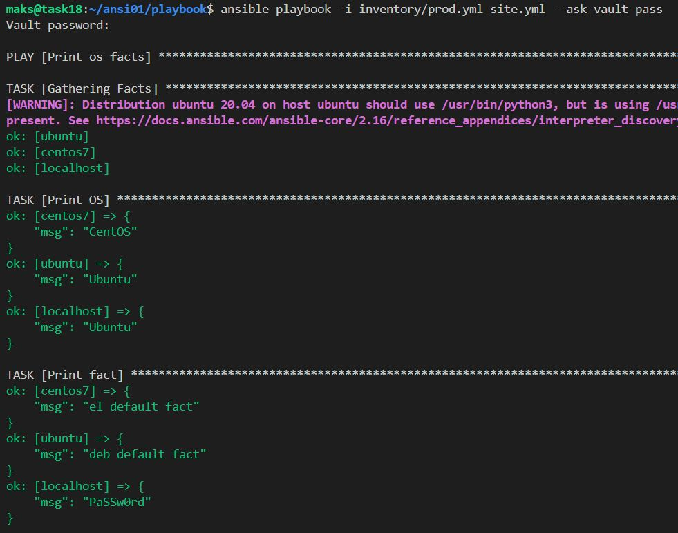

# Домашнее задание к занятию 1 «Введение в Ansible»

## Подготовка к выполнению

1. Установите Ansible версии 2.10 или выше.
2. Создайте свой публичный репозиторий на GitHub с произвольным именем.
3. Скачайте [Playbook](https://github.com/netology-code/08-ansible-01-base_02.25/blob/main/playbook) из репозитория с домашним заданием и перенесите его в свой репозиторий.

## Основная часть

`Ansible` установка:
```bash
sudo apt update 
sudo apt install ansible -y
```

1. Попробуйте запустить playbook на окружении из `test.yml`, зафиксируйте значение, которое имеет факт `some_fact` для указанного хоста при выполнении playbook.
```bash
ansible-playbook -i inventory/test.yml site.yml
```


2. Найдите файл с переменными (group_vars), в котором задаётся найденное в первом пункте значение, и поменяйте его на `all default fact`.
```bash
nano group_vars/all/examp.yml
# меняем значение `12` на `all default fact`
```


3. Воспользуйтесь подготовленным (используется `docker`) или создайте собственное окружение для проведения дальнейших испытаний.
**вначале по пробовать без залезания внутрь контейнера**  
```bash
docker run -d --name centos7 --hostname centos7 centos:7 sleep infinity
# заходим в контейнер
docker exec -it centos7 bash
# доп комманды внутри контейнера
sed -i s/mirror.centos.org/vault.centos.org/g /etc/yum.repos.d/*.repo
sed -i s/^#.*baseurl=http/baseurl=http/g /etc/yum.repos.d/*.repo
sed -i s/^mirrorlist=http/#mirrorlist=http/g /etc/yum.repos.d/*.repo

sed -i 's/mirrorlist/#mirrorlist/g' /etc/yum.repos.d/CentOS-*
sed -i 's|#baseurl=http://mirror.centos.org|baseurl=http://vault.centos.org|g' /etc/yum.repos.d/CentOS-*

yum clean all
yum makecache
#
docker run -d --name ubuntu cocoabeans/ubuntu-python sleep infinity # с ним работает по умолчанию
# для ниже контейнера (нужно после его запуска зайти в него)
docker run -d --name ubuntu --hostname ubuntu ubuntu:latest sleep infinity
# входим в контейнер
docker exec -it ubuntu bash
# в нутри контейнера запускаем обновление и установку python3
# во время установки зона Europ и Moscow
apt update
apt install python3 -y
# проверка
ansible -i inventory/prod.yml all -m ping
```
Так же через [`compose.yml`](compose.yml) (не всегда отрабатывает)

Проверка после установки
```bash
# Проверить Python в Ubuntu
docker exec ubuntu python3 --version

# Проверить Python в CentOS  
docker exec centos7 python3 --version

# Тест Ansible
ansible -i inventory/prod.yml all -m ping -o
```

**через ENV окружение появляются проблемы ХЗ**

4. Проведите запуск playbook на окружении из `prod.yml`. Зафиксируйте полученные значения `some_fact` для каждого из `managed host`.
```bash
ansible-playbook -i inventory/prod.yml site.yml
```


5. Добавьте факты в `group_vars` каждой из групп хостов так, чтобы для `some_fact` получились значения: для `deb` — `deb default fact`, для `el` — `el default fact`.

Заходим в `group_vars` и в папках `deb` и `el` имеется единственный файл в нём меняем значения на нужные.  
Варик через `sed`
```bash
sed -i 's/some_fact: "deb"/some_fact: "deb default fact"/' group_vars/deb/examp.yml
sed -i 's/some_fact: "el"/some_fact: "el default fact"/' group_vars/el/examp.yml
```
```bash
ansible-playbook -i inventory/prod.yml site.yml
```


6.  Повторите запуск playbook на окружении `prod.yml`. Убедитесь, что выдаются корректные значения для всех хостов.

7. При помощи `ansible-vault` зашифруйте факты в `group_vars/deb` и `group_vars/el` с паролем `netology`.
```bash
# вариант 1
ansible-vault encrypt group_vars/deb/examp.yml
ansible-vault encrypt group_vars/el/examp.yml
# Вариант 2 через пробел 
ansible-vault encrypt group_vars/el/examp.yml group_vars/deb/examp.yml
# Вариант 3
ansible-vault encrypt group_vars/{deb,el}/examp.yml
# Вариант 4 - зашифровать всё содежимое папки
ansible-vault encrypt group_vars/deb/*.yml
ansible-vault encrypt group_vars/el/*.yml
```


8. Запустите playbook на окружении `prod.yml`. При запуске `ansible` должен запросить у вас пароль. Убедитесь в работоспособности.
```bash
ansible-playbook -i inventory/prod.yml site.yml --ask-vault-pass
```
- > а можно через файл
```bash
# Создаем файл с паролем
echo "netology" > vault_pass.txt
# изменяем права только на своего пользователя
chmod 600 vault_pass.txt
# Запускаем с файлом пароля
ansible-playbook -i inventory/prod.yml site.yml --vault-password-file vault_pass.txt
```

9. Посмотрите при помощи `ansible-doc` список плагинов для подключения. Выберите подходящий для работы на `control node`.
```bash
# Смотрим все доступные плагины подключения
ansible-doc -t connection -l
```
`control node` - это та машина, где запускается Ansible  
Предположительно вот этот `модуль ansible.builtin.local`

10. В `prod.yml` добавьте новую группу хостов с именем  `local`, в ней разместите localhost с необходимым типом подключения.

в `prod.yml` добавил 
```text
  local:
    hosts:
      localhost:
        ansible_connection: local
```

11. Запустите playbook на окружении `prod.yml`. При запуске `ansible` должен запросить у вас пароль. Убедитесь, что факты `some_fact` для каждого из хостов определены из верных `group_vars`.

Была в `group_vars` сделана папка `local`(название папки совподает с prod.yml) и в ней сделан файл examp.yml с содержимым
```txt
---
  some_fact: all local
```
Результат (файлы зашифрованы)
```bash
ansible-playbook -i inventory/prod.yml site.yml --ask-vault-pass
```


12. Заполните `README.md` ответами на вопросы. Сделайте `git push` в ветку `master`. В ответе отправьте ссылку на ваш открытый репозиторий с изменённым `playbook` и заполненным `README.md`.


13. Предоставьте скриншоты результатов запуска команд.

## Необязательная часть

1. При помощи `ansible-vault` расшифруйте все зашифрованные файлы с переменными.
```bash
ansible-vault decrypt group_vars/deb/examp.yml group_vars/el/examp.yml
```

2. Зашифруйте отдельное значение `PaSSw0rd` для переменной `some_fact` паролем `netology`. Добавьте полученное значение в `group_vars/all/exmp.yml`.
```bash
ansible-vault encrypt_string 'PaSSw0rd'
```
```txt
New Vault password: 
Confirm New Vault password:
Encryption successful
!vault |
          $ANSIBLE_VAULT;1.1;AES256
          34633437313234626530646639313032383739323262623433363862343561326637356362373237
          3834363461636566333561313436356331626666336439320a623438366162626330663361333162
          35323432373363613466323466636234303561366461623636313635326562313665366365343835
          3863383835373561380a333934633636373065333133316236363234376239343661613531323166
          3733
```


3. Запустите `playbook`, убедитесь, что для нужных хостов применился новый `fact`.
```bash
ansible-playbook -i inventory/prod.yml site.yml --ask-vault-pass
```


4. Добавьте новую группу хостов `fedora`, самостоятельно придумайте для неё переменную. В качестве образа можно использовать [этот вариант](https://hub.docker.com/r/pycontribs/fedora).
```bash
docker pull pycontribs/fedora:latest
# запуск
docker run -d --name fedora pycontribs/fedora:latest sleep infinity
```
```bash
cat inventory/prod.yml
```
```txt
  fedora:
    hosts:
      fedora:
        ansible_connection: docker
```
Была создана папка `fedora` c файлом `exampl.yml`

```txt
---
  some_fact: "FEDORA"
```
```bash
ansible-playbook -i inventory/prod.yml site.yml --ask-vault-pass
```


5. Напишите скрипт на bash: автоматизируйте поднятие необходимых контейнеров, запуск ansible-playbook и остановку контейнеров.


6. Все изменения должны быть зафиксированы и отправлены в ваш личный репозиторий.

---

### Как оформить решение задания

Приложите ссылку на ваше решение в поле «Ссылка на решение» и нажмите «Отправить решение»
---
