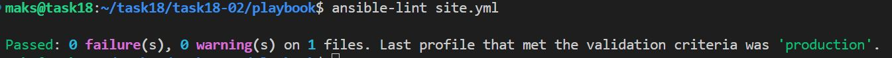
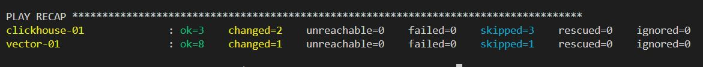
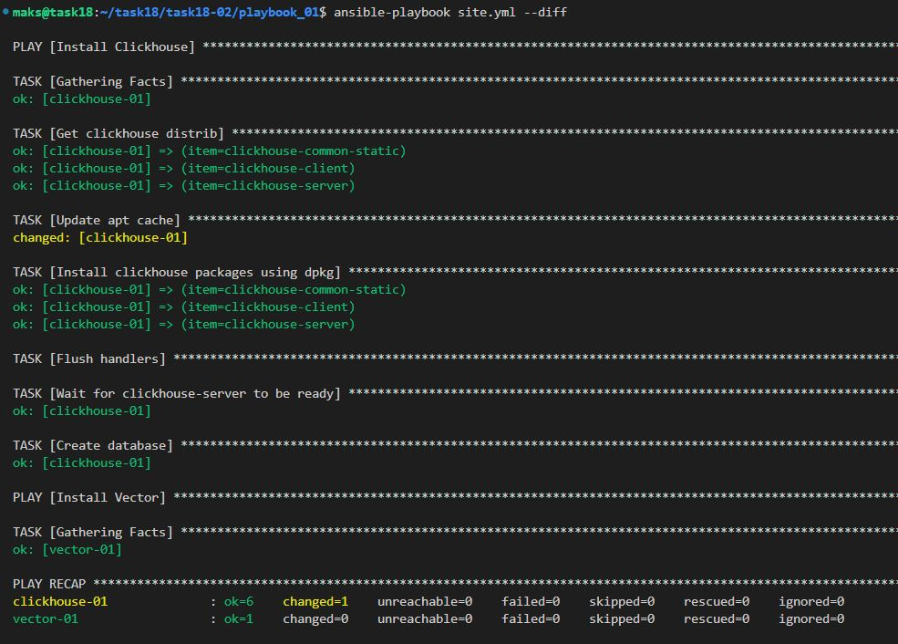
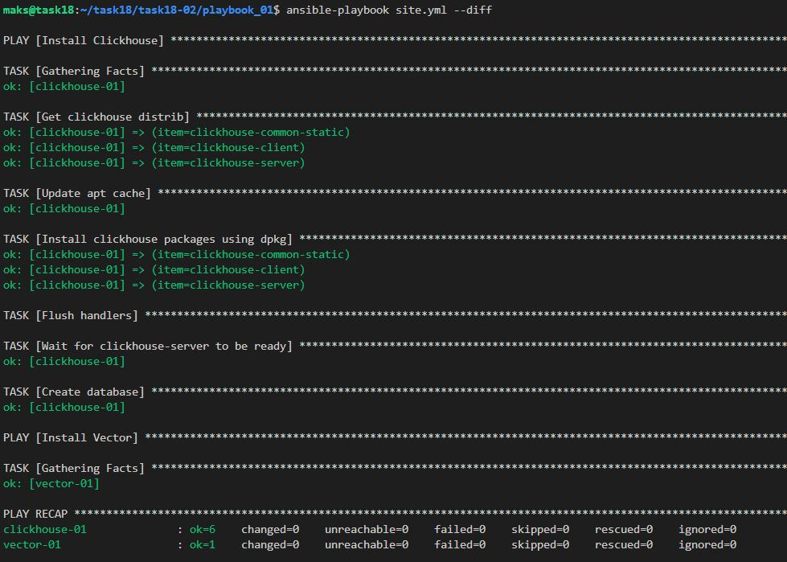

# Домашнее задание к занятию 2 «Работа с Playbook»

## Подготовка к выполнению

1. * Необязательно. Изучите, что такое [ClickHouse](https://www.youtube.com/watch?v=fjTNS2zkeBs) и [Vector](https://www.youtube.com/watch?v=CgEhyffisLY).
2. Создайте свой публичный репозиторий на GitHub с произвольным именем или используйте старый.
3. Скачайте [Playbook](./playbook/) из репозитория с домашним заданием и перенесите его в свой репозиторий.
4. Подготовьте хосты в соответствии с группами из предподготовленного playbook.

Подготавливал через `terraform`

## Основная часть

1. Подготовьте свой inventory-файл `prod.yml`.
2. Допишите playbook: нужно сделать ещё один play, который устанавливает и настраивает [vector](https://vector.dev). Конфигурация vector должна деплоиться через template файл jinja2. От вас не требуется использовать все возможности шаблонизатора, просто вставьте стандартный конфиг в template файл. Информация по шаблонам по [ссылке](https://www.dmosk.ru/instruktions.php?object=ansible-nginx-install). не забудьте сделать handler на перезапуск vector в случае изменения конфигурации!
3. При создании tasks рекомендую использовать модули: `get_url`, `template`, `unarchive`, `file`.
4. Tasks должны: скачать дистрибутив нужной версии, выполнить распаковку в выбранную директорию, установить vector.
5. Запустите `ansible-lint site.yml` и исправьте ошибки, если они есть.



6. Попробуйте запустить playbook на этом окружении с флагом `--check`.

```bash
ansible-playbook site.yml --check
```
```bash
# Запускаем только Vector с подробным выводом (валился в ошибки)
ansible-playbook --tags vector -v site.yml
```


7. Запустите playbook на `prod.yml` окружении с флагом `--diff`. Убедитесь, что изменения на системе произведены.
```bash
ansible-playbook site.yml --diff
```


8. Повторно запустите playbook с флагом `--diff` и убедитесь, что playbook идемпотентен.
```bash
ansible-playbook site.yml --diff
```


9. Подготовьте README.md-файл по своему playbook. В нём должно быть описано: что делает playbook, какие у него есть параметры и теги. Пример качественной документации ansible playbook по [ссылке](https://github.com/opensearch-project/ansible-playbook). Так же приложите скриншоты выполнения заданий №5-8
10. Готовый playbook выложите в свой репозиторий, поставьте тег `08-ansible-02-playbook` на фиксирующий коммит, в ответ предоставьте ссылку на него.

---

### Как оформить решение задания

Приложите ссылку на ваше решение в поле "Ссылка на решение" и нажмите "Отправить решение"

---

### Решение 9

---

## Ansible Playbook для установки ClickHouse и Vector

Этот Ansible playbook устанавливает и настраивает связку ClickHouse (колоночная аналитическая СУБД) и Vector (сборщик и обработчик логов).


- [Обзор](#Обзор)
- [Требования](#Требования)
- [Структура проекта](#структура-проекта)
- [Инвентарь](#Инвентарь)
- [Переменные](#переменные)
- [Теги](#теги)
- [Использование](#использование)
- [Проверка работы](#проверка-работы)
- [Идемпотентность](#идемпотентность)
- [Устранение неполадок](#устранение-неполадок)

### Обзор

Playbook состоит из двух частей:

1. ClickHouse - устанавливается на выделенные хосты, настраивается для внешнего доступа и создается база данных `logs`
2. Vector - устанавливается на выделенные хосты, настраивается сбор демо-логов.

### Требования

- Ansible 2.9+
- Python 3.6+
- Доступ к хостам по SSH

Операционные системы

- Ubuntu 20.04/22.04

Сетевые порты

- ClickHouse: 9000 (native), 8123 (HTTP)
- Vector: 8686 (API)

### Структура проекта (tree)

```txt
.
├── ansible.cfg
├── group_vars
│   ├── clickhouse
│   │   └── vars.yml
│   └── vector
│       └── var.yml
├── inventory
│   └── prod.yml
├── site.yml
└── templates
    └── vector.yaml.j2
```

### Инвентарь

Файл `inventory/prod.yml` содержит группы хостов:
```yaml
---
clickhouse:
  hosts:
    clickhouse-01:
      ansible_host: "IP"
vector:
  hosts:
    vector-01:
      ansible_host: "IP"    
```

### Переменные

ClickHouse переменные (`group_vars/clickhouse/vars.yml`)
```yaml
---
clickhouse_version: "22.8.5.29"
clickhouse_packages:
  - clickhouse-common-static
  - clickhouse-client
  - clickhouse-server
```
Vector переменные (`group_vars/vector/vars.yml`)
```yaml
---
vector_version: "0.50.0"
vector_config_path: "/etc/vector/vector.yaml"
```

### Теги

ClickHouse теги  
- `clickhouse` - все задачи ClickHouse
- `clickhouse:distr` - скачивание и установка пакетов
- `clickhouse:start service` - запуск сервиса
- `clickhouse:wait` - ожидание готовности сервиса
- `clickhouse:db` - создание базы данных

Vector теги  
- `vector` - все задачи Vector
- `vector:distr` - скачивание и установка пакетов
- `vector:restartservice` - перезапуск сервиса
- `vector:config` - развертывание конфигурации

### Использование

Полная установка
```bash
ansible-playbook site.yml
```

Тестовый запуск (без изменений)
```bash
ansible-playbook --check site.yml
```

Установка с просмотром изменений
```bash
ansible-playbook --diff site.yml
```

### Проверка работы

Запускаем только Clickhouse с подробным выводом
```bash
ansible-playbook --tags clickhouse -v site.yml
```

Запускаем только Vector с подробным выводом
```bash
ansible-playbook --tags vector -v site.yml
```

### Идемпотентность

Playbook разработан как идемпотентный - повторные запуски не должны вносить изменений в систему:
```bash
# Первый запуск - вносит изменения
ansible-playbook --diff site.yml

# Второй запуск - не должно быть изменений
ansible-playbook --diff site.yml
```

Конфигурация Vector

Шаблон конфигурации Vector (`templates/vector.yaml.j2`):
- Демо-логи в syslog формате
- API для мониторинга на порту 8686

### Устранение неполадок

ClickHouse не запускается
```bash
systemctl status clickhouse-server
journalctl -u clickhouse-server -f
```

Vector не запускается
```bash
systemctl status vector
journalctl -u vector -f
```