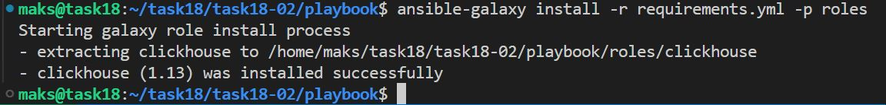

# Домашнее задание к занятию 4 «Работа с roles»

### Боровиков Максим

## Подготовка к выполнению

1. * Необязательно. Познакомьтесь с [LightHouse](https://youtu.be/ymlrNlaHzIY?t=929).
2. Создайте два пустых публичных репозитория в любом своём проекте: vector-role и lighthouse-role.
3. Добавьте публичную часть своего ключа к своему профилю на GitHub.

## Основная часть

Ваша цель — разбить ваш playbook на отдельные roles. 

Задача — сделать roles для ClickHouse, Vector и LightHouse и написать playbook для использования этих ролей. 

Ожидаемый результат — существуют три ваших репозитория: два с roles и один с playbook.

**Что нужно сделать**

1. Создайте в старой версии playbook файл `requirements.yml` и заполните его содержимым:

   ```yaml
   ---
     - src: git@github.com:AlexeySetevoi/ansible-clickhouse.git
       scm: git
       version: "1.13"
       name: clickhouse 
   ```

2. При помощи `ansible-galaxy` скачайте себе эту роль.
```bash
ansible-galaxy install -r requirements.yml -p roles
```


3. Создайте новый каталог с ролью при помощи `ansible-galaxy role init vector-role`.
```bash
ansible-galaxy role init vector
- Role vector was created successfully
```

4. На основе tasks из старого playbook заполните новую role. Разнесите переменные между `vars` и `default`.

5. Перенести нужные шаблоны конфигов в `templates`.

6. Опишите в `README.md` обе роли и их параметры. Пример качественной документации ansible role [по ссылке](https://github.com/cloudalchemy/ansible-prometheus).

7. Повторите шаги 3–6 для LightHouse. Помните, что одна роль должна настраивать один продукт.
```bash
ansible-galaxy role init lighthouse
```

8. Выложите все roles в репозитории. Проставьте теги, используя семантическую нумерацию. Добавьте roles в `requirements.yml` в playbook.

Перенос содержимого в репозиторий
```bash
cd ./vector/
git init
git add .
git commit -m "Initial commit"
git branch -M main
git remote add origin https://github.com/AlkoHead/vector-role.git
git push -u origin main
```

9. Переработайте playbook на использование roles. Не забудьте про зависимости LightHouse и возможности совмещения `roles` с `tasks`.

10. Выложите playbook в репозиторий.

11. В ответе дайте ссылки на оба репозитория с roles и одну ссылку на репозиторий с playbook.

[lighthouse-role](https://github.com/AlkoHead/lighthouse-role "https://github.com/AlkoHead/lighthouse-role")

[vector-role](https://github.com/AlkoHead/vector-role "https://github.com/AlkoHead/vector-role")

[playbook](https://github.com/AlkoHead/Neto/tree/main/training/18%20Система%20управления%20конфигурациями/06%20Работа%20с%20roles/playbook "https://github.com/AlkoHead/Neto/tree/main/training/18%20Система%20управления%20конфигурациями/06%20Работа%20с%20roles/playbook")


### Последовательность

1. через terraform поднимаем 3 вм
```
terraform apply
```
2. outputs выводит IP машин
3. заполняем в playbook/inventory/prod.yml
4. запускаем скачивание ролей
```bash
ansible-galaxy install -r requirements.yml -p roles
```
5. установка
```bash
ansible-playbook site.yml -i inventory/prod.yml 
```
6. Удаление ClickHouse, Vector и LightHouse
```bash
ansible-playbook cleanup.yml -i ./inventory/prod.yml
```
7. удаление VM
```bash
terraform destroy
```

---

### Как оформить решение задания

Выполненное домашнее задание пришлите в виде ссылки на .md-файл в вашем репозитории.

---
