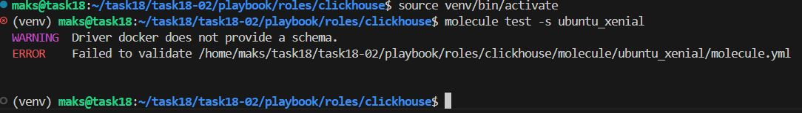
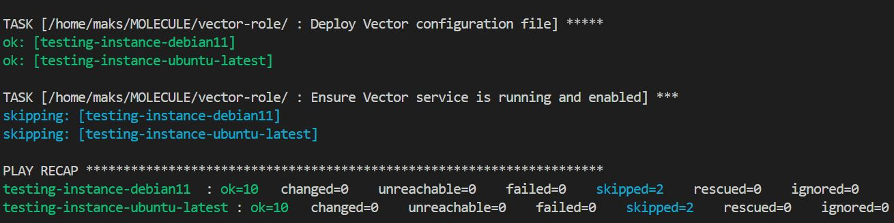
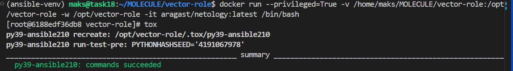
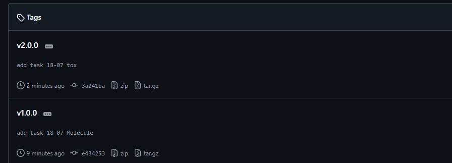

# Домашнее задание к занятию 5 «Тестирование roles»

## Подготовка к выполнению

1. Установите molecule и его драйвера: `pip3 install molecule molecule_docker molecule_podman`.

`pip3` нужно запускать из окружения
```bash
python3 -m venv venv
source venv/bin/activate
pip install --upgrade pip
#pip install "molecule[docker,podman]"
pip install molecule[docker] docker
pip install molecule-docker

molecule --version
# выйти из окружения
deactivate
```
```txt
molecule 25.12.0 using python 3.12 
    ansible:2.20.1
    default:25.12.0 from molecule
```
список установленных пакетов
```bash
pip list | grep -i docker
pip list | grep molecule
```

2. Выполните `docker pull aragast/netology:latest` —  это образ с podman, tox и несколькими пайтонами (3.7 и 3.9) внутри.

## Основная часть

Ваша цель — настроить тестирование ваших ролей. 

Задача — сделать сценарии тестирования для vector. 

Ожидаемый результат — все сценарии успешно проходят тестирование ролей.

### Molecule

1. Запустите  `molecule test -s ubuntu_xenial` (или с любым другим сценарием, не имеет значения) внутри корневой директории clickhouse-role, посмотрите на вывод команды. Данная команда может отработать с ошибками или не отработать вовсе, это нормально. Наша цель - посмотреть как другие в реальном мире используют молекулу И из чего может состоять сценарий тестирования.

Запуск по этапов по отдельности
```bash
molecule create
molecule converge  # вручную проверьте контейнер
molecule verify
molecule destroy
```



2. Перейдите в каталог с ролью vector-role и создайте сценарий тестирования по умолчанию при помощи `molecule init scenario --driver-name docker`.

```bash
molecule init scenario
```
```txt
INFO     default ➜ init: Initializing new scenario default...

PLAY [Create a new molecule scenario] ******************************************

TASK [Check if destination folder exists] **************************************
changed: [localhost]

TASK [Check if destination folder is empty] ************************************
ok: [localhost]

TASK [Fail if destination folder is not empty] *********************************
skipping: [localhost]

TASK [Expand templates] ********************************************************
changed: [localhost] => (item=molecule/default/molecule.yml)
changed: [localhost] => (item=molecule/default/destroy.yml)
changed: [localhost] => (item=molecule/default/verify.yml)
changed: [localhost] => (item=molecule/default/create.yml)
changed: [localhost] => (item=molecule/default/converge.yml)

PLAY RECAP *********************************************************************
localhost                  : ok=3    changed=2    unreachable=0    failed=0    skipped=1    rescued=0    ignored=0

INFO     default ➜ init: Initialized scenario in /home/maks/task18/task18-02/playbook/roles/vector/molecule/default successfully.
```

3. Добавьте несколько разных дистрибутивов (oraclelinux:8, ubuntu:latest) для инстансов и протестируйте роль, исправьте найденные ошибки, если они есть.

добавлены в `molecule.yml`
```txt
debian:bullseye
ubuntu:latest
```

4. Добавьте несколько assert в verify.yml-файл для  проверки работоспособности vector-role (проверка, что конфиг валидный, проверка успешности запуска и др.).

5. Запустите тестирование роли повторно и проверьте, что оно прошло успешно.
```bash
molecule test
```

6. Добавьте новый тег на коммит с рабочим сценарием в соответствии с семантическим версионированием.

Действие:
```bash
git add . 
git commit 
git tag v1.0.0 
git push origin main 
git push --tags
```

### Tox

1. Добавьте в директорию с vector-role файлы из [директории](./example).
2. Запустите `docker run --privileged=True -v <path_to_repo>:/opt/vector-role -w /opt/vector-role -it aragast/netology:latest /bin/bash`, где path_to_repo — путь до корня репозитория с vector-role на вашей файловой системе.
Из раборного урока 2 `docker run --privileged=True -it aragast/netology:latest /bin/bash`

```bash
docker run --privileged=True -v /home/maks/MOLECULE/vector-role:/opt
/vector-role -w /opt/vector-role -it aragast/netology:latest /bin/bash
```

3. Внутри контейнера выполните команду `tox`, посмотрите на вывод.

<details>
<summary>Click to expand</summary>

(ansible-venv) maks@task18:~/MOLECULE/vector-role$ docker run --privileged=True -v /home/maks/MOLECULE/vector-role:/opt
/vector-role -w /opt/vector-role -it aragast/netology:latest /bin/bash
[root@4f29ab21342a vector-role]# tox
py37-ansible210 create: /opt/vector-role/.tox/py37-ansible210
py37-ansible210 installdeps: -rtox-requirements.txt, ansible<3.0
py37-ansible210 installed: ansible==2.10.7,ansible-base==2.10.17,ansible-compat==1.0.0,arrow==1.2.3,bcrypt==4.2.1,binaryornot==0.4.4,cached-property==1.5.2,Cerberus==1.3.8,certifi==2026.1.4,cffi==1.15.1,chardet==5.2.0,charset-normalizer==3.4.4,click==8.1.8,click-help-colors==0.9.4,cookiecutter==2.6.0,cryptography==45.0.7,distro==1.9.0,enrich==1.2.7,idna==3.10,importlib-metadata==6.7.0,Jinja2==3.1.6,jmespath==1.0.1,lxml==5.4.0,markdown-it-py==2.2.0,MarkupSafe==2.1.5,mdurl==0.1.2,molecule==3.6.1,molecule-podman==1.1.0,packaging==24.0,paramiko==2.12.0,pluggy==1.2.0,pycparser==2.21,Pygments==2.17.2,PyNaCl==1.5.0,python-dateutil==2.9.0.post0,python-slugify==8.0.4,PyYAML==6.0.1,requests==2.31.0,rich==13.8.1,selinux==0.2.1,six==1.17.0,subprocess-tee==0.3.5,text-unidecode==1.3,typing_extensions==4.7.1,urllib3==2.0.7,zipp==3.15.0
py37-ansible210 run-test-pre: PYTHONHASHSEED='1608406570'
py37-ansible210 run-test: commands[0] | molecule test -s compatibility --destroy always
/opt/vector-role/.tox/py37-ansible210/lib/python3.7/site-packages/ansible/parsing/vault/__init__.py:44: CryptographyDeprecationWarning: Python 3.7 is no longer supported by the Python core team and support for it is deprecated in cryptography. The next release of cryptography will remove support for Python 3.7.
  from cryptography.exceptions import InvalidSignature
CRITICAL 'molecule/compatibility/molecule.yml' glob failed.  Exiting.
ERROR: InvocationError for command /opt/vector-role/.tox/py37-ansible210/bin/molecule test -s compatibility --destroy always (exited with code 1)
py37-ansible30 create: /opt/vector-role/.tox/py37-ansible30
py37-ansible30 installdeps: -rtox-requirements.txt, ansible<3.1
py37-ansible30 installed: ansible==3.0.0,ansible-base==2.10.17,ansible-compat==1.0.0,arrow==1.2.3,bcrypt==4.2.1,binaryornot==0.4.4,cached-property==1.5.2,Cerberus==1.3.8,certifi==2026.1.4,cffi==1.15.1,chardet==5.2.0,charset-normalizer==3.4.4,click==8.1.8,click-help-colors==0.9.4,cookiecutter==2.6.0,cryptography==45.0.7,distro==1.9.0,enrich==1.2.7,idna==3.10,importlib-metadata==6.7.0,Jinja2==3.1.6,jmespath==1.0.1,lxml==5.4.0,markdown-it-py==2.2.0,MarkupSafe==2.1.5,mdurl==0.1.2,molecule==3.6.1,molecule-podman==1.1.0,packaging==24.0,paramiko==2.12.0,pluggy==1.2.0,pycparser==2.21,Pygments==2.17.2,PyNaCl==1.5.0,python-dateutil==2.9.0.post0,python-slugify==8.0.4,PyYAML==6.0.1,requests==2.31.0,rich==13.8.1,selinux==0.2.1,six==1.17.0,subprocess-tee==0.3.5,text-unidecode==1.3,typing_extensions==4.7.1,urllib3==2.0.7,zipp==3.15.0
py37-ansible30 run-test-pre: PYTHONHASHSEED='1608406570'
py37-ansible30 run-test: commands[0] | molecule test -s compatibility --destroy always
/opt/vector-role/.tox/py37-ansible30/lib/python3.7/site-packages/ansible/parsing/vault/__init__.py:44: CryptographyDeprecationWarning: Python 3.7 is no longer supported by the Python core team and support for it is deprecated in cryptography. The next release of cryptography will remove support for Python 3.7.
  from cryptography.exceptions import InvalidSignature
CRITICAL 'molecule/compatibility/molecule.yml' glob failed.  Exiting.
ERROR: InvocationError for command /opt/vector-role/.tox/py37-ansible30/bin/molecule test -s compatibility --destroy always (exited with code 1)
py39-ansible210 create: /opt/vector-role/.tox/py39-ansible210
py39-ansible210 installdeps: -rtox-requirements.txt, ansible<3.0
py39-ansible210 installed: ansible==2.10.7,ansible-base==2.10.17,ansible-compat==24.10.0,ansible-core==2.15.13,attrs==25.4.0,bracex==2.6,cffi==2.0.0,click==8.1.8,click-help-colors==0.9.4,cryptography==46.0.5,distro==1.9.0,enrich==1.2.7,importlib-resources==5.0.7,Jinja2==3.1.6,jmespath==1.1.0,jsonschema==4.25.1,jsonschema-specifications==2025.9.1,lxml==6.0.2,markdown-it-py==3.0.0,MarkupSafe==3.0.3,mdurl==0.1.2,molecule==6.0.3,molecule-podman==2.0.3,packaging==26.0,pluggy==1.6.0,pycparser==2.23,Pygments==2.19.2,PyYAML==6.0.3,referencing==0.36.2,resolvelib==1.0.1,rich==14.3.3,rpds-py==0.27.1,selinux==0.3.0,subprocess-tee==0.4.2,typing_extensions==4.15.0,wcmatch==10.1
py39-ansible210 run-test-pre: PYTHONHASHSEED='1608406570'
py39-ansible210 run-test: commands[0] | molecule test -s compatibility --destroy always
CRITICAL 'molecule/compatibility/molecule.yml' glob failed.  Exiting.
ERROR: InvocationError for command /opt/vector-role/.tox/py39-ansible210/bin/molecule test -s compatibility --destroy always (exited with code 1)
py39-ansible30 create: /opt/vector-role/.tox/py39-ansible30
py39-ansible30 installdeps: -rtox-requirements.txt, ansible<3.1
py39-ansible30 installed: ansible==3.0.0,ansible-base==2.10.17,ansible-compat==24.10.0,ansible-core==2.15.13,attrs==25.4.0,bracex==2.6,cffi==2.0.0,click==8.1.8,click-help-colors==0.9.4,cryptography==46.0.5,distro==1.9.0,enrich==1.2.7,importlib-resources==5.0.7,Jinja2==3.1.6,jmespath==1.1.0,jsonschema==4.25.1,jsonschema-specifications==2025.9.1,lxml==6.0.2,markdown-it-py==3.0.0,MarkupSafe==3.0.3,mdurl==0.1.2,molecule==6.0.3,molecule-podman==2.0.3,packaging==26.0,pluggy==1.6.0,pycparser==2.23,Pygments==2.19.2,PyYAML==6.0.3,referencing==0.36.2,resolvelib==1.0.1,rich==14.3.3,rpds-py==0.27.1,selinux==0.3.0,subprocess-tee==0.4.2,typing_extensions==4.15.0,wcmatch==10.1
py39-ansible30 run-test-pre: PYTHONHASHSEED='1608406570'
py39-ansible30 run-test: commands[0] | molecule test -s compatibility --destroy always
CRITICAL 'molecule/compatibility/molecule.yml' glob failed.  Exiting.
ERROR: InvocationError for command /opt/vector-role/.tox/py39-ansible30/bin/molecule test -s compatibility --destroy always (exited with code 1)
_______________________________________________________ summary _______________________________________________________
ERROR:   py37-ansible210: commands failed
ERROR:   py37-ansible30: commands failed
ERROR:   py39-ansible210: commands failed
ERROR:   py39-ansible30: commands failed

</details>

5. Создайте облегчённый сценарий для `molecule` с драйвером `molecule_podman`. Проверьте его на исполнимость.
6. Пропишите правильную команду в `tox.ini`, чтобы запускался облегчённый сценарий.
8. Запустите команду `tox`. Убедитесь, что всё отработало успешно.



9. Добавьте новый тег на коммит с рабочим сценарием в соответствии с семантическим версионированием.

```bash
git add . 
git commit 
git tag v2.0.0 
git push origin main 
git push --tags
```


