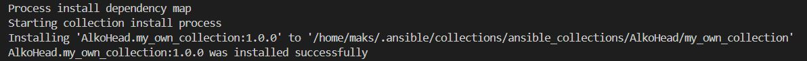
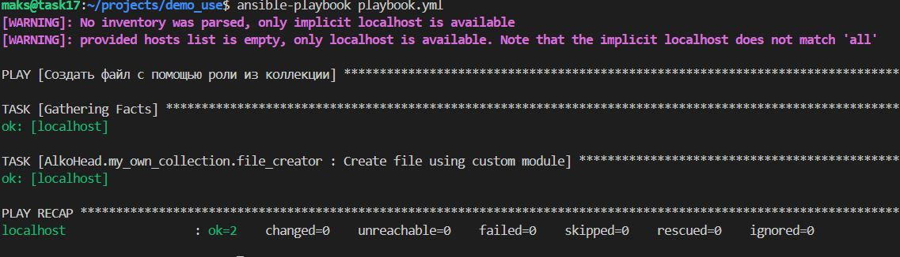

# Домашнее задание к занятию 6 «Создание собственных модулей»

## Боровиков Максим

## Подготовка к выполнению

1. Создайте пустой публичный репозиторий в своём любом проекте: `my_own_collection`.
2. Скачайте репозиторий Ansible: `git clone https://github.com/ansible/ansible.git` по любому, удобному вам пути.
3. Зайдите в директорию Ansible: `cd ansible`.
4. Создайте виртуальное окружение: `python3 -m venv venv`.
5. Активируйте виртуальное окружение: `. venv/bin/activate`. Дальнейшие действия производятся только в виртуальном окружении.
6. Установите зависимости `pip install -r requirements.txt`.
7. Запустите настройку окружения `. hacking/env-setup`.
8. Если все шаги прошли успешно — выйдите из виртуального окружения `deactivate`.
9. Ваше окружение настроено. Чтобы запустить его, нужно находиться в директории `ansible` и выполнить конструкцию `. venv/bin/activate && . hacking/env-setup`.

## Основная часть

Ваша цель — написать собственный module, который вы можете использовать в своей role через playbook. Всё это должно быть собрано в виде collection и отправлено в ваш репозиторий.

```bash
mkdir projects
cd ./projects/
ls
git clone https://github.com/ansible/ansible.git
cd ./ansible/
sudo apt install python3.12-venv
python3 -m venv venv
pip install -r requirements.txt
. venv/bin/activate && . hacking/env-setup
```

**Шаг 1.** В виртуальном окружении создайте новый `my_own_module.py` файл.

перешёл из папки ansible выше
```bash
cd ..
git clone https://github.com/AlkoHead/my_own_collection.git
cd ./my_own_collection/
mkdir -p plugins/modules
touch plugins/modules/my_own_module.py
```

**Шаг 2.** Наполните его содержимым:

[my_own_module.py](code/my_own_module.py)

```python
#!/usr/bin/python

# Copyright: (c) 2018, Terry Jones <terry.jones@example.org>
# GNU General Public License v3.0+ (see COPYING or https://www.gnu.org/licenses/gpl-3.0.txt)
from __future__ import (absolute_import, division, print_function)
__metaclass__ = type

DOCUMENTATION = r'''
---
module: my_test

short_description: This is my test module

# If this is part of a collection, you need to use semantic versioning,
# i.e. the version is of the form "2.5.0" and not "2.4".
version_added: "1.0.0"

description: This is my longer description explaining my test module.

options:
    name:
        description: This is the message to send to the test module.
        required: true
        type: str
    new:
        description:
            - Control to demo if the result of this module is changed or not.
            - Parameter description can be a list as well.
        required: false
        type: bool
# Specify this value according to your collection
# in format of namespace.collection.doc_fragment_name
extends_documentation_fragment:
    - my_namespace.my_collection.my_doc_fragment_name

author:
    - Your Name (@yourGitHubHandle)
'''

EXAMPLES = r'''
# Pass in a message
- name: Test with a message
  my_namespace.my_collection.my_test:
    name: hello world

# pass in a message and have changed true
- name: Test with a message and changed output
  my_namespace.my_collection.my_test:
    name: hello world
    new: true

# fail the module
- name: Test failure of the module
  my_namespace.my_collection.my_test:
    name: fail me
'''

RETURN = r'''
# These are examples of possible return values, and in general should use other names for return values.
original_message:
    description: The original name param that was passed in.
    type: str
    returned: always
    sample: 'hello world'
message:
    description: The output message that the test module generates.
    type: str
    returned: always
    sample: 'goodbye'
'''

from ansible.module_utils.basic import AnsibleModule


def run_module():
    # define available arguments/parameters a user can pass to the module
    module_args = dict(
        name=dict(type='str', required=True),
        new=dict(type='bool', required=False, default=False)
    )

    # seed the result dict in the object
    # we primarily care about changed and state
    # changed is if this module effectively modified the target
    # state will include any data that you want your module to pass back
    # for consumption, for example, in a subsequent task
    result = dict(
        changed=False,
        original_message='',
        message=''
    )

    # the AnsibleModule object will be our abstraction working with Ansible
    # this includes instantiation, a couple of common attr would be the
    # args/params passed to the execution, as well as if the module
    # supports check mode
    module = AnsibleModule(
        argument_spec=module_args,
        supports_check_mode=True
    )

    # if the user is working with this module in only check mode we do not
    # want to make any changes to the environment, just return the current
    # state with no modifications
    if module.check_mode:
        module.exit_json(**result)

    # manipulate or modify the state as needed (this is going to be the
    # part where your module will do what it needs to do)
    result['original_message'] = module.params['name']
    result['message'] = 'goodbye'

    # use whatever logic you need to determine whether or not this module
    # made any modifications to your target
    if module.params['new']:
        result['changed'] = True

    # during the execution of the module, if there is an exception or a
    # conditional state that effectively causes a failure, run
    # AnsibleModule.fail_json() to pass in the message and the result
    if module.params['name'] == 'fail me':
        module.fail_json(msg='You requested this to fail', **result)

    # in the event of a successful module execution, you will want to
    # simple AnsibleModule.exit_json(), passing the key/value results
    module.exit_json(**result)


def main():
    run_module()


if __name__ == '__main__':
    main()
```
Или возьмите это наполнение [из статьи](https://docs.ansible.com/ansible/latest/dev_guide/developing_modules_general.html#creating-a-module).

**Шаг 3.** Заполните файл в соответствии с требованиями Ansible так, чтобы он выполнял основную задачу: module должен создавать текстовый файл на удалённом хосте по пути, определённом в параметре `path`, с содержимым, определённым в параметре `content`.

Проверка синтексиса
```
python3 /home/maks/projects/my_own_collection/plugins/modules/my_own_module.py
```
Добавление в переменную окружения `ANSIBLE_LIBRARY`
```bash
export ANSIBLE_LIBRARY=/home/maks/projects/my_own_collection/plugins/modules
```
Проверка документации через `ansible-doc` (нахожусь в папке ansible)
```bash
ansible-doc my_own_module
```
проверьте путь в ANSIBLE_LIBRARY
```bash
echo $ANSIBLE_LIBRARY
```


**Шаг 4.** Проверьте module на исполняемость локально.

Сделал playbook `test_module.yml`
```bash
ansible-playbook test_module.yml
```


Содержимое


[Ссылка на test_module.yml](code/test_module.yml)

**Шаг 5.** Напишите single task playbook и используйте module в нём.

**Шаг 6.** Проверьте через playbook на идемпотентность.

```bash
ansible-playbook test_module.yml --check
```

**Шаг 7.** Выйдите из виртуального окружения.
```bash
deactivate
```

**Шаг 8.** Инициализируйте новую collection: `ansible-galaxy collection init my_own_namespace.yandex_cloud_elk`.

```bash
mkdir -p ~/projects
cd ~/projects
ansible-galaxy collection init AlkoHead.my_own_collection
```

**Шаг 9.** В эту collection перенесите свой module в соответствующую директорию.

**Шаг 10.** Single task playbook преобразуйте в single task role и перенесите в collection. У role должны быть default всех параметров module.

**Шаг 11.** Создайте playbook для использования этой role.

[playbook.yml](code/playbook.yml)

**Шаг 12.** Заполните всю документацию по collection, выложите в свой репозиторий, поставьте тег `1.0.0` на этот коммит.

```bash
cd ./AlkoHead/my_own_collection/
ls
git init
git remote add origin https://github.com/AlkoHead/my_own_collection.git
git add .
git config user.name "AlkoHead"
git config user.email "onemakslink@yandex.ru"
git commit -m "feat: add my_own_module, file_creator role, and documentation"
git branch -M main
git push -u origin main
git tag -a 1.0.0 -m "Release version 1.0.0"
git push origin 1.0.0
```

**Шаг 13.** Создайте .tar.gz этой collection: `ansible-galaxy collection build` в корневой директории collection.

```bash
cd /home/maks/projects/AlkoHead/my_own_collection
ansible-galaxy collection build
```

**Шаг 14.** Создайте ещё одну директорию любого наименования, перенесите туда single task playbook и архив c collection.

```bash
mkdir -p /home/maks/projects/demo_use
cd /home/maks/projects/demo_use
cp /home/maks/projects/playbook.yml .
cp /home/maks/projects/AlkoHead/my_own_collection/AlkoHead-my_own_collection-1.0.0.tar.gz .
```

**Шаг 15.** Установите collection из локального архива: `ansible-galaxy collection install <archivename>.tar.gz`.

```bash
ansible-galaxy collection install AlkoHead-my_own_collection-1.0.0.tar.gz
```


**Шаг 16.** Запустите playbook, убедитесь, что он работает.

```bash
ansible-playbook playbook.yml
```


**Шаг 17.** В ответ необходимо прислать ссылки на collection и tar.gz архив, а также скриншоты выполнения пунктов 4, 6, 15 и 16.

[Ссылка на collection](https://github.com/AlkoHead/my_own_collection "https://github.com/AlkoHead/my_own_collection")

Ссылка на `.tar.gz` архив (автоматически генерируется GitHub по тегу):
```bash
https://github.com/AlkoHead/my_own_collection/archive/refs/tags/1.0.0.tar.gz
```
[Ссылка на архив](code/AlkoHead-my_own_collection-1.0.0.tar.gz)

