Описание задания
Познакомьтесь с различными видами досок, которые предлагает Kaiten, пройдите весь путь задачи до её завершения.

Что нужно сделать?
1. Настройка доски

- Создайте пространство и добавьте новую доску типа Scrum.
- Добавьте новую колонку в «Готово для тестирования», переместите колонку так, чтобы она была после колонки «В работе».

2. Создание задачи по Frontend

- Создайте задачу в Backlog доске, например «Frontend Bug»
- Переместите все задачи на доску Sprint, в колонку Бэклог спринта.
- Переместите одну из задач в колонку работа и добавьте там комментарий по желанию, например, «Frontend Bug» -> «Баг будет устранён путём обновления библиотеки в микрофронтенде».
- Создайте в выбранной задаче дочернюю карточку в Backlog доске с названием «Обновить библиотеку» «[LIB-456] Upgrade Material-UI from v4.12.3 to v5.0.0 in product-details microfrontend to resolve layout bugs»
- Переместите новую карточку в Бэклог Спринта, потом «В работе», в колонке «В работе» добавьте комментарий, например, «Library Material-UI updated to v5.0.0», также добавьте трудозатраты в новой задаче — 1ч.
- Переместите дочернюю задачу в колонку «Готово» на доске Sprint.
- Переместите родительскую задачу «Поправить bug на Frontend» в колонку «Готово» на доске Sprint, не забудьте списать потраченное время 0,2 ч.

3. Создание задачи по Backend

- Создайте две задачи в Backlog доске, например «Backend — Integration with YandexPay».
- Добавьте дочернюю задачу в задачу «Поправить bug на Backend», назовите её «Update API Endpoint for Improved Error Handling», получившуюся подзадачу переместите в колонку «Готово для тестирования».
- Переместите новую дочернюю задачу в колонку «В работе» и добавьте комментарий «Update the API endpoint to enhance error handling mechanisms.» После добавьте трудозатраты (4ч) и переместите задачу в колонку «Готово для тестирования».
- В новой колонке «Готово для тестирования» добавьте следующий комментарий «All tests passed successfully» и трудозатраты (1ч). Переместите в колонку «Готово».
- Завершите задачу/карточку «Поправить bug на Backend» переместив в колонку «Готово».

Решение:

1. 
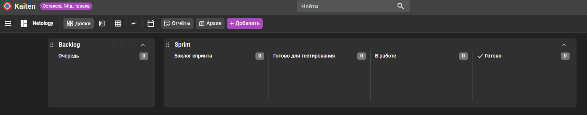

2. 
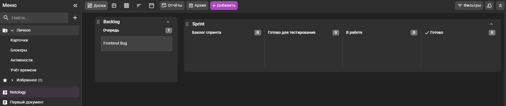
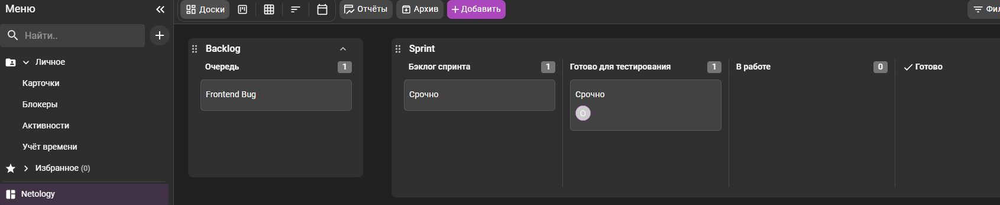

Перемещение осущесвтялется обычным перетаскиванием

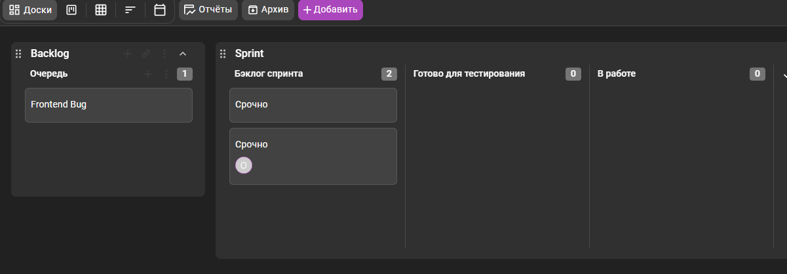

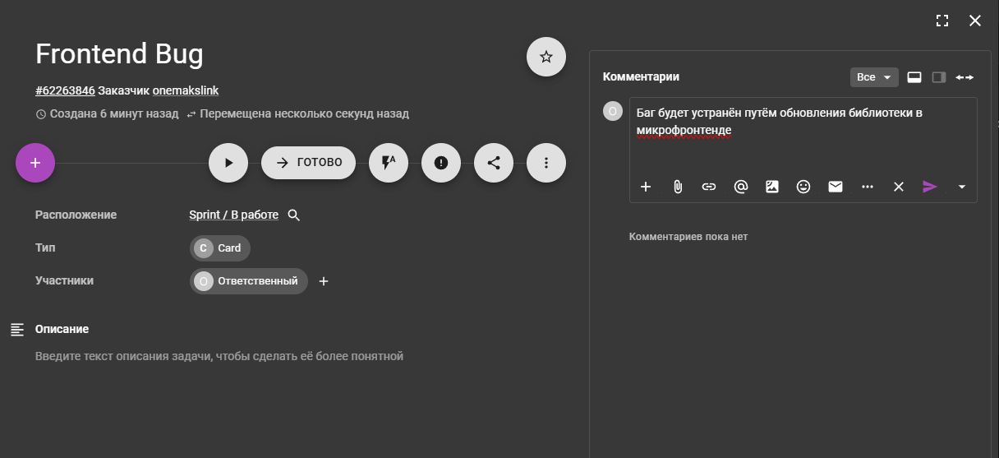

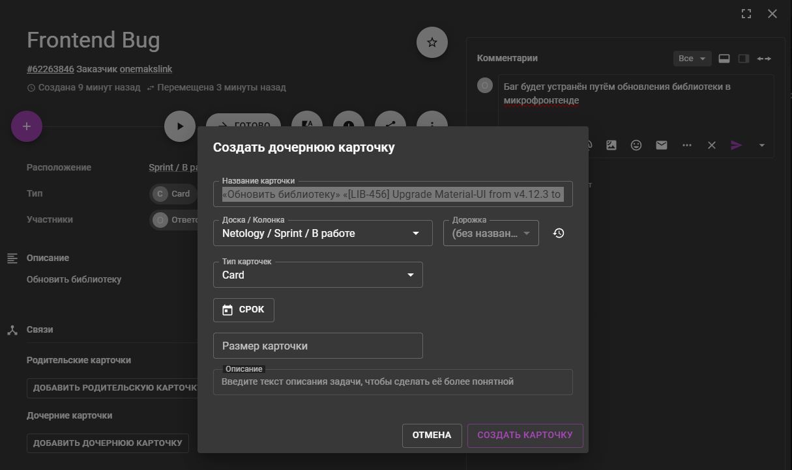

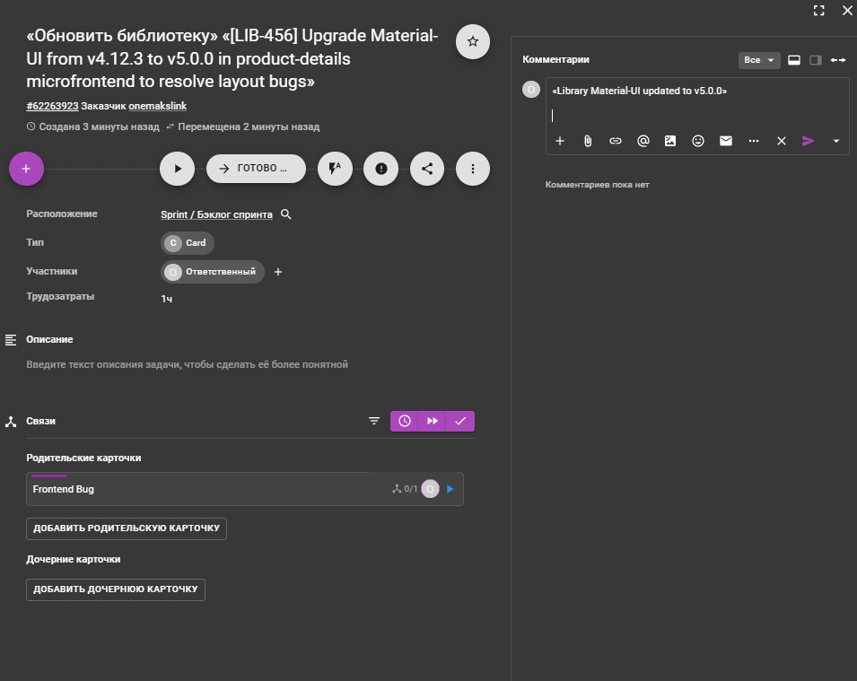

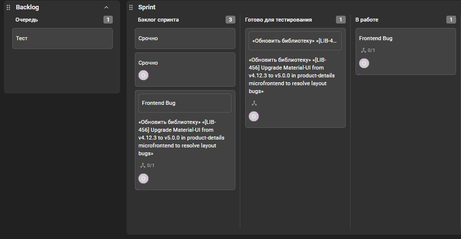

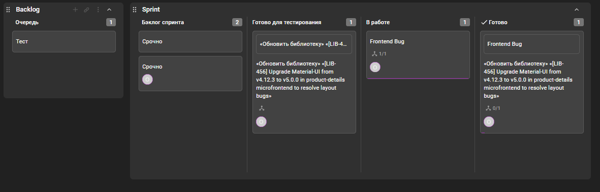

3. 
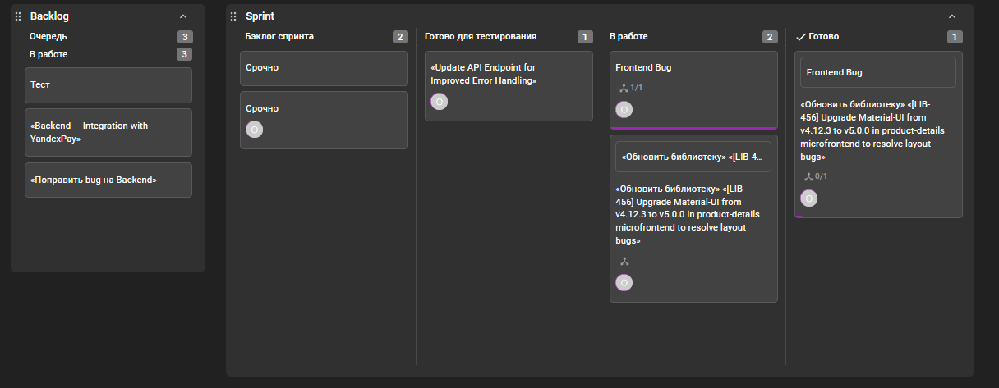

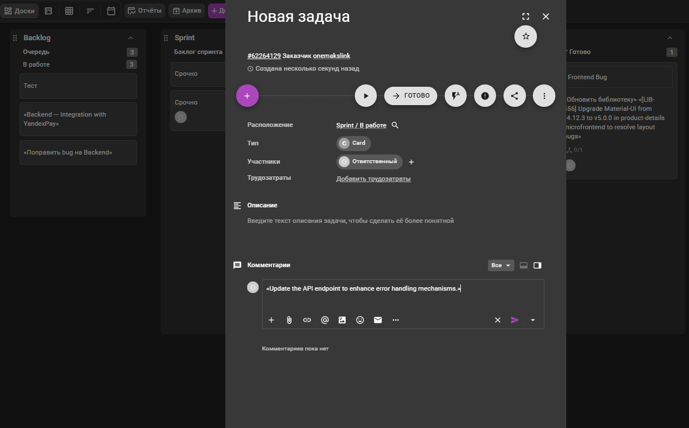

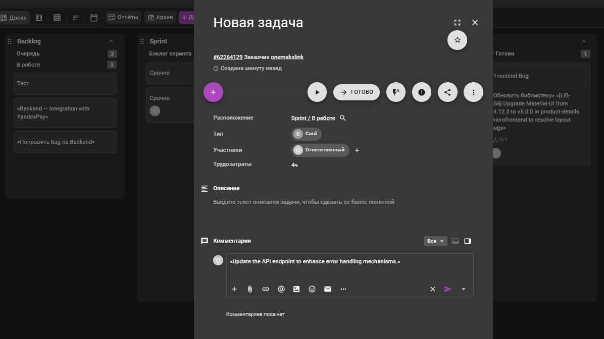

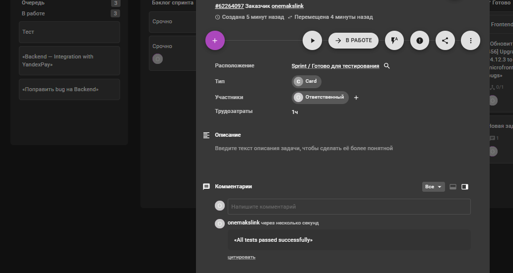

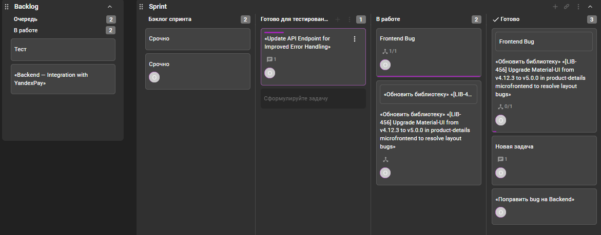

Хотелось бы добавить в качете досок очень понравился продукт `yougile`, для некомерческого использвоания он бесплатен и не имеет ограничений.

Пример доски:

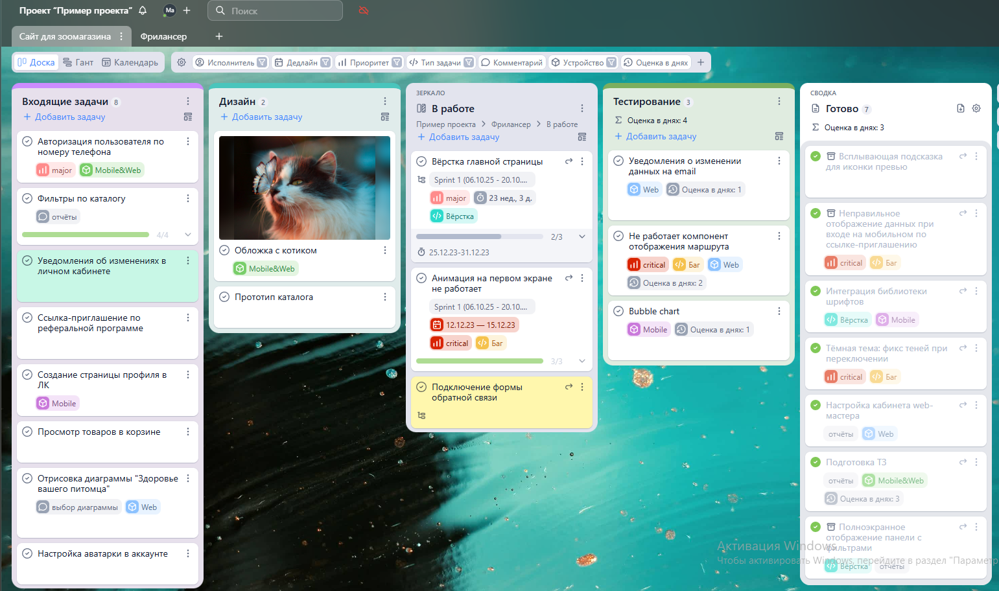