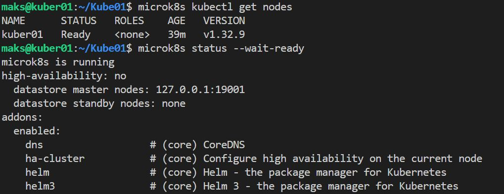
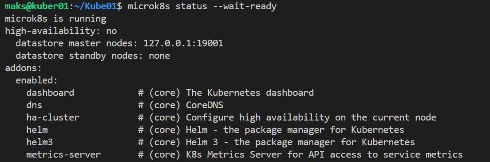
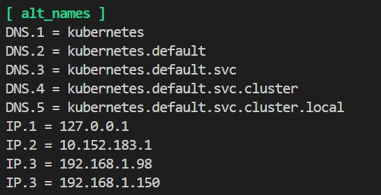
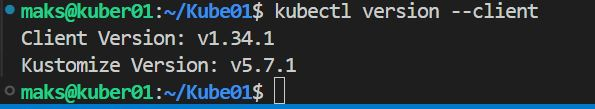
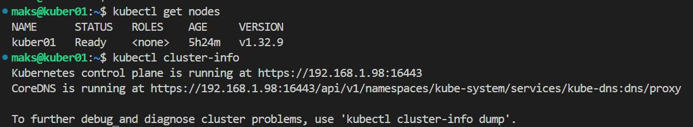

# Домашнее задание к занятию «Kubernetes. Причины появления. Команда kubectl»

### Цель задания

Для экспериментов и валидации ваших решений вам нужно подготовить тестовую среду для работы с Kubernetes. Оптимальное решение — развернуть на рабочей машине или на отдельной виртуальной машине MicroK8S.

------

### Чеклист готовности к домашнему заданию

1. Личный компьютер с ОС Linux или MacOS 

или

2. ВМ c ОС Linux в облаке либо ВМ на локальной машине для установки MicroK8S  

------

### Инструкция к заданию

1. Установка MicroK8S:
    - sudo apt update,
    - sudo apt install snapd,
    - sudo snap install microk8s --classic,
    - добавить локального пользователя в группу `sudo usermod -a -G microk8s $USER`,
    - изменить права на папку с конфигурацией `sudo chown -f -R $USER ~/.kube`.

2. Полезные команды:
    - проверить статус `microk8s status --wait-ready`;
    - подключиться к microK8s и получить информацию можно через команду `microk8s command`, например, `microk8s kubectl get nodes`;
    - включить addon можно через команду `microk8s enable`; 
    - список addon `microk8s status`;
    - вывод конфигурации `microk8s config`;
    - проброс порта для подключения локально `microk8s kubectl port-forward -n kube-system service/kubernetes-dashboard 10443:443`.

3. Настройка внешнего подключения:
    - отредактировать файл /var/snap/microk8s/current/certs/csr.conf.template
    ```shell
    # [ alt_names ]
    # Add
    # IP.4 = 123.45.67.89
    ```
    - обновить сертификаты `sudo microk8s refresh-certs --cert front-proxy-client.crt`.

4. Установка kubectl:
    - curl -LO https://storage.googleapis.com/kubernetes-release/release/`curl -s https://storage.googleapis.com/kubernetes-release/release/stable.txt`/bin/linux/amd64/kubectl;
    - chmod +x ./kubectl;
    - sudo mv ./kubectl /usr/local/bin/kubectl;
    - настройка автодополнения в текущую сессию `bash source <(kubectl completion bash)`;
    - добавление автодополнения в командную оболочку bash `echo "source <(kubectl completion bash)" >> ~/.bashrc`.

------

### Инструменты и дополнительные материалы, которые пригодятся для выполнения задания

1. [Инструкция](https://microk8s.io/docs/getting-started) по установке MicroK8S.
2. [Инструкция](https://kubernetes.io/ru/docs/reference/kubectl/cheatsheet/#bash) по установке автодополнения **kubectl**.
3. [Шпаргалка](https://kubernetes.io/ru/docs/reference/kubectl/cheatsheet/) по **kubectl**.

------

### Задание 1. Установка MicroK8S

1. Установить MicroK8S на локальную машину или на удалённую виртуальную машину.

```bash
sudo apt update && sudo apt upgrade -y
# если надо
# sudo apt install snapd curl wget -y
# установка
sudo snap install microk8s --classic
# добавление поьлзователя в группу microk8s
sudo usermod -a -G microk8s $USER
# изменить права на папку с конфигурацией
sudo chown -f -R $USER ~/.kube
# перезайти в систему или
newgrp microk8s
# узел (node) активен
microk8s kubectl get nodes
# проверить статус
microk8s status --wait-ready
#
microk8s kubectl get services
```


2. Установить dashboard.

```bash
microk8s enable dashboard
microk8s status --wait-ready
```


3. Сгенерировать сертификат для подключения к внешнему ip-адресу.
```bash
# вносим ip адрес с котрого будем подключаться
nano /var/snap/microk8s/current/certs/csr.conf.template
```
Добовляем IP с которого будет подключатся


```bash
# обновляем конкретные сертификаты
microk8s refresh-certs --cert front-proxy-client.crt
# Обновляем все сертификаты (если надо)
# sudo microk8s refresh-certs
```

------

### Задание 2. Установка и настройка локального kubectl
1. Установить на локальную машину kubectl.
[Ссылка на офф репозиторий](https://kubernetes.io/ru/docs/tasks/tools/install-kubectl/ "https://kubernetes.io/ru/docs/tasks/tools/install-kubectl/")
```bash
# Загрузить последнюю версию из офф репозитория
curl -LO https://dl.k8s.io/release/`curl -LS https://dl.k8s.io/release/stable.txt`/bin/linux/amd64/kubectl
# Сделайте бинарный файл kubectl исполняемым
chmod +x ./kubectl
# Переместите бинарный файл в директорию из переменной окружения PATH
sudo mv ./kubectl /usr/local/bin/kubectl
# Убедитесь, что установлена последняя версия:
kubectl version --client
```


```bash
# автодополнение команд kubectl в bash:
echo 'source <(kubectl completion bash)' >> ~/.bashrc
source ~/.bashrc
```
2. Настроить локально подключение к кластеру.
```bash
# смотрим конфиг
microk8s config
# Сохранить конфиг
microk8s config > ~/.kube/config
# Или с указанием файла
microk8s config > my-cluster-config.yaml
# Указать конкретный конфиг файл
kubectl --kubeconfig=my-cluster-config.yaml get nodes
# получает список узлов (nodes) в Kubernetes-кластере, используя указанный конфигурационный файл 
kubectl --kubeconfig ~/.kube/config get nodes
```
```bash
# проверка 
kubectl get nodes
kubectl cluster-info
kubectl get pods -A
```



3. Подключиться к дашборду с помощью port-forward.
```bash
microk8s kubectl port-forward -n kube-system service/kubernetes-dashboard --address 0.0.0.0  10443:443
Forwarding from 0.0.0.0:10443 -> 8443
# получаем токен
microk8s kubectl create token default
```


------

### Правила приёма работы

1. Домашняя работа оформляется в своём Git-репозитории в файле README.md. Выполненное домашнее задание пришлите ссылкой на .md-файл в вашем репозитории.
2. Файл README.md должен содержать скриншоты вывода команд `kubectl get nodes` и скриншот дашборда.

------

### Критерии оценки
Зачёт — выполнены все задания, ответы даны в развернутой форме, приложены соответствующие скриншоты и файлы проекта, в выполненных заданиях нет противоречий и нарушения логики.

На доработку — задание выполнено частично или не выполнено, в логике выполнения заданий есть противоречия, существенные недостатки.

Если проблемы с подключением:

```bash
# Проверить конфиг
kubectl config view

# Проверить текущий контекст
kubectl config current-context

# Сменить контекст если нужно
kubectl config use-context microk8s

```

Фоновый режим
```bash
# Запустить в фоне
microk8s kubectl port-forward -n kube-system service/kubernetes-dashboard 8080:443 --address 0.0.0.0 &

# Посмотреть работающие port-forward процессы
microk8s kubectl get pods -n kube-system | grep dashboard

# Остановить фоновый процесс
kill %1
```