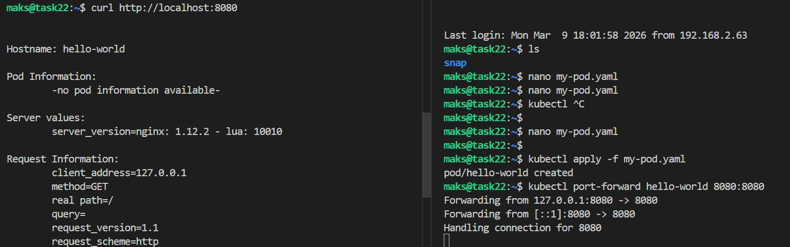
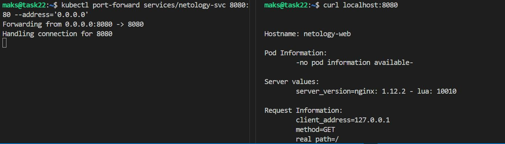
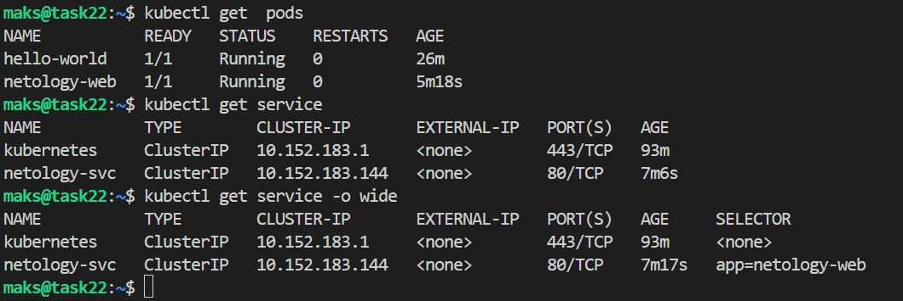

# Домашнее задание к занятию «Базовые объекты K8S»

### Цель задания

В тестовой среде для работы с Kubernetes, установленной в предыдущем ДЗ, необходимо развернуть Pod с приложением и подключиться к нему со своего локального компьютера. 

------

### Чеклист готовности к домашнему заданию

1. Установленное k8s-решение (например, MicroK8S).
2. Установленный локальный kubectl.
3. Редактор YAML-файлов с подключенным Git-репозиторием.

------

### Инструменты и дополнительные материалы, которые пригодятся для выполнения задания

1. Описание [Pod](https://kubernetes.io/docs/concepts/workloads/pods/) и примеры манифестов.
2. Описание [Service](https://kubernetes.io/docs/concepts/services-networking/service/).

------

### Задание 1. Создать Pod с именем hello-world

1. Создать манифест (yaml-конфигурацию) Pod.
```bash
nano my-pod.yaml
```

2. Использовать image - gcr.io/kubernetes-e2e-test-images/echoserver:2.2.
3. Подключиться локально к Pod с помощью `kubectl port-forward` и вывести значение (curl или в браузере).
```bash
kubectl apply -f my-pod.yaml
kubectl port-forward hello-world 8080:8080
# или
kubectl port-forward hello-world 8080:8080 --address='0.0.0.0'
# на новой вкладке
curl http://localhost:8080
```


[my-pod.yaml](code/my-pod.yaml)

------

### Задание 2. Создать Service и подключить его к Pod

1. Создать Pod с именем netology-web.
```bash
nano netology-web.yaml
```

[netology-web.yaml](code/netology-web.yaml)

2. Использовать image — gcr.io/kubernetes-e2e-test-images/echoserver:2.2.
3. Создать Service с именем netology-svc и подключить к netology-web.
```bash
nano netology-svc.yaml
```

[netology-svc.yaml](code/netology-svc.yaml)

4. Подключиться локально к Service с помощью `kubectl port-forward` и вывести значение (curl или в браузере).
```bash
kubectl apply -f netology-web.yaml 
kubectl apply -f netology-svc.yaml
kubectl port-forward services/netology-svc 8080:80 --address='0.0.0.0'
# на новой вкладке
curl localhost:8080
```


```bash
kubectl get  pods
kubectl get service
kubectl get service -o wide
```


------

### Правила приёма работы

1. Домашняя работа оформляется в своем Git-репозитории в файле README.md. Выполненное домашнее задание пришлите ссылкой на .md-файл в вашем репозитории.
2. Файл README.md должен содержать скриншоты вывода команд `kubectl get pods`, а также скриншот результата подключения.
3. Репозиторий должен содержать файлы манифестов и ссылки на них в файле README.md.

------

### Критерии оценки
Зачёт — выполнены все задания, ответы даны в развернутой форме, приложены соответствующие скриншоты и файлы проекта, в выполненных заданиях нет противоречий и нарушения логики.

На доработку — задание выполнено частично или не выполнено, в логике выполнения заданий есть противоречия, существенные недостатки.
