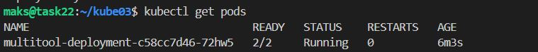
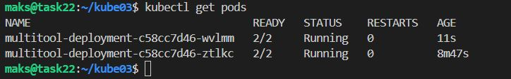
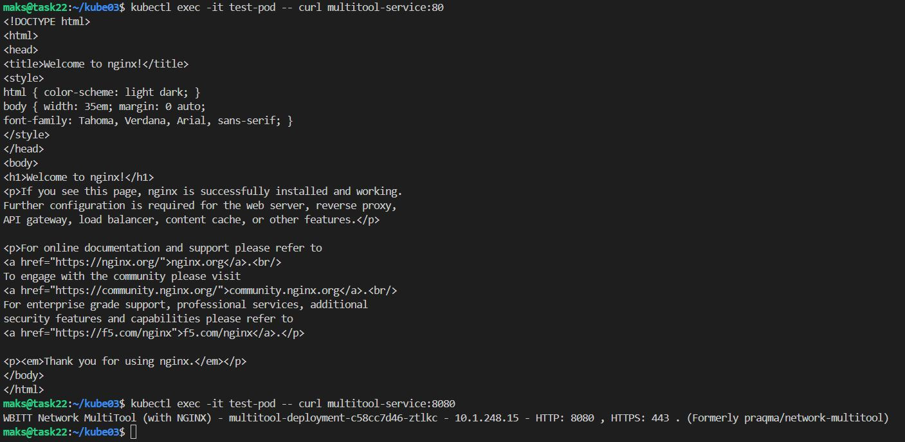
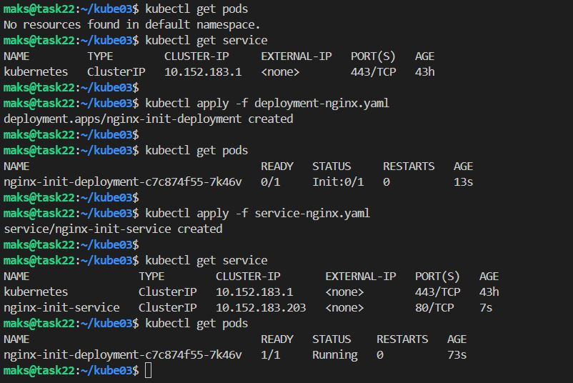

# Домашнее задание к занятию «Запуск приложений в K8S»

### Цель задания

В тестовой среде для работы с Kubernetes, установленной в предыдущем ДЗ, необходимо развернуть Deployment с приложением, состоящим из нескольких контейнеров, и масштабировать его.

------

### Чеклист готовности к домашнему заданию

1. Установленное k8s-решение (например, MicroK8S).
2. Установленный локальный kubectl.
3. Редактор YAML-файлов с подключённым git-репозиторием.

------

### Инструменты и дополнительные материалы, которые пригодятся для выполнения задания

1. [Описание](https://kubernetes.io/docs/concepts/workloads/controllers/deployment/) Deployment и примеры манифестов.
2. [Описание](https://kubernetes.io/docs/concepts/workloads/pods/init-containers/) Init-контейнеров.
3. [Описание](https://github.com/wbitt/Network-MultiTool) Multitool.

------

### Задание 1. Создать Deployment и обеспечить доступ к репликам приложения из другого Pod

1. Создать Deployment приложения, состоящего из двух контейнеров — nginx и multitool. Решить возникшую ошибку.

[deployment.yaml](code/deployment.yaml)

```bash
kubectl apply -f deployment.yaml
```
2. После запуска увеличить количество реплик работающего приложения до 2.
Увеличил `replicas: 2`
3. Продемонстрировать количество подов до и после масштабирования.



после



4. Создать Service, который обеспечит доступ до реплик приложений из п.1.

[service.yaml](code/service.yaml)

```bash
kubectl apply -f service.yaml
kubectl get service -o wide
```

5. Создать отдельный Pod с приложением multitool и убедиться с помощью `curl`, что из пода есть доступ до приложений из п.1.

[pod.yaml](code/pod.yaml)

```bash
kubectl apply -f pod.yaml
kubectl get pods
```
```bash
kubectl exec -it test-pod -- curl multitool-service:80
kubectl exec -it test-pod -- curl multitool-service:8080
```


Удаление `Pod`
```bash
kubectl delete pod <Name Of The Pod>
kubectl delete pod <pod-name> --force
kubectl delete service <service name>
kubectl delete -f deployment.yaml 
```
------

### Задание 2. Создать Deployment и обеспечить старт основного контейнера при выполнении условий

1. Создать Deployment приложения nginx и обеспечить старт контейнера только после того, как будет запущен сервис этого приложения.

[deployment-nginx.yaml](code/deployment-nginx.yaml)

2. Убедиться, что nginx не стартует. В качестве Init-контейнера взять busybox.


3. Создать и запустить Service. Убедиться, что Init запустился.

[service-nginx.yaml](code/service-nginx.yaml)

4. Продемонстрировать состояние пода до и после запуска сервиса.



------

### Правила приема работы

1. Домашняя работа оформляется в своем Git-репозитории в файле README.md. Выполненное домашнее задание пришлите ссылкой на .md-файл в вашем репозитории.
2. Файл README.md должен содержать скриншоты вывода необходимых команд `kubectl` и скриншоты результатов.
3. Репозиторий должен содержать файлы манифестов и ссылки на них в файле README.md.

------
