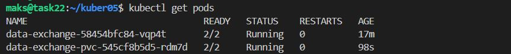
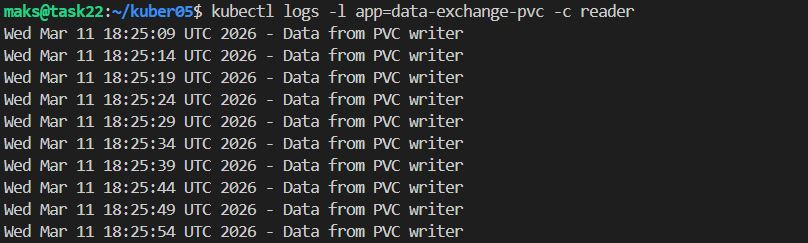
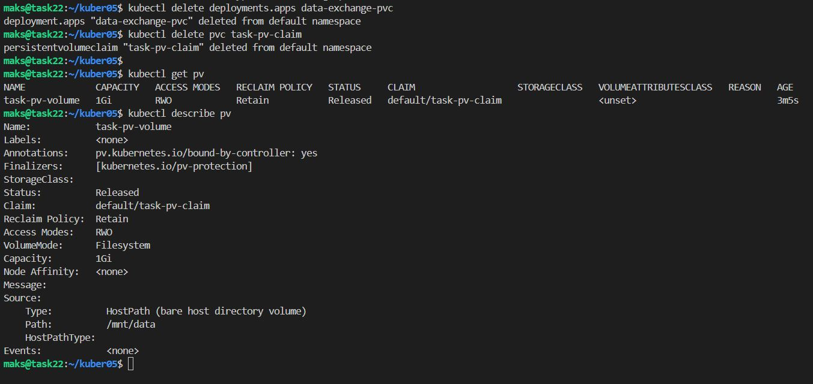
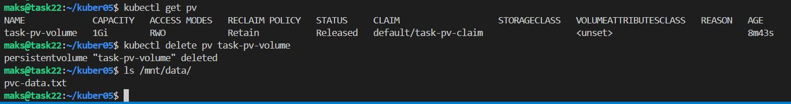
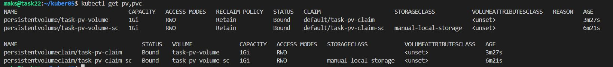
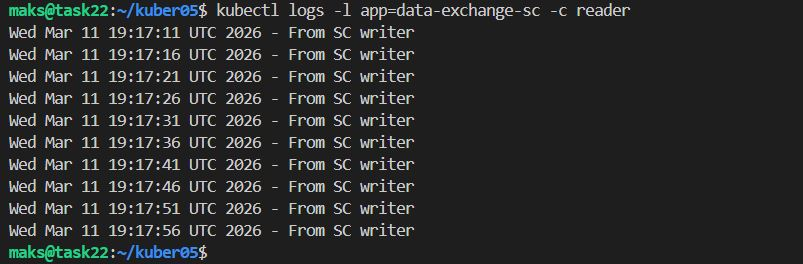

# Домашнее задание к занятию «Хранение в K8s»

### Примерное время выполнения задания — 180 минут

### Цель задания

Научиться работать с хранилищами в тестовой среде Kubernetes:
- обеспечить обмен файлами между контейнерами пода;
- создавать **PersistentVolume** (PV) и использовать его в подах через **PersistentVolumeClaim** (PVC);
- объявлять свой **StorageClass** (SC) и монтировать его в под через **PVC**.

Это задание поможет вам освоить базовые принципы взаимодействия с хранилищами в Kubernetes — одного из ключевых навыков для работы с кластерами. На практике Volume, PV, PVC используются для хранения данных независимо от пода, обмена данными между подами и контейнерами внутри пода. Понимание этих механизмов поможет вам упростить проектирование слоя данных для приложений, разворачиваемых в кластере k8s.

------

## **Подготовка**
### **Чеклист готовности**

1. Установленное K8s-решение (допустим, MicroK8S).
2. Установленный локальный kubectl.
3. Редактор YAML-файлов с подключенным GitHub-репозиторием.

------

### Инструменты, которые пригодятся для выполнения задания

1. [Инструкция](https://microk8s.io/docs/getting-started) по установке MicroK8S.
2. [Инструкция](https://minikube.sigs.k8s.io/docs/start/?arch=%2Fwindows%2Fx86-64%2Fstable%2F.exe+download) по установке Minikube. 
3. [Инструкция](https://kubernetes.io/docs/tasks/tools/install-kubectl-windows/) по установке kubectl.
4. [Инструкция](https://marketplace.visualstudio.com/items?itemName=ms-kubernetes-tools.vscode-kubernetes-tools) по установке VS Code

### Дополнительные материалы, которые пригодятся для выполнения задания
1. [Описание Volumes](https://kubernetes.io/docs/concepts/storage/volumes/).
2. [Описание Ephemeral Volumes](https://kubernetes.io/docs/concepts/storage/volumes/).
3. [Описание PersistentVolume](https://kubernetes.io/docs/concepts/storage/persistent-volumes/).
4. [Описание PersistentVolumeClaim](https://kubernetes.io/docs/concepts/storage/persistent-volumes/#persistentvolumeclaims).
5. [Описание StorageClass](https://kubernetes.io/docs/concepts/storage/storage-classes/).
6. [Описание Multitool](https://github.com/wbitt/Network-MultiTool).

------

## Задание 1. Volume: обмен данными между контейнерами в поде
### Задача

Создать Deployment приложения, состоящего из двух контейнеров, обменивающихся данными.

### Шаги выполнения
1. Создать Deployment приложения, состоящего из контейнеров busybox и multitool.

[containers-data-exchange.yaml](code/containers-data-exchange.yaml)

2. Настроить busybox на запись данных каждые 5 секунд в некий файл в общей директории.

3. Обеспечить возможность чтения файла контейнером multitool.

```bash
kubectl apply -f containers-data-exchange.yaml
# проверка что pods поднялись
kubectl get pods
```

<details><summary>kubectl describe pods data-exchange</summary>

```bash

maks@task22:~/kuber05$ kubectl describe pods data-exchange
Name:             data-exchange-58454bfc84-vqp4t
Namespace:        default
Priority:         0
Service Account:  default
Node:             task22/192.168.2.48
Start Time:       Wed, 11 Mar 2026 21:02:54 +0300
Labels:           app=data-exchange
                  pod-template-hash=58454bfc84
Annotations:      cni.projectcalico.org/containerID: eecb1f72ce5d33d59ae2fd92350fc3543f833f3a84cb5072994357917d90d066
                  cni.projectcalico.org/podIP: 10.1.248.12/32
                  cni.projectcalico.org/podIPs: 10.1.248.12/32
Status:           Running
IP:               10.1.248.12
IPs:
  IP:           10.1.248.12
Controlled By:  ReplicaSet/data-exchange-58454bfc84
Containers:
  writer:
    Container ID:  containerd://2591e76dd044a02d5153eb4b1500f805d60d90578c69f0917f3a26cb1c258cb9
    Image:         busybox
    Image ID:      docker.io/library/busybox@sha256:b3255e7dfbcd10cb367af0d409747d511aeb66dfac98cf30e97e87e4207dd76f
    Port:          <none>
    Host Port:     <none>
    Command:
      /bin/sh
      -c
    Args:
      while true; do
        echo "$(date) - Hello from writer container" >> /shared/data.txt
        sleep 5
      done

    State:          Running
      Started:      Wed, 11 Mar 2026 21:02:56 +0300
    Ready:          True
    Restart Count:  0
    Environment:    <none>
    Mounts:
      /shared from shared-data (rw)
      /var/run/secrets/kubernetes.io/serviceaccount from kube-api-access-pwf4n (ro)
  reader:
    Container ID:  containerd://00176a42c9c9730462132c1524fb6377a77e273497a249be526de916ac9b8223
    Image:         wbitt/network-multitool
    Image ID:      docker.io/wbitt/network-multitool@sha256:db2810fe2c8d36db074eab5d98fbf861c8ed55e0786d648d3477b3de9135632e
    Port:          <none>
    Host Port:     <none>
    Command:
      /bin/sh
      -c
    Args:
      tail -f /shared/data.txt

    State:          Running
      Started:      Wed, 11 Mar 2026 21:02:57 +0300
    Ready:          True
    Restart Count:  0
    Environment:    <none>
    Mounts:
      /shared from shared-data (rw)
      /var/run/secrets/kubernetes.io/serviceaccount from kube-api-access-pwf4n (ro)
Conditions:
  Type                        Status
  PodReadyToStartContainers   True
  Initialized                 True
  Ready                       True
  ContainersReady             True
  PodScheduled                True
Volumes:
  shared-data:
    Type:       EmptyDir (a temporary directory that shares a pod's lifetime)
    Medium:
    SizeLimit:  <unset>
  kube-api-access-pwf4n:
    Type:                    Projected (a volume that contains injected data from multiple sources)
    TokenExpirationSeconds:  3607
    ConfigMapName:           kube-root-ca.crt
    Optional:                false
    DownwardAPI:             true
QoS Class:                   BestEffort
Node-Selectors:              <none>
Tolerations:                 node.kubernetes.io/not-ready:NoExecute op=Exists for 300s
                             node.kubernetes.io/unreachable:NoExecute op=Exists for 300s
Events:
  Type    Reason     Age   From               Message
  ----    ------     ----  ----               -------
  Normal  Scheduled  67s   default-scheduler  Successfully assigned default/data-exchange-58454bfc84-vqp4t to task22
  Normal  Pulling    67s   kubelet            spec.containers{writer}: Pulling image "busybox"
Events:
  Type    Reason     Age   From               Message
  ----    ------     ----  ----               -------
  Normal  Scheduled  67s   default-scheduler  Successfully assigned default/data-exchange-58454bfc84-vqp4t to task22
Events:
  Type    Reason     Age   From               Message
  ----    ------     ----  ----               -------
Events:
  Type    Reason     Age   From               Message
Events:
Events:
Events:
Events:
Events:
Events:
  Type    Reason     Age   From               Message
  ----    ------     ----  ----               -------
  Normal  Scheduled  67s   default-scheduler  Successfully assigned default/data-exchange-58454bfc84-vqp4t to task22
  Normal  Pulling    67s   kubelet            spec.containers{writer}: Pulling image "busybox"
  Normal  Pulled     66s   kubelet            spec.containers{writer}: Successfully pulled image "busybox" in 1.009s (1.009s including waiting). Image size: 2222260 bytes.
  Normal  Created    66s   kubelet            spec.containers{writer}: Container created
  Normal  Started    66s   kubelet            spec.containers{writer}: Container started
  Normal  Pulling    66s   kubelet            spec.containers{reader}: Pulling image "wbitt/network-multitool"
  Normal  Pulled     65s   kubelet            spec.containers{reader}: Successfully pulled image "wbitt/network-multitool" in 894ms (894ms including waiting). Image size: 96718848 bytes.
  Normal  Created    65s   kubelet            spec.containers{reader}: Container created
  Normal  Started    65s   kubelet            spec.containers{reader}: Container started

```
</details>

<details><summary>чтения файла</summary>

```bash

maks@task22:~/kuber05$ kubectl logs data-exchange-58454bfc84-vqp4t -c reader -f
Wed Mar 11 18:02:56 UTC 2026 - Hello from writer container
Wed Mar 11 18:03:01 UTC 2026 - Hello from writer container
Wed Mar 11 18:03:06 UTC 2026 - Hello from writer container
Wed Mar 11 18:03:11 UTC 2026 - Hello from writer container
Wed Mar 11 18:03:16 UTC 2026 - Hello from writer container
Wed Mar 11 18:03:21 UTC 2026 - Hello from writer container
Wed Mar 11 18:03:26 UTC 2026 - Hello from writer container
Wed Mar 11 18:03:31 UTC 2026 - Hello from writer container
Wed Mar 11 18:03:36 UTC 2026 - Hello from writer container
Wed Mar 11 18:03:41 UTC 2026 - Hello from writer container

```
</details>

### Что сдать на проверку
- Манифесты:
  - `containers-data-exchange.yaml`
- Скриншоты:
  - описание пода с контейнерами (`kubectl describe pods data-exchange`)
  - вывод команды чтения файла (`tail -f <имя общего файла>`)

------

## Задание 2. PV, PVC
### Задача
Создать Deployment приложения, использующего локальный PV, созданный вручную.

### Шаги выполнения
1. Создать Deployment приложения, состоящего из контейнеров busybox и multitool, использующего созданный ранее PVC

[pv-pvc.yaml](code/pv-pvc.yaml)

2. Создать PV и PVC для подключения папки на локальной ноде, которая будет использована в поде.



3. Продемонстрировать, что контейнер multitool может читать данные из файла в смонтированной директории, в который busybox записывает данные каждые 5 секунд. 



4. Удалить Deployment и PVC. Продемонстрировать, что после этого произошло с PV. Пояснить, почему. (Используйте команду `kubectl describe pv`).



`Status: Released` 

`Reclaim Policy: Retain` — данные не удаляются автоматически.

5. Продемонстрировать, что файл сохранился на локальном диске ноды. Удалить PV.  Продемонстрировать, что произошло с файлом после удаления PV. Пояснить, почему.




`hostPath:` - это прямая ссылка, удаление PV не удаляет данные на диске.

### Что сдать на проверку
- Манифесты:
  - `pv-pvc.yaml`
- Скриншоты:
  - каждый шаг выполнения задания, начиная с шага 2.
- Описания:
  - объяснение наблюдаемого поведения ресурсов в двух последних шагах.

------

## Задание 3. StorageClass
### Задача
Создать Deployment приложения, использующего PVC, созданный на основе StorageClass.

### Шаги выполнения

1. Создать Deployment приложения, состоящего из контейнеров busybox и multitool, использующего созданный ранее PVC.

[sc.yaml](code/sc.yaml)

2. Создать SC и PVC для подключения папки на локальной ноде, которая будет использована в поде.



3. Продемонстрировать, что контейнер multitool может читать данные из файла в смонтированной директории, в который busybox записывает данные каждые 5 секунд.




### Что сдать на проверку
- Манифесты:
  - `sc.yaml`
- Скриншоты:
  - каждый шаг выполнения задания, начиная с шага 2

```bash
# удаление
kubectl delete -f sc.yam
kubectl delete -f pv-pvc.yaml
kubectl get pods
kubectl get service
kubectl get pv
kubectl get pvс
```
---
## Шаблоны манифестов с учебными комментариями
### 1. Deployment (containers-data-exchange.yaml)
```yaml
apiVersion: apps/v1
kind: Deployment
metadata:
  name: data-exchange
spec:
  replicas: # ЗАДАНИЕ: Укажите количество реплик
  selector:
    matchLabels:
      app: # ДОПОЛНИТЕ: Метка для селектора
  template:
    metadata:
      labels:
        app: # ПОВТОРИТЕ: Метка из selector.matchLabels
    spec:
      containers:
      - name: # ДОПОЛНИТЕ: Имя первого контейнера
        image: busybox
        command: ["/bin/sh", "-c"] 
        args: ["echo $(date) > путь_к_файлу; sleep 3600"] # КЛЮЧЕВОЕ: Команда записи данных в файл в директории из секции volumeMounts контейнера
        volumeMounts:
        - name: # ДОПОЛНИТЕ: Имя монтируемого раздела. Должно совпадать с именем эфемерного хранилища, объявленного на уровне пода.
          mountPath: # КЛЮЧЕВОЕ: Путь монтирования эфемерного хранилища внутри контейнера 1
      - name: # ДОПОЛНИТЕ: Имя второго контейнера
        image: busybox
        command: ["/bin/sh", "-c"]
        args: ["tail -f путь_к_файлу"] # КЛЮЧЕВОЕ: Команда для чтения данных из файла, расположенного в директории, указанной в volumeMounts контейнера
        volumeMounts:
        - name: # ДОПОЛНИТЕ: Имя монтируемого раздела. Должно совпадать с именем эфемерного хранилища, объявленного на уровне пода
          mountPath: # КЛЮЧЕВОЕ: Путь монтирования эфемерного хранилища внутри контейнера 2
      volumes:
      - name: # ДОПОЛНИТЕ: Имя монтируемого раздела эфемерного хранилища
        emptyDir: {} # ИНФОРМАЦИЯ: Определяем эфемерное хранилище, которое работает только внутри пода
```
### 2. Deployment (pv-pvc.yaml)
```yaml
---
apiVersion: v1
kind: PersistentVolume
metadata:
  name: # ДОПОЛНИТЕ: Имя хранилища
spec:
  capacity:
    storage: 1Gi
  volumeMode: Filesystem
  accessModes:
    - ReadWriteOnce
  persistentVolumeReclaimPolicy: Retain
  hostPath:
    path: # КЛЮЧЕВОЕ: Путь к директории на ноде (хосте, на котором развёрнут кластер)
---
apiVersion: v1
kind: PersistentVolumeClaim
metadata:
  name: # ДОПОЛНИТЕ: Имя PVC
spec:
  volumeName: # ДОПОЛНИТЕ: Имя PV, к которому будет привязан PVC, должен совпадать с созданным ранее PV
  volumeMode: Filesystem
  accessModes:
    - ReadWriteOnce
  resources:
    requests:
      storage: # ДОПОЛНИТЕ: Какой объём хранилища вы хотите передать в контейнер. Должно быть меньше или равно параметру storage из PV
---
apiVersion: apps/v1
kind: Deployment
metadata:
  name: data-exchange-pvc
spec:
  replicas: # ЗАДАНИЕ: Укажите количество реплик
  selector:
    matchLabels:
      app: # ДОПОЛНИТЕ: Метка для селектора
  template:
    metadata:
      labels:
        app: # ПОВТОРИТЕ: Метка из selector.matchLabels
    spec:
      containers:
      - name: # ДОПОЛНИТЕ: Имя первого контейнера
        image: busybox
        command: ["/bin/sh", "-c"] 
        args: ["echo $(date) > путь_к_файлу; sleep 3600"] # КЛЮЧЕВОЕ: Команда записи данных в файл в директории из секции volumeMounts контейнера 
        volumeMounts:
        - name: # ДОПОЛНИТЕ: Имя монтируемого раздела. Должно совпадать с именем хранилища, объявленного на уровне пода
          mountPath: # КЛЮЧЕВОЕ: Путь монтирования хранилища внутри контейнера 1
      - name: # ДОПОЛНИТЕ: Имя второго контейнера
        image: busybox
        command: ["/bin/sh", "-c"]
        args: ["tail -f путь_к_файлу"] # КЛЮЧЕВОЕ: Команда для чтения данных из файла, расположенного в директории, указанной в volumeMounts контейнера
        volumeMounts:
        - name: # ДОПОЛНИТЕ: Имя монтируемого раздела. Должно совпадать с именем хранилища, объявленного на уровне пода
          mountPath: # КЛЮЧЕВОЕ: Путь монтирования хранилища внутри контейнера 2
      volumes:
      - name: # ДОПОЛНИТЕ: Имя монтируемого раздела хранилища
        persistentVolumeClaim:
          claimName: # КЛЮЧЕВОЕ: Совпадает с именем PVC объявленного ранее
```
### 3. Deployment (sc.yaml)
```yaml
apiVersion: storage.k8s.io/v1
kind: StorageClass
metadata:
  name: # ДОПОЛНИТЕ: Имя StorageClass
provisioner: kubernetes.io/no-provisioner # ИНФОРМАЦИЯ: Нет автоматического развёртывания
volumeBindingMode: WaitForFirstConsumer
---
apiVersion: v1
kind: PersistentVolumeClaim
metadata:
  name: # ДОПОЛНИТЕ: Имя PVC
spec:
  volumeMode: Filesystem
  accessModes:
    - ReadWriteOnce
  resources:
    requests:
      storage: # ДОПОЛНИТЕ: Какой объем хранилища вы хотите передать в контейнер. Должно быть меньше или равно параметру storage из PV
  storageClassName: # ДОПОЛНИТЕ: Имя StorageClass. Должно совпадать с объявленным ранее
---
apiVersion: apps/v1
kind: Deployment
metadata:
  name: data-exchange-sc
spec:
  replicas: # ЗАДАНИЕ: Укажите количество реплик
  selector:
    matchLabels:
      app: # ДОПОЛНИТЕ: Метка для селектора
  template:
    metadata:
      labels:
        app: # ПОВТОРИТЕ: Метка из selector.matchLabels
    spec:
      containers:
      - name: # ДОПОЛНИТЕ: Имя первого контейнера
        image: busybox
        command: ["/bin/sh", "-c"] 
        args: ["echo $(date) > путь_к_файлу; sleep 3600"] # КЛЮЧЕВОЕ: Команда для чтения данных из файла, расположенного в директории, указанной в volumeMounts контейнера
        volumeMounts:
        - name: # ДОПОЛНИТЕ: Имя монтируемого раздела. Должно совпадать с именем хранилища, объявленного на уровне пода
          mountPath: # КЛЮЧЕВОЕ: Путь монтирования хранилища внутри контейнера 1
      - name: # ДОПОЛНИТЕ: Имя второго контейнера
        image: busybox
        command: ["/bin/sh", "-c"]
        args: ["tail -f путь_к_файлу"] # КЛЮЧЕВОЕ: Команда для чтения данных из файла, расположенного в директории, указанной в volumeMounts контейнера
        volumeMounts:
        - name: # ДОПОЛНИТЕ: Имя монтируемого раздела. Должно совпадать с именем хранилища, объявленного на уровне пода
          mountPath: # КЛЮЧЕВОЕ: Путь монтирования хранилища внутри контейнера 2
      volumes:
      - name: # ДОПОЛНИТЕ: Имя монтируемого раздела хранилища
        persistentVolumeClaim:
          claimName: # КЛЮЧЕВОЕ: Совпадает с именем PVC объявленного ранее
```

## **Правила приёма работы**
1. Домашняя работа оформляется в своём Git-репозитории в файле README.md. Выполненное домашнее задание пришлите ссылкой на .md-файл в вашем репозитории.
2. Файл README.md должен содержать скриншоты вывода необходимых команд `kubectl`, скриншоты результатов, пояснения.
3. Репозиторий должен содержать тексты манифестов или ссылки на них в файле README.md.

## **Критерии оценивания задания**
1. Зачёт: Все задачи выполнены, манифесты корректны, есть доказательства работы (скриншоты) и пояснения по заданию 2.
2. Доработка (на доработку задание направляется 1 раз): основные задачи выполнены, при этом есть ошибки в манифестах или отсутствуют проверочные скриншоты.
3. Незачёт: работа выполнена не в полном объёме, есть ошибки в манифестах, отсутствуют проверочные скриншоты. Все попытки доработки израсходованы (на доработку работа направляется 1 раз). Этот вид оценки используется крайне редко.

## **Срок выполнения задания**  
1. 5 дней на выполнение задания.
2. 5 дней на доработку задания (в случае направления задания на доработку).