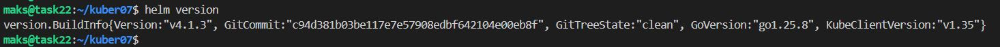
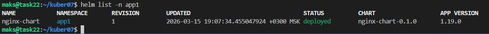
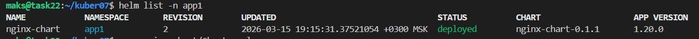
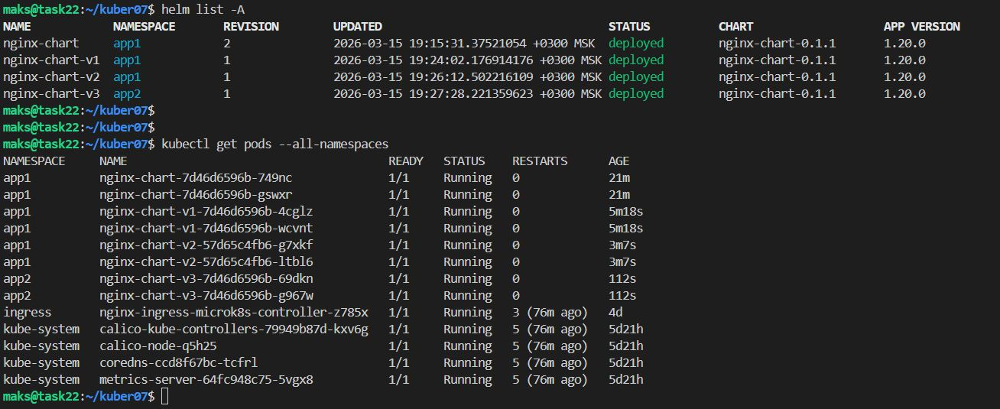

# Домашнее задание к занятию «Helm»

### Цель задания

В тестовой среде Kubernetes необходимо установить и обновить приложения с помощью Helm.

------

### Чеклист готовности к домашнему заданию

1. Установленное k8s-решение, например, MicroK8S.
2. Установленный локальный kubectl.
3. Установленный локальный Helm.
4. Редактор YAML-файлов с подключенным репозиторием GitHub.

------

### Инструменты и дополнительные материалы, которые пригодятся для выполнения задания

1. [Инструкция](https://helm.sh/docs/intro/install/) по установке Helm. [Helm completion](https://helm.sh/docs/helm/helm_completion/).

Установка
```bash
curl -fsSL -o get_helm.sh https://raw.githubusercontent.com/helm/helm/main/scripts/get-helm-4
chmod 700 get_helm.sh
./get_helm.sh
helm version
```



------

### Задание 1. Подготовить Helm-чарт для приложения

1. Необходимо упаковать приложение в чарт для деплоя в разные окружения. 
2. Каждый компонент приложения деплоится отдельным deployment’ом или statefulset’ом.
3. В переменных чарта измените образ приложения для изменения версии.

Создаём чарт
```bash
helm create nginx-chart
```
Подготовим [deployment.yaml](code/templates/deployment.yaml) [service.yaml](code/templates/service.yaml) и разместим в `templates`

В переменных чарта измените образ приложения [Chart.yaml](code/Chart.yaml)

Подготовим [values.yaml](code/values.yaml)

```bash
# создание namespace
kubectl create namespace app1
kubectl create namespace app2
```
```bash
helm install nginx-chart ./nginx-chart -n app1
helm list -n app1
```



Изменения в `Chart.yaml`

```txt
  apiVersion: v2
  name: nginx-chart
  description: A Helm chart for Kubernetes

  type: application

  version: 0.1.1
  appVersion: "1.20.0"
```

```bash
helm upgrade nginx-chart ./nginx-chart -n app1
helm list -n app1
```



Версия поменялась на 1.20.0

------
### Задание 2. Запустить две версии в разных неймспейсах

1. Подготовив чарт, необходимо его проверить. Запуститe несколько копий приложения.
2. Одну версию в namespace=app1, вторую версию в том же неймспейсе, третью версию в namespace=app2.
3. Продемонстрируйте результат.

```bash
helm install nginx-chart-v1 ./nginx-chart -n app1
helm install nginx-chart-v2 ./nginx-chart -n app1
helm install nginx-chart-v3 ./nginx-chart -n app2
helm list -A
kubectl get pods --all-namespaces
```



### Правила приёма работы

1. Домашняя работа оформляется в своём Git репозитории в файле README.md. Выполненное домашнее задание пришлите ссылкой на .md-файл в вашем репозитории.
2. Файл README.md должен содержать скриншоты вывода необходимых команд `kubectl`, `helm`, а также скриншоты результатов.
3. Репозиторий должен содержать тексты манифестов или ссылки на них в файле README.md.

