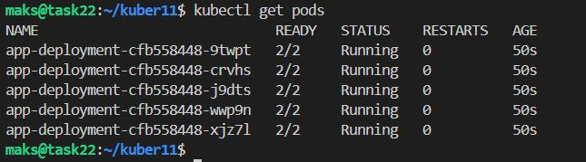
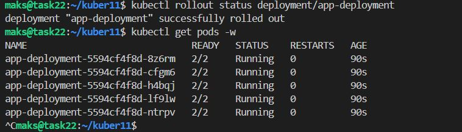
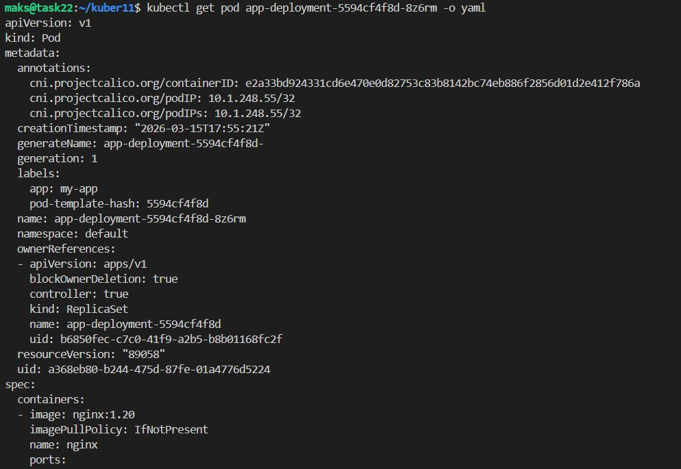
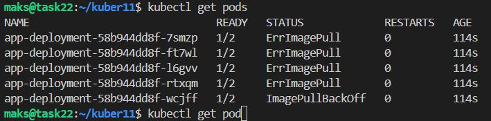
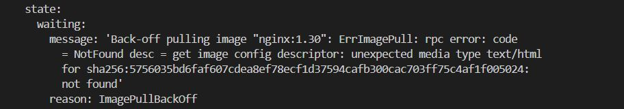
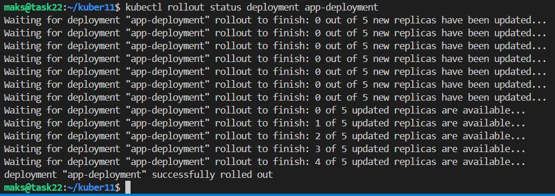
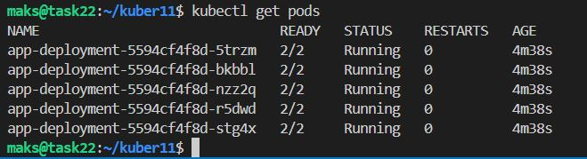

# Домашнее задание к занятию «Обновление приложений»

### Цель задания

Выбрать и настроить стратегию обновления приложения.

### Чеклист готовности к домашнему заданию

1. Кластер K8s.

### Инструменты и дополнительные материалы, которые пригодятся для выполнения задания

1. [Документация Updating a Deployment](https://kubernetes.io/docs/concepts/workloads/controllers/deployment/#updating-a-deployment).
2. [Статья про стратегии обновлений](https://habr.com/ru/companies/flant/articles/471620/).

-----

### Задание 1. Выбрать стратегию обновления приложения и описать ваш выбор

1. Имеется приложение, состоящее из нескольких реплик, которое требуется обновить.
2. Ресурсы, выделенные для приложения, ограничены, и нет возможности их увеличить.
3. Запас по ресурсам в менее загруженный момент времени составляет 20%.
4. Обновление мажорное, новые версии приложения не умеют работать со старыми.
5. Вам нужно объяснить свой выбор стратегии обновления приложения.

Доступные стратегии:

- Rolling Update (постепенное обновление):
- > По умолчанию Kubernetes создаёт новый Pod перед удалением старого.
- > При 3 репликах и запасе 20 % система не сможет запустить даже одну дополнительную реплику — превысит лимит ресурсов.

- Recreate (пересоздание):
- > Сначала удаляет все старые Pods, затем запускает новые.
- > Создаёт простой приложения на время запуска новых реплик.

- Blue‑Green Deployment:
- > Требует полного дублирования инфраструктуры (в 2 раза больше ресурсов).
- > При запасе 20 % невозможно выделить ресурсы для параллельного запуска новой версии.

- Canary Release:
- > Предполагает параллельную работу старой и новой версий.
- > Требует дополнительных ресурсов для новых Pods.

Несмотря на то, что стратегия `Recreate` вызовет простой приложения, она укладывается в ограничение по ресурсам и полностью исключает риск конфликта между несовместимыми версиями приложения.


### Задание 2. Обновить приложение

1. Создать deployment приложения с контейнерами nginx и multitool. Версию nginx взять 1.19. Количество реплик — 5.
2. Обновить версию nginx в приложении до версии 1.20, сократив время обновления до минимума. Приложение должно быть доступно.
3. Попытаться обновить nginx до версии 1.28, приложение должно оставаться доступным.
4. Откатиться после неудачного обновления.

Создаём манифест [deployment.yaml](code/deployment.yaml)

Запускаем
```bash
kubectl apply -f deployment.yaml
# проверяем
kubectl get pods
```



Обновить версию nginx в приложении до версии 1.20

```bash
kubectl set image deployment/app-deployment nginx=nginx:1.20
kubectl rollout status deployment/app-deployment
kubectl get pods -w
```



```bash
# заглянем внутрь, что бы убедится в обновлении версии nginx
kubectl get pod app-deployment-5594cf4f8d-8z6rm
```



Будем обновлять до версии 1.30, т.к. По данным на 4 февраля 2026 года, последняя версия программы Nginx — 1.28.2. Тестовая версия на тот же день — 1.29.5.

```bash
kubectl set image deployment/app-deployment nginx=nginx:1.30
# проверяем состояние Pods
kubectl get pods -w
```
<details>
<summary>Результат kubectl get pods -w</summary> 

```bash

maks@task22:~/kuber11$ kubectl get pods -w
NAME                              READY   STATUS        RESTARTS   AGE
app-deployment-5594cf4f8d-8z6rm   2/2     Terminating   0          10m
app-deployment-5594cf4f8d-cfgm6   2/2     Terminating   0          10m
app-deployment-5594cf4f8d-h4bqj   2/2     Terminating   0          10m
app-deployment-5594cf4f8d-lf9lw   2/2     Terminating   0          10m
app-deployment-5594cf4f8d-ntrpv   2/2     Terminating   0          10m
app-deployment-5594cf4f8d-cfgm6   2/2     Terminating   0          10m
app-deployment-5594cf4f8d-h4bqj   2/2     Terminating   0          10m
app-deployment-5594cf4f8d-lf9lw   2/2     Terminating   0          10m
app-deployment-5594cf4f8d-ntrpv   2/2     Terminating   0          10m
app-deployment-5594cf4f8d-8z6rm   2/2     Terminating   0          10m
app-deployment-5594cf4f8d-cfgm6   0/2     Error         0          10m
app-deployment-5594cf4f8d-cfgm6   0/2     Error         0          10m
app-deployment-5594cf4f8d-cfgm6   0/2     Error         0          10m
app-deployment-5594cf4f8d-h4bqj   0/2     Error         0          10m
app-deployment-5594cf4f8d-lf9lw   0/2     Error         0          10m
app-deployment-5594cf4f8d-ntrpv   0/2     Error         0          10m
app-deployment-5594cf4f8d-8z6rm   0/2     Error         0          10m
app-deployment-58b944dd8f-7smzp   0/2     Pending       0          0s
app-deployment-58b944dd8f-rtxqm   0/2     Pending       0          0s
app-deployment-58b944dd8f-wcjff   0/2     Pending       0          0s
app-deployment-58b944dd8f-7smzp   0/2     Pending       0          0s
app-deployment-58b944dd8f-rtxqm   0/2     Pending       0          0s
app-deployment-58b944dd8f-ft7wl   0/2     Pending       0          0s
app-deployment-58b944dd8f-l6gvv   0/2     Pending       0          0s
app-deployment-58b944dd8f-wcjff   0/2     Pending       0          0s
app-deployment-58b944dd8f-7smzp   0/2     ContainerCreating   0          0s
app-deployment-58b944dd8f-l6gvv   0/2     Pending             0          0s
app-deployment-58b944dd8f-ft7wl   0/2     Pending             0          0s
app-deployment-58b944dd8f-wcjff   0/2     ContainerCreating   0          0s
app-deployment-58b944dd8f-rtxqm   0/2     ContainerCreating   0          0s
app-deployment-58b944dd8f-ft7wl   0/2     ContainerCreating   0          0s
app-deployment-58b944dd8f-l6gvv   0/2     ContainerCreating   0          0s
app-deployment-5594cf4f8d-ntrpv   0/2     Error               0          10m
app-deployment-5594cf4f8d-ntrpv   0/2     Error               0          10m
app-deployment-5594cf4f8d-8z6rm   0/2     Error               0          10m
app-deployment-5594cf4f8d-8z6rm   0/2     Error               0          10m
app-deployment-5594cf4f8d-lf9lw   0/2     Error               0          10m
app-deployment-5594cf4f8d-lf9lw   0/2     Error               0          10m
app-deployment-5594cf4f8d-h4bqj   0/2     Error               0          10m
app-deployment-5594cf4f8d-h4bqj   0/2     Error               0          10m
app-deployment-58b944dd8f-7smzp   0/2     ContainerCreating   0          1s
app-deployment-58b944dd8f-rtxqm   0/2     ContainerCreating   0          1s
app-deployment-58b944dd8f-l6gvv   0/2     ContainerCreating   0          1s
app-deployment-58b944dd8f-wcjff   0/2     ContainerCreating   0          1s
app-deployment-58b944dd8f-ft7wl   0/2     ContainerCreating   0          2s
app-deployment-58b944dd8f-rtxqm   1/2     ErrImagePull        0          6s
app-deployment-58b944dd8f-7smzp   1/2     ErrImagePull        0          6s
app-deployment-58b944dd8f-wcjff   1/2     ErrImagePull        0          6s
app-deployment-58b944dd8f-ft7wl   1/2     ErrImagePull        0          6s
app-deployment-58b944dd8f-l6gvv   1/2     ErrImagePull        0          6s
app-deployment-58b944dd8f-rtxqm   1/2     ImagePullBackOff    0          7s
app-deployment-58b944dd8f-ft7wl   1/2     ImagePullBackOff    0          7s
app-deployment-58b944dd8f-l6gvv   1/2     ImagePullBackOff    0          7s
app-deployment-58b944dd8f-7smzp   1/2     ImagePullBackOff    0          7s
app-deployment-58b944dd8f-wcjff   1/2     ImagePullBackOff    0          7s
app-deployment-58b944dd8f-7smzp   1/2     ErrImagePull        0          33s
app-deployment-58b944dd8f-wcjff   1/2     ErrImagePull        0          34s
app-deployment-58b944dd8f-ft7wl   1/2     ErrImagePull        0          34s
app-deployment-58b944dd8f-rtxqm   1/2     ErrImagePull        0          38s
app-deployment-58b944dd8f-l6gvv   1/2     ErrImagePull        0          39s
app-deployment-58b944dd8f-7smzp   1/2     ImagePullBackOff    0          44s
app-deployment-58b944dd8f-wcjff   1/2     ImagePullBackOff    0          45s
app-deployment-58b944dd8f-ft7wl   1/2     ImagePullBackOff    0          47s
app-deployment-58b944dd8f-rtxqm   1/2     ImagePullBackOff    0          52s
app-deployment-58b944dd8f-l6gvv   1/2     ImagePullBackOff    0          52s
app-deployment-58b944dd8f-wcjff   1/2     ErrImagePull        0          59s
app-deployment-58b944dd8f-7smzp   1/2     ErrImagePull        0          61s
app-deployment-58b944dd8f-ft7wl   1/2     ErrImagePull        0          64s
app-deployment-58b944dd8f-rtxqm   1/2     ErrImagePull        0          66s

```

</details> 

Состояние Pods
```bash
kubectl get pods
```



Изучаем проблему 
```bash
kubectl get pod app-deployment-58b944dd8f-7smzp -o yaml
kubectl describe deployments.apps app-deployment
```



<details>
<summary>kubectl describe deployments.apps app-deployment</summary>

```bash

maks@task22:~/kuber11$ kubectl describe deployments.apps app-deployment 
Name:               app-deployment
Namespace:          default
CreationTimestamp:  Sun, 15 Mar 2026 20:49:24 +0300
Labels:             app=my-app
Annotations:        deployment.kubernetes.io/revision: 3
Selector:           app=my-app
Replicas:           5 desired | 5 updated | 5 total | 0 available | 5 unavailable
StrategyType:       Recreate
MinReadySeconds:    0
Pod Template:
  Labels:  app=my-app
  Containers:
   nginx:
    Image:      nginx:1.30
    Port:       80/TCP
    Host Port:  0/TCP
    Limits:
      cpu:     500m
      memory:  128Mi
    Requests:
      cpu:        250m
      memory:     64Mi
    Environment:  <none>
    Mounts:       <none>
   multitool:
    Image:      gcr.io/kubernetes-e2e-test-images/echoserver:2.2
    Port:       8080/TCP
    Host Port:  0/TCP
    Limits:
      cpu:     200m
      memory:  64Mi
    Requests:
      cpu:         100m
      memory:      32Mi
    Environment:   <none>
    Mounts:        <none>
  Volumes:         <none>
  Node-Selectors:  <none>
  Tolerations:     <none>
Conditions:
  Type           Status  Reason
  ----           ------  ------
  Available      False   MinimumReplicasUnavailable
  Progressing    True    ReplicaSetUpdated
OldReplicaSets:  app-deployment-cfb558448 (0/0 replicas created), app-deployment-5594cf4f8d (0/0 replicas created)
NewReplicaSet:   app-deployment-58b944dd8f (5/5 replicas created)
Events:          <none>

```

</details>

Откатываем
```bash
kubectl rollout undo deployment app-deployment
# наблюдаем
kubectl rollout status deployment app-deployment
```



```bash
kubectl get pods
```


## Дополнительные задания — со звёздочкой*

Задания дополнительные, необязательные к выполнению, они не повлияют на получение зачёта по домашнему заданию. **Но мы настоятельно рекомендуем вам выполнять все задания со звёздочкой.** Это поможет лучше разобраться в материале.   

### Задание 3*. Создать Canary deployment

1. Создать два deployment'а приложения nginx.
2. При помощи разных ConfigMap сделать две версии приложения — веб-страницы.
3. С помощью ingress создать канареечный деплоймент, чтобы можно было часть трафика перебросить на разные версии приложения.

### Правила приёма работы

1. Домашняя работа оформляется в своем Git-репозитории в файле README.md. Выполненное домашнее задание пришлите ссылкой на .md-файл в вашем репозитории.
2. Файл README.md должен содержать скриншоты вывода необходимых команд, а также скриншоты результатов.
3. Репозиторий должен содержать тексты манифестов или ссылки на них в файле README.md.
